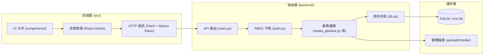

# 專案全端開發規範 (Full-Stack Development Guidelines)

> **版本**：v1.0.0  
> **最後更新**：2026-09-12  
> **狀態**：生效中 (Active)  
> **適用範疇**：後端 FastAPI 服務、前端 React 應用、資料庫遷移與自動化測試  

本規範以專案現有實作（Phase 1 RBAC 資料核心、Phase 2 媒體影像管線、作品集前台與管理後台）為基準，定義全端架構、程式碼風格、安全守則、API 設計與測試驗證準則，供後續階段（Phase 3 區塊編輯器、Phase 4 狀態機等）開發遵循。

---

## 1. 系統架構與分層職責 (System Architecture)

專案嚴格遵循「前後端分離」與「階段式解耦」之工程原則：



### 1.1 分層與目錄原則

1. **後端模組化 (`backend/`)**：
   - `main.py`：負責 FastAPI 應用實例化、CORS 與靜態目錄掛載、API 端點路由定義與 HTTP 請求驗證。
   - `auth.py`：專責 RFC 7519 JWT 權杖簽發、解析與 RBAC 角色守衛依賴項。
   - `db.py`：專責 SQLite 資料庫連線工廠、DDL Schema 定義、PBKDF2 密碼雜湊與種子資料注入。
   - 專用業務管線獨立拆檔（如 `media_pipeline.py`），維持路由層的簡潔度。
2. **前端模組化 (`src/`)**：
   - `App.jsx`：應用程式根入口，掌管全域主題（深色/淺色）與頂層視圖路由（`portfolio` 作品集 / `cms` 管理後台）。
   - `components/`：功能模組化獨立元件，各元件內聚自身 UI 狀態與樣式邏輯。
   - `index.css`：定義 Design Tokens（CSS Variables）以支援全站深淺色主題切換。

---

## 2. 後端開發規範 (Backend Guidelines - FastAPI & Python)

### 2.1 API 設計與路由約定

1. **路徑規範**：所有商業邏輯 API 一律以 `/api/v1` 為前綴，採用 RESTful 風格命名：
   - 查詢清單：`GET /api/v1/resources`
   - 查詢單筆：`GET /api/v1/resources/{id}`
   - 建立資源：`POST /api/v1/resources`
   - 部分更新：`PATCH /api/v1/resources/{id}`
   - 刪除資源：`DELETE /api/v1/resources/{id}`
2. **標準回應格式**：
   - 成功回應一律包含 `code`、`message` 與 `data`：
     ```json
     {
       "code": 200,
       "message": "操作成功",
       "data": {}
     }
     ```
   - 異常回應拋出標準 `HTTPException`，`detail` 結構如下：
     ```python
     raise HTTPException(
         status_code=status.HTTP_400_BAD_REQUEST,
         detail={
             "code": 400,
             "error": "RESOURCE_NOT_FOUND",
             "message": "查無指定的媒體資產"
         }
     )
     ```
3. **請求驗證**：一律使用 Pydantic `BaseModel` 定義 Request Body，明確標記欄位型別與選擇性欄位（`Optional[...]`）。

### 2.2 資料庫與 SQL 規範

1. **外鍵約束強制啟用**：每次獲取連線皆須執行 `PRAGMA foreign_keys = ON;`（已封裝於 `get_db()`）。
2. **參數化查詢（防範 SQL Injection）**：
   - 嚴禁字串拼接 SQL。所有查詢一律使用佔位符 `?` 並以 Tuple 傳入參數：
     ```python
     # 正確範例
     cursor.execute("SELECT * FROM users WHERE id = ?;", (user_id,))
     
     # 嚴格禁止
     cursor.execute(f"SELECT * FROM users WHERE id = {user_id};")
     ```
3. **字典回傳模式**：資料庫連線須設定 `conn.row_factory = sqlite3.Row`，查詢結果可直接轉為字典 `dict(row)`。
4. **敏感資訊脫敏**：查詢或回傳使用者資料時，**絕不可回傳** `password_hash`。

### 2.3 身份驗證與 RBAC 權限守衛

1. **角色定義**：目前系統定義 4 種標準角色：
   - `super_admin`：系統管理員（全域最高權限）。
   - `editor`：主編（管理分類、標籤、媒體庫與文章發佈審核）。
   - `author`：專欄作者（撰寫草稿、管理個人媒體資產）。
   - `proofreader`：校對員（審閱校正，不可異動結構與直接發佈）。
2. **端點權限保護**：
   - 需要登入端點：使用 `Depends(get_current_user)`。
   - 限制特定角色端點：使用 `Depends(require_roles("super_admin", "editor"))`。

### 2.4 媒體管線與上傳安全

1. **Magic Number 檔案驗證**：上傳時不可單純信任副檔名或 MIME Type，必須透過檔案二進制前導位元組（Magic Bytes）驗證檔案真實性（支援 JPEG, PNG, WebP, GIF, BMP）。
2. **檔案上限**：單檔限制不超過 20MB。
3. **WebP 自動衍生機制**：
   - 原圖：保留以供歷史還原或原始下載。
   - 主圖：品質 85% 之 WebP 格式。
   - 中圖：寬度上限 1200px 之 WebP（維持原始比例）。
   - 縮圖：400x400 正方形裁切之 WebP。
4. **EXIF 方向校正**：處理圖片前必須呼叫 `ImageOps.exif_transpose(img)` 校正手機拍攝方向。

---

## 3. 前端開發規範 (Frontend Guidelines - React 18 & Vite)

### 3.1 元件設計與狀態管理

1. **React 現代語法**：全面採用 Functional Components 與 Hooks，禁止 Class 元件。
2. **單向資料流與職責分離**：
   - 複雜狀態（如上傳佇列、編輯中圖片座標、分類樹）維持在負責該功能的專屬元件內部。
   - 跨模組狀態（如登入權杖 `token`、使用者偏好）提升至父層或透過 `localStorage` 同步。
3. **副作用控管**：`useEffect` 必須明確宣告依賴項陣列（Dependency Array），避免無窮迴圈渲染。

### 3.2 樣式與主題系統 (CSS Variables)

1. **禁止寫死深淺色色碼**：介面元件樣式必須引用 `index.css` 定義的 CSS 變數：
   - 背景色：`var(--bg-primary)`, `var(--bg-card)`, `var(--bg-secondary)`
   - 文字色：`var(--text-primary)`, `var(--text-secondary)`, `var(--text-muted)`
   - 主題色：`var(--accent)`, `var(--accent-hover)`
   - 邊框色：`var(--border)`
2. **響應式佈局**：以 Flexbox 與 CSS Grid 為核心排版，適應行動端與桌面端視窗。

### 3.3 API 請求與錯誤處理

1. **統一認證標頭**：向後端請求時，若已登入必須於 Header 附加：
   ```javascript
   headers: {
     'Authorization': `Bearer ${token}`,
     'Content-Type': 'application/json'
   }
   ```
2. **非同步異常防護**：所有 `fetch` 呼叫必須包裹於 `try...catch` 區塊，並透過 `showToast` 或錯誤提示區塊告知使用者操作失敗原因。
3. **高頻操作防抖 (Debounce)**：搜尋欄輸入、自動儲存等高頻觸發動作，前端必須設定 300ms ~ 3000ms 防抖處理。

---

## 4. 安全與防護準則 (Security Best Practices)

> [!CAUTION]
> 安全性是系統穩定運作的前提，任何涉及使用者認證、權限判定與檔案存取的功能皆須嚴格遵照以下準則。

1. **密碼儲存標準**：
   - 使用 PBKDF2-HMAC-SHA256 演算法，配置獨立 16 位元組隨機 Salt，迭代次數不得低於 100,000 次。
   - 絕不允許明文或簡易 MD5/SHA1 雜湊存儲。
2. **權限越權攔截 (IDOR 防護)**：
   - 後端在更新、刪除媒體資產或文章時，必須在 SQL 層級比對 `uploader_id == current_user.id`，或判定使用者是否具備管理員權限，嚴防水平越權存取。
3. **敏感資訊隔離**：
   - 開發金鑰與連線字串統一透過環境變數或專用設定管理，不得將真實憑證推播至版本控制庫（VCS）。

---

## 5. 測試與品質檢核流程 (Testing & Verification)

本專案採用階段驗收測試驅動開發（Test-Driven Verification）：

| 測試腳本 | 驗收階段 | 核心檢核目標 |
| :--- | :--- | :--- |
| `backend/test_phase1.py` | Phase 1 | 認證 JWT、4 角色登入、二層分類樹 CRUD、標籤統計、RBAC 越權阻擋 |
| `backend/test_phase2.py` | Phase 2 | 檔案大小與 Magic Byte 驗證、WebP 85% 轉碼、多尺寸生成、線上裁切與虛擬資料夾 |

### 5.1 提交前驗證檢查清單

在完成任一階段的功能開發或修復後，必須確保通過以下檢查：
- [ ] 後端自動化單元測試 100% 通過（`python backend/test_phase1.py` 與 `python backend/test_phase2.py`）。
- [ ] 前端專案編譯無錯誤（`npm run build` 通過）。
- [ ] 介面在 Dark Mode 與 Light Mode 下色彩對比均清晰可讀。
- [ ] 相關規格文件與進度表（`todo.md`、`spec.md`）同步更新完成。
