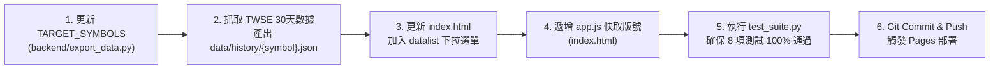

# 台股趨勢分析工具開發與發布規範 (Stock Trend App Development Guidelines)

> **版本**：v3.0.0  
> **最後更新**：2026-10-10  
> **狀態**：生效中 (Active)  
> **適用範疇**：台灣股市行情抓取管線、FastAPI 後端、原生前端 (JS/HTML/Chart.js)、GitHub Actions 自動化排程與 GitHub Pages 部署

本規範定義「台股趨勢分析小幫手（台灣股市分析工具）」之雙模架構、數據清洗守則、圖表生命週期、靜態資料庫維護流程與品質驗證標準。

---

## 1. 系統架構與雙模運行模式 (Dual-Mode Architecture)

系統設計遵循「官方數據直連」與「零伺服器雲端展示」的雙模相容架構：

```mermaid
graph TD
    subgraph Client["前端使用者介面 (app.js + index.html)"]
        UI["股價即時儀表板 • 30天均線趨勢圖 (Chart.js) • 次日多空分析報告"]
    end

    subgraph ModeDetect{"運行模式自動判定 (AppState.dataSourceMode)"}
        Detect["檢查 window.location.hostname"]
    end

    subgraph BackendMode["本機完整模式 (Local Backend Mode)"]
        Srv["FastAPI 後端 (backend/server.py:8000)"]
        ClientTWSE["twse_tpex_client.py (重試 / 節流 / 快取)"]
        LiveTWSE["證交所 (TWSE) / 櫃買中心 (TPEx) 官方 OpenAPI"]
    end

    subgraph StaticMode["雲端無伺服器展示模式 (GitHub Pages Mode)"]
        StaticData["靜態資料集 (data/quotes.json, calendar.json, history/*.json)"]
        GHA["GitHub Actions (每日 16:30 自動排程執行 export_data.py)"]
    end

    UI --> Detect
    Detect -->|localhost / 127.0.0.1| Srv
    Detect -->|GitHub Pages / 行動裝置| StaticData
    Srv --> ClientTWSE --> LiveTWSE
    GHA -->|抓取最新成交並 Commit & Push| StaticData
```

### 1.1 雙模運作原則

1. **本地後端模式 (Local Backend Mode)**：
   - 適用於本地開發或需查詢**全市場任意股票**之情境。
   - 前端發送請求至 `http://127.0.0.1:8000/api`。
   - 後端即時連線 TWSE/TPEx 官方端點，無個股歷史檔案限制。
2. **靜態展示模式 (GitHub Pages / Serverless Mode)**：
   - 託管於 GitHub Pages（如 `https://tinachang912-eng.github.io/stocktrend-app/`）。
   - 瀏覽器受同源政策（CORS）限制無法直接跨域請求 TWSE，因此改為讀取靜態快照 `./data/`。
   - **當日收盤價**：讀取 `data/quotes.json`（涵蓋全市場上市櫃所有個股與 ETF）。
   - **歷史趨勢與均線**：讀取 `data/history/{symbol}.json`（收錄核心與熱門權值股）。
   - 由 GitHub Actions 排程工作流（`.github/workflows/update-market-data.yml`）每日台北時間 16:30 自動更新資料庫。

---

## 2. 數據清洗與業務邏輯規範 (Data Cleaning & Logic Rules)

> [!IMPORTANT]
> 股市數據涉及精確運算，任何清洗失誤皆會導致均線失真或系統崩潰，嚴格禁止違反下列規則。

### 2.1 股票代碼格式規範
- **嚴格字串型別**：股票代號一律以 `str` 儲存與傳遞，**絕對禁止轉為整數（Integer）**。
- **保留前導零**：如 ETF 代碼 `0050`、`0056`、`00878`，以及附英文後綴之櫃買標的 `00679B`，必須完整保留原樣。
- **輸入清洗**：前端與後端接收輸入時，一律透過正規表達式擷取首個 4~6 碼代號並轉大寫：`rawInput.match(/^[0-9A-Za-z]{4,6}/)`。

### 2.2 價格與數值清洗防呆
- **無效價格處理**：遇到價格為 `"--"`、`"-"`、`"null"`、`"None"`、空字串或成交量為 0 之情境，**必須回傳 `None`（Python）或 `null`（JavaScript），嚴格禁止轉為 `0.0`**。
  - *原因*：若轉為 0，會導致計算 MA5 / MA20 均線時出現嚴重偏誤與跌停假象。
- **千分位與符號去除**：解析官方數值前，必須清除千分位逗號 `,` 與正負號 `+`，再進行 `float()` 解析。
- **浮點數四捨五入**：所有計算出之均線、乖離率（BIAS）、支撐壓力位一律保留小數點後兩位（`round(val, 2)`）。

### 2.3 交易日曆與時效校驗
- **時區基準**：全面強制綁定 `Asia/Taipei`（台灣時間），嚴禁使用系統未校正之本地時區。
- **營業日判定**：
  - 非週末（排除週六與週日）。
  - 排除證交所公告之國定假日與風災休市日（由 `calendar_service.py` 維護並快取）。
  - 當日 13:30 前，最新應有交易日為「前一營業日」；13:30 證交所收盤結算後，應有交易日更新為「當日」。

---

## 3. 前端開發規範 (Frontend Guidelines - Native JS & Chart.js)

### 3.1 圖表生命週期與狀態清理 (Chart.js Lifecycle)
- **切換股票防呆（關鍵）**：
  在 `renderTrendChart(symbol, historyData)` 中，若 `historyData` 不存在或無成交紀錄：
  1. **必須主動銷毀舊實例**：`AppState.chartInstance.destroy()`，並將 `AppState.chartInstance = null`。
  2. **嚴禁殘留舊圖**：不得直接 `return` 而保留前一檔股票之畫布。
  3. **呈現友善狀態**：更新圖表副標題或表格提示：「*靜態展示版尚未收錄此檔歷史走勢，僅呈現當日最新收盤價*」。
- **Tooltip 與響應式**：
  - 圖表需啟用 `maintainAspectRatio: false`，支援手機與各尺寸螢幕。
  - 均線使用虛線標示（MA5: `borderDash: [3, 3]`、MA20: `borderDash: [5, 4]`）。

### 3.2 觀察名單管理與儲存
- **數量限制**：觀察名單最少保留 1 檔，上限 10 檔。
- **持久化保存**：任何增刪股票操作，必須即時更新 `localStorage.setItem('TW_STOCK_OFFICIAL_WATCHLIST_V3', ...)`。
- **還原機制**：提供一鍵「還原預設」功能（預設 2330 台積電、2308 台達電、2454 聯發科）。

### 3.3 快取破壞（Cache Busting）
- 每次修改 `app.js` 或樣式邏輯時，必須在 `index.html` 內遞增引入腳本之版本查詢參數：
  ```html
  <script src="app.js?v=YYYYMMDD_vX"></script>
  ```
  避免訪客與 GitHub Pages 瀏覽器因載入舊快取而發生行為異常。

---

## 4. 靜態資料庫擴充標準作業程序 (Static Bundle Expansion SOP)

當需要為 GitHub Pages 靜態版追加支援特定個股（例如 `1303` 南亞、`2059` 川湖）時，依序遵循以下標準流程：



1. **更新匯出清單**：在 `backend/export_data.py` 中的 `TARGET_SYMBOLS` 加入該代號與名稱備註。
2. **產出歷史 JSON**：執行客戶端抓取 30 天數據，生成 `data/history/{symbol}.json`（需包含 `history` 陣列與 `indicators` 指標物件）。
3. **新增下拉提示**：在 `index.html` 的 `<datalist id="stockSuggestions">` 中增加該股票選項。
4. **遞增快取版號**：更新 `index.html` 中的 `app.js?v=...`。
5. **通過測試驗證**：執行 `py backend/test_suite.py`。
6. **推播至儲存庫**：Commit 並 Push 至 `origin/main`。

---

## 5. 後端與自動化維護規範 (Backend & CI/CD Guidelines)

### 5.1 官方 API 存取與防護
- **官方端點**：
  - TWSE: `https://openapi.twse.com.tw/v1/exchangeReport/STOCK_DAY_ALL`
  - TWSE 個股月報: `https://www.twse.com.tw/exchangeReport/STOCK_DAY`
  - TPEx: `https://www.tpex.org.tw/openapi/v1/tpex_mainboard_quotes`
- **防護措施**：
  - 設定超時時間（`timeout = 8` 秒）。
  - 最大重試次數（`max_retries = 3`）。
  - 本地快取（`backend/cache/market_quotes_cache.json`），當 API 連線失敗或連線逾時時自動降級讀取本地快取。

### 5.2 GitHub Actions 自動排程
- 工作流定義檔：[`.github/workflows/update-market-data.yml`](file:///c:/Users/TINA/Documents/antigravity/practice/.github/workflows/update-market-data.yml)。
- 觸發時機：
  - 排程：每週一至週五 UTC 08:30（台北時間 16:30，台股收盤結算後）。
  - 手動觸發：支援 `workflow_dispatch`。
- 提交保護：檢查 `git diff --quiet`，僅在資料確實有異動時才自動 Commit 並 Push，標記 `[skip ci]` 避免無窮觸發。

---

## 6. 品質檢驗與測試標準 (Quality Assurance)

在提交任何代碼變更之前，必須確認通過以下檢查項：

- [ ] **測試套件 100% 通過**：執行 `py backend/test_suite.py`，全部 8 項單元測試均為 `OK`。
- [ ] **代號保留前導零**：驗證 `0050`、`0056`、`00679B` 未被截斷或轉換型別。
- [ ] **空值價格無假零**：驗證無收盤價時指標為 `None`，未被誤算為 `0`。
- [ ] **圖表無舊資料殘留**：切換至無歷史資料之個股時，前一檔股票之圖表已確實銷毀並顯示提示。
- [ ] **時區一致性**：伺服器與資料處理時間均標示 `Asia/Taipei`。
