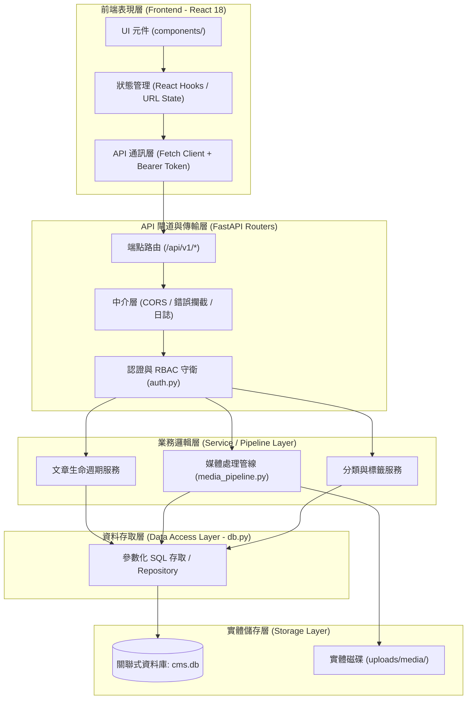

# 系統架構與工程設計規範 (System Architecture & Engineering Design)

> **定位**：定義現代全端系統的高內聚、低耦合軟體架構，引導模組拆分、資料模型設計、認證授權邊界、非同步管線與可擴展性規劃。  
> **適用技術棧**：FastAPI (Python 3.10+)、SQLite / PostgreSQL、React 18 + Vite、RESTful API。  
> **關聯規範**：[`dev-guidelines.md`](file:///c:/Users/TINA/Documents/antigravity/practice/.agents/rules/dev-guidelines.md) | [`spec.md`](file:///c:/Users/TINA/Documents/antigravity/practice/spec.md)

---

## 1. 架構核心原則 (Core Architectural Principles)

1. **分層解耦與單向依賴 (Layered Decoupling & Unidirectional Dependency)**：
   - 上層依賴下層介面，下層嚴禁反向依賴上層實作。
   - 表現層（UI / 路由）不包含商業邏輯；資料存取層不包含 HTTP 或呈現邏輯。
2. **單一職責與領域高內聚 (Single Responsibility & Cohesion)**：
   - 每個模組僅專注單一業務領域（例如：`auth` 專責驗證、`media` 專責影像管線、`articles` 專責內容流轉）。
3. **安全為預設配置 (Secure by Default)**：
   - 零信任架構：端點預設受保護、SQL 查詢預設參數化、資料庫預設啟用外鍵約束、敏感欄位預設脫敏。
4. **契約優先與規格對齊 (Contract-First & Spec-Driven)**：
   - API 契約與 Schema 定義先行（Pydantic Models / DDL），確保前後端可並行開發與自動化測試。

---

## 2. 全端系統分層架構 (Full-Stack Layered Architecture)



### 2.1 各層職責劃分矩陣

| 架構層次 | 負責檔案 / 目錄 | 主要職責 | 嚴格禁止事項 |
| :--- | :--- | :--- | :--- |
| **前端表現層** | `src/components/`, `src/App.jsx` | 渲染 UI、捕獲使用者互動、展示反饋與錯誤 | 直接操作資料庫、寫死後端內部路徑 |
| **API 路由層** | `backend/main.py`, 路由模組 | 接收 HTTP 請求、驗證 Payload、分發給服務層 | 撰寫複雜 SQL、直接進行大檔二進制影像處理 |
| **守衛層 (Guard)** | `backend/auth.py` | JWT 解析、RBAC 角色比對、請求前置驗證 | 承載業務資料更新或副作用邏輯 |
| **業務服務層** | `backend/media_pipeline.py`, 服務檔 | 核心業務規則、狀態機流轉、轉碼管線、交易協調 | 直接依賴 FastAPI `Request` 或 HTTP Response |
| **資料存取層** | `backend/db.py` | 連線池管理、DDL 執行、外鍵強制啟用、CRUD 查詢 | 洩漏 `password_hash`、字串拼接 SQL |
| **持久化儲存層** | `backend/cms.db`, `uploads/` | 資料庫實體檔、圖片衍生物儲存與備份 | 直接對外暴露未經驗證的目錄遍歷存取 |

---

## 3. 資料架構與 Schema 設計準則 (Data Architecture & Schema Design)

### 3.1 關聯式資料庫原則
1. **外鍵約束強制啟用**：
   - 每次建立 SQLite 連線必須確保執行 `PRAGMA foreign_keys = ON;`。
2. **標準審計欄位 (Audit Fields)**：
   - 所有實體資料表皆應包含以下欄位：
     - `created_at DATETIME DEFAULT CURRENT_TIMESTAMP`
     - `updated_at DATETIME DEFAULT CURRENT_TIMESTAMP`
3. **軟刪除 (Soft Delete)**：
   - 核心內容表（如文章表 `articles`）應設計 `deleted_at DATETIME NULL`，避免因誤刪導致資料不可復原。
4. **索引優化策略**：
   - 常用於 `WHERE`、`ORDER BY`、`JOIN` 的欄位（如 `status`、`author_id`、`slug`、`category_id`）建立專用或組合索引。

### 3.2 典型資料模型 DDL 範例

```sql
-- 分類表
CREATE TABLE IF NOT EXISTS categories (
    id INTEGER PRIMARY KEY AUTOINCREMENT,
    name TEXT NOT NULL UNIQUE,
    slug TEXT NOT NULL UNIQUE,
    parent_id INTEGER NULL REFERENCES categories(id) ON DELETE SET NULL,
    sort_order INTEGER DEFAULT 0,
    created_at DATETIME DEFAULT CURRENT_TIMESTAMP
);

-- 文章主表
CREATE TABLE IF NOT EXISTS articles (
    id INTEGER PRIMARY KEY AUTOINCREMENT,
    title TEXT NOT NULL,
    slug TEXT NOT NULL UNIQUE,
    summary TEXT,
    content TEXT NOT NULL,
    status TEXT NOT NULL CHECK(status IN ('draft', 'pending', 'scheduled', 'published', 'trash')),
    author_id INTEGER NOT NULL REFERENCES users(id) ON DELETE CASCADE,
    category_id INTEGER REFERENCES categories(id) ON DELETE SET NULL,
    published_at DATETIME NULL,
    scheduled_at DATETIME NULL,
    deleted_at DATETIME NULL,
    created_at DATETIME DEFAULT CURRENT_TIMESTAMP,
    updated_at DATETIME DEFAULT CURRENT_TIMESTAMP
);

-- 索引宣告
CREATE INDEX IF NOT EXISTS idx_articles_status ON articles(status);
CREATE INDEX IF NOT EXISTS idx_articles_author ON articles(author_id);
CREATE INDEX IF NOT EXISTS idx_articles_slug ON articles(slug);
```

---

## 4. 認證、授權與安全邊界 (Security & RBAC Architecture)

### 4.1 角色職權矩陣 (Role-Based Access Control)

系統嚴格遵循最小權限原則（Principle of Least Privilege）：

| 權限項目 | `super_admin` (管理員) | `editor` (主編) | `author` (專欄作者) | `proofreader` (校對員) |
| :--- | :---: | :---: | :---: | :---: |
| **使用者與權限管理** | 全權操作 | 僅檢視 | 無權限 | 無權限 |
| **分類與全域標籤** | 增刪改查 | 增刪改查 | 僅檢視 | 僅檢視 |
| **個人文章與草稿** | 增刪改查 | 增刪改查 | 增刪改查 | 僅檢視並加註意見 |
| **他人文章發佈/審核** | 可審核發佈 | 可審核發佈 | 無權限 | 僅可標記校對狀態 |
| **媒體庫資產上傳** | 全部權限 | 全部權限 | 僅限本人資產 | 僅限預覽與插入 |
| **直接發布至前台** | 允許 | 允許 | 須送審 (Pending) | 禁止 |

### 4.2 水平越權 (IDOR) 防護架構
- 任何針對特定資源的修改或刪除動作，必須於服務層比對擁有者：
  ```python
  def verify_resource_ownership(resource_owner_id: int, current_user: dict):
      if current_user["role"] == "super_admin":
          return True
      if resource_owner_id != current_user["id"]:
          raise HTTPException(
              status_code=403,
              detail={"code": 403, "error": "FORBIDDEN", "message": "無權限存取或修改他人專屬資源"}
          )
      return True
  ```

---

## 5. 架構決策紀錄 (Architectural Decision Record, ADR) 範本

當架構發生重大演進（例如：引進新的快取機制、更換資料庫、重構狀態流轉）時，應建立 ADR：

```markdown
# ADR-00X: [決策標題，例如：引進 WebP 衍生影像儲存管線]

## 狀態 (Status)
提議中 (Proposed) / 已採納 (Accepted) / 已廢棄 (Deprecated)

## 背景與問題脈絡 (Context)
說明目前遭遇的架構瓶頸、效能挑戰或業務需求。

## 決策方案 (Decision)
明確說明採納的方案，包含架構分層、通訊協定、相依套件與資料結構變更。

## 方案權衡 (Consequences)
- **正面效益 (Pros)**：例如：首屏載入時間減少 60%、頻寬節省 70%。
- **負面代價 (Cons)**：例如：伺服器上傳時 CPU 負擔略微增加、需額外磁碟空間存放縮圖。
```

---

## 6. 架構檢核與驗收清單 (Architecture Checklist)

- [ ] 是否滿足高內聚、低耦合？路由層是否不含龐雜商業邏輯？
- [ ] 資料庫連線是否強制啟用外鍵約束 (`PRAGMA foreign_keys = ON`)？
- [ ] API 設計是否遵循 `/api/v1` 前綴與標準 JSON 回應包裝？
- [ ] 涉及資源修改與查詢時，是否包含 IDOR 水平越權校驗？
- [ ] 密碼雜湊是否採用具備 Salt 的高強度演算法（如 PBKDF2/Argon2），且絕對不外洩？
- [ ] 靜態資產與大檔處理是否具備非同步或專用 Pipeline 分離？
