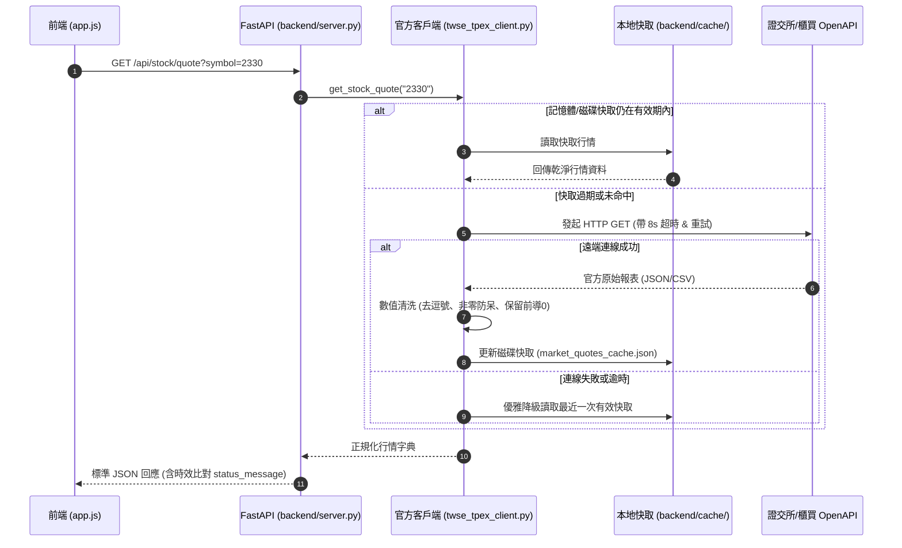

# 全端 API 整合與通訊規範 (Backend Integration Guidelines)

> **定位**：規範前後端通訊協定、RESTful 端點介面契約、外部官方金融 OpenAPI 介接、逾時重試防護與強固的數值清洗管線。  
> **適用技術棧**：Python FastAPI、Uvicorn、`urllib.request` / `requests`、`pytz`、Pydantic、原生 Fetch API。  
> **關聯規範**：[`dev-guidelines.md`](file:///c:/Users/TINA/Documents/antigravity/practice/.agents/rules/dev-guidelines.md) | [`architecture`](file:///c:/Users/TINA/Documents/antigravity/practice/.agents/skills/architecture/SKILL.md)

---

## 1. 通訊核心架構與序列流程 (Communication Architecture)



---

## 2. API 端點契約規格 (RESTful Endpoints)

所有後端商業 API 一律以 `/api` 為前綴，提供以下核心端點：

### 2.1 服務健康狀態
- **`GET /`**：
  回傳服務連線狀態與 `Asia/Taipei` 當前時間，供前端即時檢測後端在線狀態。

### 2.2 單檔即時行情查詢
- **`GET /api/stock/quote?symbol={code}`**：
  - **參數**：`symbol`（字串，必填，如 `"0050"`, `"2330"`, `"00679B"`）。
  - **回應**：代碼、名稱、收盤價、漲跌價差、成交量、資料來源、實際交易日與日曆比對狀態。

### 2.3 批次行情查詢
- **`GET /api/stocks/batch?symbols={code1,code2,...}`**：
  - **參數**：`symbols`（以逗點分隔的股票代碼字串）。
  - **回應**：`{ data: [ Quote, Quote, ... ] }`。

### 2.4 30 個營業日真實歷史與指標
- **`GET /api/stock/history?symbol={code}`**：
  - **回應**：
    ```json
    {
      "symbol": "2330",
      "total_days": 26,
      "history": [ { "date": "2026-09-01", "close_price": 234.5, "change": -8.0, "volume": 129835537 } ],
      "indicators": {
        "ma5": 2559.0,
        "ma20": 2480.5,
        "high_30": 2600.0,
        "low_30": 2320.0,
        "bias_5": -0.35,
        "bias_20": 2.80
      }
    }
    ```

### 2.5 官方市場交易日曆
- **`GET /api/market/calendar`**：
  回傳今日是否為營業日、應有最新交易日（考慮 13:30 收盤時段）與國定假日清單。

---

## 3. 數據清洗與強固防呆規範 (Data Cleaning Guidelines)

> [!IMPORTANT]
> 外部資料不可信，所有進入系統之字串與價格必須通過以下防呆函式處理：

```python
def clean_price_val(val: Any) -> Optional[float]:
    """
    清洗收盤價格字串：
    1. 去除千分位逗號 ',' 與前後空白
    2. 若值為 None, '--', '-', 'null', '' 則必須回傳 None
    3. 成交價 <= 0 且成交量為 0 時，回傳 None（嚴禁轉為 0.0！）
    """
    if val is None:
        return None
    s = str(val).strip().replace(",", "")
    if not s or s in ("--", "-", "null", "None", ""):
        return None
    try:
        f = float(s)
        if f <= 0:
            return None
        return round(f, 2)
    except (ValueError, TypeError):
        return None
```

---

## 4. 外部連線韌性與防護準則 (Connection Resilience)

1. **嚴格配置逾時（Timeout）**：任何外部 HTTP 請求必須設定 `timeout = 8` 秒，嚴禁無限制等待導致執行緒卡死。
2. **指數退避重試（Retry）**：配置最多 3 次重試，每次間隔具備抖動（Jitter）。
3. **離線快取防線（Local Cache Fallback）**：
   - 抓取成功時將結果寫入 `backend/cache/market_quotes_cache.json`。
   - 若官方 API 連線中斷或遭遇 HTTP 429 / 503，自動讀取本地快取並標記 `is_cached = True`，維持系統可用性。
4. **CORS 全面放行（Development）**：配置 `CORSMiddleware` 允許本地 `http://localhost:*` 與靜態預覽請求。

---

## 5. 後端整合檢核清單 (Backend Integration Checklist)

- [ ] **代碼保留前導零**：所有 API 參數與回傳結構中，`symbol` 均以 `str` 傳遞。
- [ ] **非零價格守門**：遇到休市或無成交時，收盤價回傳 `None` 而非 `0`。
- [ ] **時區標準一致**：所有交易日判定與抓取時間均帶有 `Asia/Taipei` 時區標註。
- [ ] **單元測試通過**：`py backend/test_suite.py` 8 項端對端連線測試 100% 通過。
