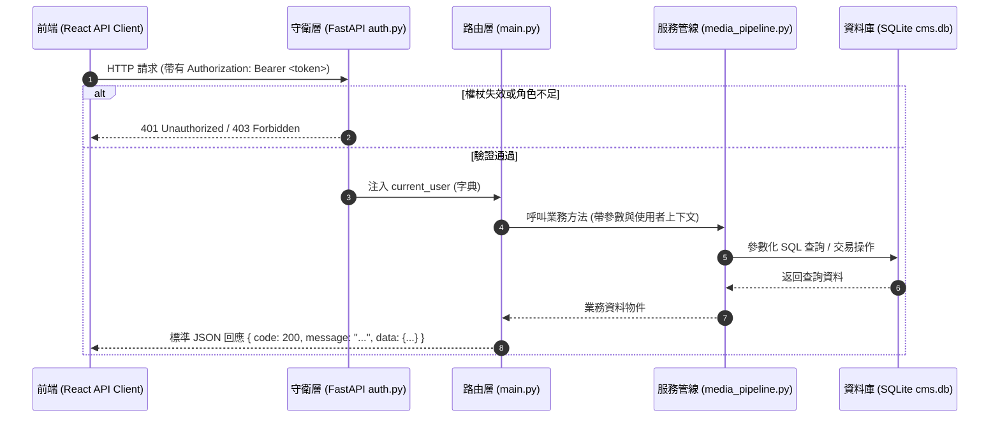

# 全端 API 整合與通訊規範 (Backend Integration Guidelines)

> **定位**：規範前後端通訊協定、RESTful 介面契約、JWT 鑑權傳遞、二進制多媒體檔案管線以及強固的非同步錯誤防護。  
> **適用技術棧**：FastAPI (Python)、Pydantic v2、原生 Fetch API / Axios、Pillow 影像處理。  
> **關聯規範**：[`dev-guidelines.md`](file:///c:/Users/TINA/Documents/antigravity/practice/.agents/rules/dev-guidelines.md) | [`architecture`](file:///c:/Users/TINA/Documents/antigravity/practice/.agents/skills/architecture/SKILL.md)

---

## 1. 通訊核心協議與契約規範 (API Contract & Protocols)



### 1.1 路由前綴與命名
- 所有 API 端點一律以 `/api/v1` 為起點。
- 採用名詞複數與 RESTful 標準動詞：
  - `GET /api/v1/articles`：分頁查詢文章清單
  - `POST /api/v1/articles`：建立新文章
  - `GET /api/v1/articles/{id}`：獲取指定文章詳情
  - `PATCH /api/v1/articles/{id}`：局部更新文章欄位
  - `DELETE /api/v1/articles/{id}`：刪除（或軟刪除）文章

### 1.2 統一回應資料格式
1. **成功回應（HTTP 200 / 201）**：
   ```json
   {
     "code": 200,
     "message": "文章已成功更新",
     "data": {
       "id": 42,
       "title": "深度剖析現代全端架構",
       "status": "published",
       "updated_at": "2026-09-12T10:00:00Z"
     }
   }
   ```
2. **錯誤回應（HTTP 4xx / 5xx）**：
   ```json
   {
     "code": 404,
     "error": "RESOURCE_NOT_FOUND",
     "message": "查無指定的媒體檔案或您無權限檢視"
   }
   ```

---

## 2. 前端通訊層封裝 (Frontend Client Architecture)

前端應封裝單一 `apiClient` 模組，統一處理驗證標頭與錯誤攔截：

```javascript
// src/api/client.js
const API_BASE_URL = import.meta.env.VITE_API_URL || 'http://localhost:8000';

export async function request(endpoint, options = {}) {
  const token = localStorage.getItem('auth_token');
  const headers = {
    'Content-Type': 'application/json',
    ...(token ? { 'Authorization': `Bearer ${token}` } : {}),
    ...options.headers,
  };

  // 若為 FormData (如檔案上傳)，移除 Content-Type 讓瀏覽器自動填寫 boundary
  if (options.body instanceof FormData) {
    delete headers['Content-Type'];
  }

  const config = {
    ...options,
    headers,
  };

  try {
    const res = await fetch(`${API_BASE_URL}${endpoint}`, config);
    const result = await res.json().catch(() => ({}));

    if (!res.ok) {
      if (res.status === 401) {
        localStorage.removeItem('auth_token');
        window.dispatchEvent(new CustomEvent('auth:expired'));
      }
      throw new Error(result.message || `請求失敗 (${res.status})`);
    }

    return result.data;
  } catch (err) {
    console.error(`[API Error] ${endpoint}:`, err);
    throw err;
  }
}
```

---

## 3. 後端端點實作規範 (FastAPI Standards)

### 3.1 Pydantic 模型驗證與防禦
```python
from pydantic import BaseModel, Field, HttpUrl
from typing import Optional, List

class ArticleCreateRequest(BaseModel):
    title: str = Field(..., min_length=2, max_length=150, description="文章標題")
    slug: str = Field(..., pattern=r'^[a-z0-9-]+$', description="URL 友好代稱")
    summary: Optional[str] = Field(None, max_length=500)
    content: str = Field(..., min_length=1, description="正文內容")
    category_id: Optional[int] = None
    tag_ids: List[int] = Field(default_factory=list)
```

### 3.2 參數化查詢與資料脫敏 (Sanitization)
```python
@router.get("/api/v1/users/me")
def get_current_user_profile(user: dict = Depends(get_current_user)):
    # 嚴格確保 password_hash 不會回傳
    safe_user = {k: v for k, v in user.items() if k != "password_hash"}
    return {
        "code": 200,
        "message": "取得個人資訊成功",
        "data": safe_user
    }
```

---

## 4. 媒體檔案上傳管線 (Multipart Pipeline)

上傳檔案絕不可依賴副檔名或客戶端宣告的 `Content-Type`，必須檢核 Magic Number：

```python
# 支援的魔術前導位元組 (Magic Bytes)
MAGIC_SIGNATURES = {
    b'\xFF\xD8\xFF': 'image/jpeg',
    b'\x89PNG\r\n\x1a\n': 'image/png',
    b'RIFF': 'image/webp',
    b'GIF87a': 'image/gif',
    b'GIF89a': 'image/gif',
}

def validate_magic_bytes(file_bytes: bytes) -> str:
    for magic, mime in MAGIC_SIGNATURES.items():
        if file_bytes.startswith(magic):
            return mime
    raise HTTPException(
        status_code=400,
        detail={"code": 400, "error": "INVALID_FILE_TYPE", "message": "檔案格式不合法或被偽造"}
    )
```

### 影像管線處理步驟：
1. **大小檢驗**：單檔限制 ≤ 20MB。
2. **Magic Bytes 檢核**：通過才進入 Pillow 處理。
3. **EXIF 轉向校正**：執行 `ImageOps.exif_transpose(img)` 修正手機翻轉問題。
4. **自動產生 WebP 衍生檔**：
   - 原圖備份：`raw_<uuid>.<ext>`
   - 主圖：品質 85% WebP
   - 中圖：寬度最高 1200px 之 WebP
   - 縮圖：400x400 正方形裁切之 WebP

---

## 5. 整合與串接檢核清單 (Integration Checklist)

- [ ] 所有請求標頭在已登入狀態下是否均帶有 `Authorization: Bearer <token>`？
- [ ] 遭遇 `401 Unauthorized` 時，前端是否能優雅清除 Token 並跳轉至登入視圖？
- [ ] 後端所有端點是否均使用 Pydantic 進行輸入參數與型別驗證？
- [ ] 後端 SQL 查詢是否 100% 採用 `?` 佔位符，杜絕 SQL 注入？
- [ ] 檔案上傳是否具備 Magic Bytes 驗證與 20MB 大小上限防護？
- [ ] 任何回傳使用者資訊的 API 是否均徹底移除 `password_hash`？
