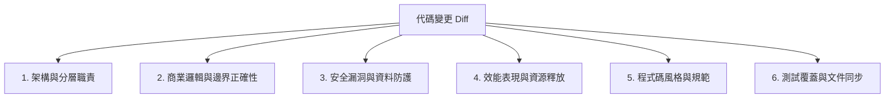

# 程式碼審查與品質把關指南 (Code Review Guidelines)

> **定位**：建立高標準、具建設性且聚焦於架構韌性與資安防護的代碼審查標準，確保進入主分支的每行程式碼皆符合生產級品質。  
> **適用範疇**：Pull Requests (PR)、重構變更審查、安全性 Audit 與全端架構評估。  
> **關聯規範**：[`coding-standards`](file:///c:/Users/TINA/Documents/antigravity/practice/.agents/skills/coding-standards/SKILL.md) | [`dev-guidelines.md`](file:///c:/Users/TINA/Documents/antigravity/practice/.agents/rules/dev-guidelines.md)

---

## 1. 審查核心哲學 (Review Philosophy)

1. **建設性大於批判性 (Constructive over Critical)**：
   - 審查的目標是提升團隊代碼品質與分享知識，而非指責。提出問題時必須附帶**具體的修改建議或代碼範例**。
2. **安全與架構一票否決 (Security & Architecture Zero-Tolerance)**：
   - 任何涉及 SQL 注入風險、IDOR 越權漏洞、敏感憑證外洩或嚴重破壞分層架構的變更，一律列為 `[BLOCKER]`，未修復前禁止合併。
3. **客觀標準高於個人偏好 (Standards over Personal Taste)**：
   - 排版與命名應依據專案規範（如 `coding-standards`），若屬個人主觀偏好應標記為 `[NIT]`，不阻礙功能上線。

---

## 2. 六大審查維度矩陣 (The 6 Review Dimensions)



### 2.1 維度清單與檢核要點

| 維度 | 檢核重點 | 常見缺失與地雷 |
| :--- | :--- | :--- |
| **1. 架構與設計** | 分層是否清晰？路由層有無混合資料庫查詢？是否單向依賴？ | 路由檔直接執行複雜 SQL、業務邏輯散落於 UI 元件 |
| **2. 功能正確性** | 是否滿足需求規格（PRD/Spec）？邊界狀態（空資料、超長文字）是否處理？ | 漏接非同步例外、空陣列引發 undefined 崩潰 |
| **3. 安全防護** | 是否有 SQL 注入？是否有水平越權 (IDOR)？有無洩漏 `password_hash`？ | 使用 `f-string` 拼接 SQL、修改他人文章未校驗 `user_id` |
| **4. 效能與資源** | 有無 N+1 查詢？React 有無不必要之重複渲染？計時器與連線有無關閉？ | `useEffect` 依賴宣告不當導致無窮迴圈、忘記呼叫 `clearTimeout` |
| **5. 代碼風格** | 命名是否語意化？有無深層巢狀 `if...else`？中英文有無保留空格？ | 命名單字母 `x, d, temp`、中英字元未空半形空格 |
| **6. 測試與文件** | 是否更新了對應階段的測試腳本？`todo.md` 與 `spec.md` 是否同步？ | 新增功能但測試集未覆蓋、文件與代碼脫節 |

---

## 3. 審查反饋等級標籤 (Feedback Severity Levels)

提供 Review 反饋時，應使用標準等級前綴：

- `[BLOCKER]`：**阻斷性缺陷**。安全漏洞、編譯失敗、破壞現有核心功能。必須修正才能核准合併。
  - *範例*：`[BLOCKER] 此處使用 f"SELECT * FROM users WHERE id = {user_id}" 存在嚴重的 SQL 注入風險，請改用參數化查詢佔位符 ?。`
- `[WARNING]`：**潛在風險**。可能導致記憶體洩漏、極端條件下崩潰或效能低落。強烈建議在合併前處理。
  - *範例*：`[WARNING] 此 useEffect 監聽事件未於 Cleanup 函式中 removeEventListener，可能造成元件卸載後的記憶體洩漏。`
- `[SUGGESTION]`：**優化建議**。可提升可讀性、擴展性或維護性的替代方案。
  - *範例*：`[SUGGESTION] 此處的五層巢狀 if 可以改用 Early Return 守衛模式簡化。`
- `[NIT]`：**微小細節**。錯別字、中英文盤古之白間距、非關鍵命名調整。不阻擋合併。
  - *範例*：`[NIT] 註解中英文之間可補上半形空格以符合排版規範。`
- `[PRAISE]`：**優秀實踐**。針對乾淨優雅的架構或巧思給予正面回饋。
  - *範例*：`[PRAISE] 這邊使用 Magic Bytes 二進制驗證檔案頭非常嚴謹且標準！`

---

## 4. 標準代碼審查報告範本 (Code Review Report Template)

進行 Review 總結時，採用此標準格式回覆：

```markdown
## 代碼審查總結 (Code Review Summary)

- **審查目標**：`[PR / 變更主題]`
- **審查結論**：✅ 核准 (Approve) / ⚠️ 建議微調 (Comment) / ❌ 請求修改 (Request Changes)

### 關鍵發現與問題清單

| 等級 | 位置 (檔案:行數) | 問題摘要 | 建議行動 |
| :--- | :--- | :--- | :--- |
| `[BLOCKER]` | `backend/main.py:120` | 未驗證擁有者 ID，存在 IDOR 水平越權漏洞 | 加入 `verify_resource_ownership` 守衛 |
| `[WARNING]` | `src/App.jsx:85` | 非同步請求未包裹 try...catch | 加入例外捕捉並彈出錯誤 Toast |
| `[SUGGESTION]` | `backend/db.py:45` | 多個查詢可合為單一 JOIN 批次拉取 | 優化 SQL 減少連線次數 |

### 程式碼改善建議範例
\`\`\`python
# 建議修改方式
if article["author_id"] != current_user["id"] and current_user["role"] != "super_admin":
    raise HTTPException(status_code=403, detail="無權限修改他人文章")
\`\`\`
```

---

## 5. 審查前提交者自檢清單 (Author Self-Checklist)

在請求他人進行 Code Review 前，提交者必須先完成以下自檢：
- [ ] 本地執行後端測試（`python backend/test_phase1.py` 等）100% 通過。
- [ ] 本地執行前端建構（`npm run build`）無錯誤。
- [ ] 已自我閱讀過所有 Diff，確認無殘留除錯程式碼（如 `console.log`、`print()`、`debugger`）。
- [ ] 無任何未授權硬編碼的金鑰（API Keys、Secrets）或明文密碼。
