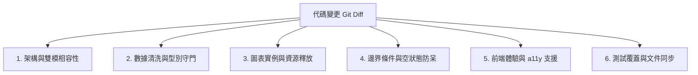

# 程式碼審查與品質把關指南 (Code Review Guidelines)

> **定位**：建立高標準、具建設性且聚焦於金融數據精確度、架構韌性與記憶體釋放的代碼審查標準，確保進入主分支的每行程式碼皆符合生產級品質。  
> **適用範疇**：Pull Requests (PR)、代碼變更 Diff 審查、版本發布前品質把關。  
> **關聯規範**：[`coding-standards`](file:///c:/Users/TINA/Documents/antigravity/practice/.agents/skills/coding-standards/SKILL.md) | [`dev-guidelines.md`](file:///c:/Users/TINA/Documents/antigravity/practice/.agents/rules/dev-guidelines.md)

---

## 1. 審查核心哲學 (Review Philosophy)

1. **建設性大於批判性 (Constructive over Critical)**：
   - 審查的目標是提升團隊代碼品質與分享知識。提出問題時必須附帶**具體的修改建議或代碼範例**。
2. **數據精確度與資安零容忍 (Zero-Tolerance on Data & Security)**：
   - 任何涉及股票前導零被截斷（`0050` 轉為 `50`）、無效價格被誤轉為 `0.0`、或 SQL/API 注入風險的變更，一律列為 `[BLOCKER]`，未修復前禁止合併。
3. **客觀規範高於個人偏好 (Standards over Taste)**：
   - 命名與格式依據 `coding-standards`；非規範強制之主觀偏好標記為 `[NIT]`，不阻礙發布進度。

---

## 2. 六大審查維度矩陣 (The 6 Review Dimensions)



### 2.1 維度清單與紅線檢核

| 維度 | 審查檢核重點 | 一票否決紅線 (BLOCKER) |
| :--- | :--- | :--- |
| **1. 架構相容性** | 確保變更在本地後端與 GitHub Pages 靜態環境皆能正常執行。 | 靜態展示版直接發起跨域外部 API 請求導致 CORS 報錯。 |
| **2. 數據清洗** | 股票代碼型別保護、無效價格處理、千分位清洗。 | 代碼被強制轉型為 `int`；無收盤價被賦值為 `0.0`。 |
| **3. 資源釋放** | Chart.js 畫布在重繪或無資料時必須先執行 `destroy()`。 | 未銷毀舊實例即 `new Chart()`，造成折線圖重疊殘留。 |
| **4. 邊界防呆** | 遇缺少歷史資料、無網路、名單滿額（10檔）之處理。 | 缺少資料時程式直接崩潰拋出 Uncaught Error 或卡死。 |
| **5. 前端與 a11y** | 375px 手機無橫向破版、全鍵盤 Tab 可巡覽、按鈕具備 Toast 反饋。 | 出現水平溢出卷軸；鍵盤焦點不可見；操作無任何反饋。 |
| **6. 測試與同步** | 執行 `backend/test_suite.py` 8 項測試、更新版本號。 | 測試未全數通過；修改 JS 後未遞增快取版號。 |

---

## 3. 審查標籤評級系統 (Review Severity Tags)

在 PR 或 Diff 審查意見中，使用以下標準標籤：

- **`[BLOCKER]` (P0 阻斷)**：嚴重邏輯缺陷、資料失真或架構崩潰風險，**必須修復才可合併**。
- **`[WARN]` (P1 警告)**：潛在效能、無障礙或邊界情境瑕疵，**強烈建議於本期修復**。
- **`[NIT]` (P2 微調)**：命名可讀性、註解文字或微小優化建議，不阻擋發布。
- **`[PRAISE]` (表揚)**：優秀的抽象設計、優雅的防呆或高質感的微互動。

---

## 4. 標準代碼審查報告範本 (Review Report Template)

```markdown
### 程式碼審查報告：[PR 標題 / Commit Hash]
- **審查結論**：[ 批准 (Approved) / ⚠️ 附帶條件批准 / ❌ 請求修改 (Changes Requested) ]
- **測試驗證**：`py backend/test_suite.py` [ 通過 / 未通過 ]

#### 發現問題明細
1. `[BLOCKER]` **backend/export_data.py**: `symbol` 變數在迴圈中被轉為 `int`，導致 `0050` 遺失前導零。
   - *建議修改*：維持 `str(symbol)` 傳遞。
2. `[WARN]` **app.js**: 在切換至無資料個股時未呼叫 `chartInstance.destroy()`，造成前一檔走勢圖殘留。
   - *建議修改*：在 `return` 前加入 `chartInstance.destroy()`。
3. `[NIT]` **index.html**: 搜尋框 placeholder 可補充支援 ETF 代碼範例。
```
