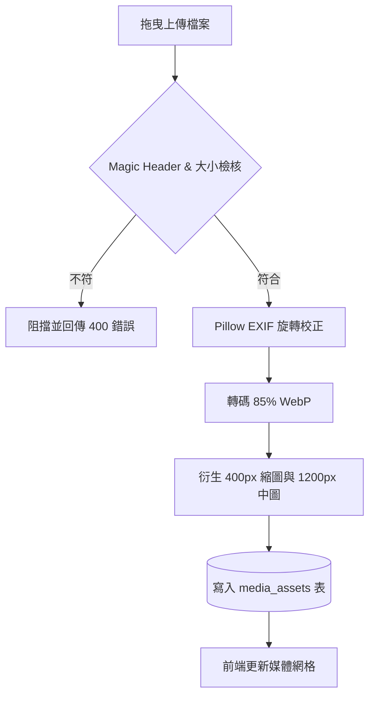

# 產品收斂對話與 PRD 生成實例 (Sample Convergence Dialog & PRD Output)

> **說明**：本範例演示 AI Agent 如何運用本 Skill 的引導心法、漏斗提問與 MoSCoW 剪裁，將使用者一段簡短模糊的訴求，在 3 ~ 4 輪對話中快速收斂，並正式產出企業級 `prd.md`。

---

## 1. 完整對話紀錄 (The Convergence Conversation)

### [Round 1: 初始痛點發散與角色界定]

**使用者**：  
> 「我想在我們的系統裡做一個媒體庫功能，現在大家編輯文章時圖片都亂丟，有的圖 15MB 導致網頁開很慢，而且要找以前用過的圖完全找不到。」

**Agent (PM)**：  
> 收到！這是一個非常普遍但極其影響前台加載體驗與團隊協作效率的痛點。  
> 為了精準收斂第一版（MVP）的範圍，我們先確認核心角色與最大痛點：
> 
> 1. **主要使用者角色**：  
>    在貴團隊中，平時主要是誰會上傳與查找圖片？  
>    - A) 只有少數 2~3 位總編輯/管理員在管圖。  
>    - B) 包含多位外部特約作者，大家各自寫稿、各自上傳。  
>    - C) 全公司所有人都能自由取用與上傳。  
> 
> 2. **最致命的痛點優先級**：  
>    若本期只能先徹底解決一個最大問題，您會選擇：  
>    - 甲) **效能問題**：強制自動壓縮圖檔（例如轉為 WebP），防止大圖拖垮前台速度。  
>    - 乙) **整理問題**：提供資料夾或標籤分類，讓以前傳過的圖能快速被搜到。

---

### [Round 2: 方案解構與邊界探勘]

**使用者**：  
> 「我們主要是 B，有 5 位專欄作者跟 1 位主編。大家權限不同，作者不應該能亂刪別人傳的圖。另外兩個痛點都很致命，但效能絕對是第一順位！常常有人丟數位相機的原始 20MB PNG 上去。」

**Agent (PM)**：  
> 非常清楚！這確立了兩大核心原則：**「強制效能管線」** 與 **「作者與主編的權限隔離」**。  
> 
> 我們來梳理功能規格與極端邊界：
> 
> 1. **影像處理管線 (Pipeline)**：  
>    - 是否同意在後端整合自動轉碼？使用者無論上傳 PNG/JPG/WebP，系統一律自動轉為高畫質 85% 質量的 **WebP**，並自動生成一張 400px 的**列表縮圖 (Thumbnail)**？  
> 2. **資產組織方式**：  
>    - 為了讓作者能分類查找，您傾向：  
>      - A) **輕量虛擬資料夾**（類似 Google Drive，可建資料夾歸類）。  
>      - B) **標籤模式**（為圖片打 Tag，純靠搜尋）。  
> 3. **極端邊界防呆**：  
>    - 若遇到使用者一次拖曳 50 張圖，或上傳非圖片檔（例如偽裝成 jpg 的 exe 或 pdf），系統是否應設定單檔上限 20MB 並以二進制檔頭檢查副檔名真實性？

---

### [Round 3: MVP 剪裁與共識收斂 (The MoSCoW Cut)]

**使用者**：  
> 「自動轉 WebP + 縮圖太棒了！組織方式用虛擬資料夾比較直覺。單檔限制 20MB 很好，但作者希望能批次上傳多張圖，還有最好能在後台直接裁切圖片，不用另外開 Photoshop。」

**Agent (PM)**：  
> 了解！「批次拖曳上傳」與「輕量裁切」對於編輯心流體驗確實很有價值。  
> 
> 為了確保 2 週內能穩定交付，我建議進行 **MoSCoW 邊界裁決**：
> - **Must-Have (P0 - 本期必做)**：  
>   1. 後端 WebP 自動轉碼 (85%) + 400px 縮圖 + Magic Header 20MB 安全檢驗。  
>   2. 虛擬資料夾 CRUD 與樹狀瀏覽。  
>   3. 多圖拖曳批次上傳與即時上傳進度條。  
>   4. 權限隔離：作者僅能刪除/編輯自己上傳的資產，主編可管理全庫。  
>   5. 輕量裁切與旋轉（固定 1:1, 4:3, 16:9 與自由裁切，儲存後自動覆蓋/衍生 WebP）。  
> - **Won't-Have (非本期目標，留待 Phase 3)**：  
>   - ❌ 影片與音訊轉碼（本期嚴格限制 Image 類型）。  
>   - ❌ AI 自動辨識圖像打標籤（避免初期引入高昂 Token 與雲端成本）。  
> 
> 若您認可上述裁決，我將立即為您產出正式的 `prd.md` 規格文件！

**使用者**：  
> 「完全同意！就照這個範圍切，請幫我產出正式 PRD。」

---

## 2. 收斂產出之標準 PRD 成品 (產出示範)

```markdown
# 企業級媒體資產中心與影像管線 (Media Center & Pipeline) PRD

> **版本**：v1.0.0  
> **狀態**：已核准 (Approved)  
> **最後更新**：2026-09-12  

## 1. 產品概述
打造高效能、具備企業級安全防護與自動壓縮轉碼的集中化媒體庫，解決大圖拖慢前台與資產管理混亂之痛點。

## 2. 目標與非目標
- **Goals**：
  - 圖片全面 WebP 化，平均節省 60%~75% 頻寬與儲存空間。
  - 支援多圖拖曳批次上傳與虛擬資料夾階層歸類。
  - 嚴格落實 RBAC 權限邊界（作者 vs 主編）。
- **Non-Goals (Out of Scope)**：
  - 本期不支援影片或音訊檔案處理。
  - 本期暫不整合外部雲端儲存 (S3/GCS)，以本地伺服器儲存為主。

## 3. 核心流程 (Mermaid)


## 4. 功能規格與驗收條件 (Given-When-Then)
### FR-MEDIA-01: 圖片自動轉碼與縮圖衍生
- **驗收條件**：
  ```gherkin
  場景: 上傳高解析度 PNG 相片
    假設 使用者上傳一張 18MB 之 PNG 圖檔
    當 請求送達後端 POST /api/v1/media/upload 端點
    那麼 系統應驗證檔頭合法
    並且 自動轉碼為 quality=85 之 .webp 檔案
    並且 同步生成 400x400 正方形縮圖
    並且 回傳 200 狀態碼與資產 ID 及 URL
  ```
```
