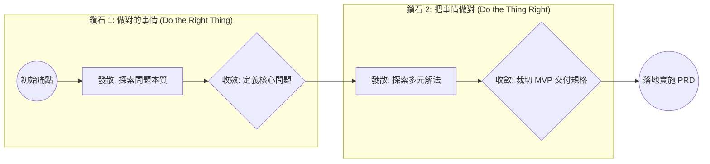

# 產品收斂方法論與邊界防禦指引 (Convergence Framework & Guardrails)

> **定位**：為 AI Agent 提供專業產品經理 (PM) 的決策架構與思維工具，用於在對話中引導使用者收斂產品邊界，防止範疇蠕變 (Scope Creep)，確保產出的 PRD 具備高度可落地性。

---

## 1. 雙鑽石模型實踐 (Double Diamond in Convergence)

產品設計本質是**「發散思考（Divergent Thinking）」**與**「收斂思考（Convergent Thinking）」**的交替迭代：



### 1.1 從鑽石 1 到鑽石 2 的關鍵躍遷
- **常見陷阱**：使用者一開口往往直接拋出「解法」（例如：「我想要一個 AI 一鍵生成 50 篇貼文的功能」）。
- **PM 應對策略**：先退回鑽石 1，探尋原始動機（「為什麼需要 50 篇？目前的瓶頸在產出速度還是題材發想？」），鎖定核心問題後再評估解法。

---

## 2. 5 Whys 需求溯源與本質探勘 (The 5 Whys Technique)

當使用者提出一個龐大、模糊或高成本的需求時，運用連環提問挖掘真相：

```text
[範例情境]
使用者: 「我希望每個用戶都能自訂後台的 30 種顏色與排版版型。」

Agent (第 1 問): 「了解，請問讓用戶自訂色彩與版型的核心情境是什麼？」
-> 使用者: 「因為不同公司的品牌識別色不同，希望能有一致的品牌感。」

Agent (第 2 問): 「明白了，是為了符合企業品牌形象 (White-labeling)。那目前是少數企業 VIP 需要，還是所有人都需要自由微調？」
-> 使用者: 「其實主要是企業版客戶希望在給客戶看的時候放他們自己的 Logo 與主色。」

Agent (第 3 問 - 方案收斂): 「如果是這樣，第一版（MVP）若先提供『上傳企業 Logo + 設定 1 個品牌主強調色』，是否就能解決 80% 的客製化品牌訴求，而無需開發複雜的 30 種元件色彩編輯器？」
-> 使用者: 「沒錯！這樣就很夠了，還能大幅提早兩週上線！」
```

---

## 3. Walking Skeleton（行走的骨架）MVP 剪裁法

在劃分 MVP（最小可行性產品）時，切忌「切片式交付（水平半成品）」，必須採用**「垂直貫穿式交付」**：

### ❌ 錯誤的切法（水平切片）
- 第一階段：把 10 個模組的 UI 全部刻完，但點擊都不會動、沒有後端連線。
- 第二階段：開始寫 API，但資料庫沒辦法持久化。
- **結果**：直到最後一刻前，沒有任何功能可以真實體驗。

### ✅ 正確的切法（Walking Skeleton 垂直貫穿）
- **挑選一條核心價值主線 (Golden Path)**：例如「登入 → 建立草稿 → 發布文章 → 前台讀者看見」。
- 該主線涵蓋「前端 UI + API 閘道 + 商業邏輯 + 資料庫持久化」，哪怕其他進階功能（AI、排程、批次匯出）全部先不做。
- **好處**：第一天就能端到端測試，架構風險最早暴露，驗收反饋週期極短。

---

## 4. MoSCoW 裁決量化指標 (Objective MoSCoW Matrix)

在與使用者爭論功能優先順序時，使用客觀評估維度：

```text
得分公式: 優先級權重 = (商業價值 × 3 + 使用頻率 × 2) / (技術複雜度 × 2 + 外部相依性)
```

| 優先級標籤 | 判定條件 | 處理準則 |
| :--- | :--- | :--- |
| **Must-Have (P0)** | - 核心價值鏈缺少此環節則中斷<br>- 牽涉資料安全或法律合規<br>- 無任何可接受的臨時替代方案 | 納入本期 Sprint，延遲交付亦不可犧牲。 |
| **Should-Have (P1)** | - 高頻高價值痛點<br>- 有手動或折衷替代方案（Workaround）但體驗不佳 | 若時程允許即納入，時程吃緊時優先降級為手動處理。 |
| **Could-Have (P2)** | - 低頻使用或僅少數極客用戶需要<br>- 美化修飾性功能 | 僅在開發速度超前時執行，否則放入儲備清單。 |
| **Won't-Have (P3)** | - 與本階段目標無直接因果關係<br>- 高成本、高不確定性、需要進一步市場驗證 | 明確記錄於 PRD「Non-Goals」與 Roadmap 中。 |

---

## 5. 邊界防禦與極端情境檢核矩陣 (Boundary Defense Matrix)

在收斂功能的最後階段，Agent 必須主動盤點以下 5 大維度的邊界漏洞：

| 邊界維度 | 典型極端情境 (Edge Cases) | 標準防呆處置原則 |
| :--- | :--- | :--- |
| **1. 初始空狀態 (Empty State)** | 首次安裝無任何文章、分類或媒體資產 | 提供友善插圖、說明文案與「一鍵注入示範資料」按鈕。 |
| **2. 資料極限值 (Extreme Values)** | 標題輸入 5,000 字、單次上傳 2GB 壓縮檔、同時勾選 10,000 筆資料 | 限制輸入字元長度、客戶端即時驗證、大檔分片或阻擋、分頁器（Pagination）。 |
| **3. 網絡與逾時 (Network Latency)** | 使用者點擊儲存後立即斷網、API 回應超過 15 秒 | 請求超時中斷、樂觀更新 (Optimistic UI) 失敗回滾、本地快取離線存檔。 |
| **4. 並發與防重 (Concurrency & Duplication)** | 連續快速點擊按鈕 5 次、多人同時間修改同一份檔案 | 按鈕 Disable 與 Loading 態、Debounce/Throttle、版本號樂觀鎖 (Optimistic Locking)。 |
| **5. 存取越權 (Security & Authorization)** | 一般作者竄改 URL 中的 `id` 嘗試編輯他人稿件 | 後端 API 守衛檢查 `author_id == current_user.id`，回傳 403 Forbidden。 |
