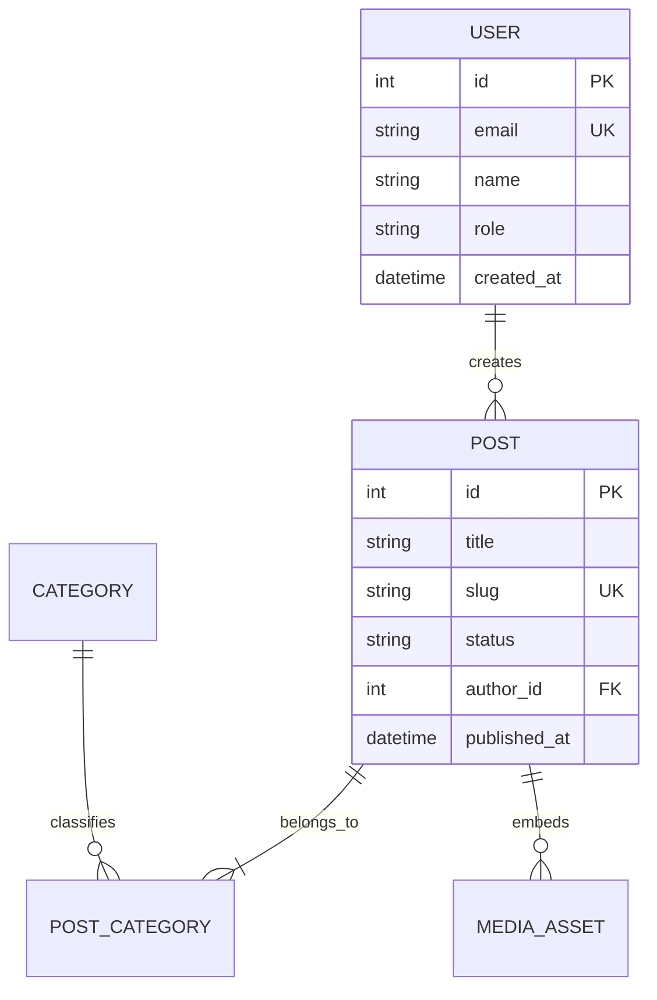

# [專案/產品名稱] 產品需求文件 (PRD.md)

> **版本**：v1.0.0  
> **文件狀態**：[草稿 (Draft) / 評審中 (In Review) / 已核准 (Approved)]  
> **負責人 / PM**：[產品負責人姓名]  
> **最後更新**：YYYY-MM-DD  
> **關聯規格**：[spec.md / 架構設計文件]

---

## 1. 產品概述與核心價值 (Product Overview & Value Proposition)

### 1.1 背景與問題陳述 (Problem Statement)
- **現況痛點**：[目前使用者面臨什麼問題？為何現有機制無法滿足？]
- **影響範圍**：[此問題影響了哪些族群？造成了多少效率損失或商業成本？]

### 1.2 產品願景與價值主張 (Vision & Value Proposition)
- **產品一句話定位**：[這是一個專為【目標受眾】設計的【產品類型】，能夠實現【核心價值】。]
- **核心價值主張 (JTBD - Jobs To Be Done)**：
  1. **[價值點 1]**：[描述]
  2. **[價值點 2]**：[描述]

---

## 2. 目標與成功指標 (Goals & Metrics)

### 2.1 專案目標 (In-Scope Goals)
- [ ] 目標 1：[可衡量的業務或體驗目標]
- [ ] 目標 2：[例如：首屏載入時間 < 1.5s，縮短發稿流程 50%]

### 2.2 明確非本期目標 (Non-Goals / Out of Scope)
> [!IMPORTANT]
> 為了確保 MVP 敏捷落地，以下項目明確**不在**本階段交付範圍內：
- ❌ **[非目標 1]**：[原因說明，例如：多語系切換將留待 Phase 2]
- ❌ **[非目標 2]**：[例如：第三方支付串接暫不支援]

### 2.3 成功衡量指標 (Success Metrics / KPIs)
| 指標名稱 | 定義與計算方式 | 目前基準 (Baseline) | 目標值 (Target) |
| :--- | :--- | :--- | :--- |
| **任務完成率** | 成功完成發布的使用者比例 | -- | > 90% |
| **平均耗時** | 從建立草稿到發布的平均分鐘數 | 25 分鐘 | < 10 分鐘 |

---

## 3. 使用者角色與畫像 (Personas & User Roles)

| 角色名稱 | 角色代碼 | 使用情境與主要職責 | 關鍵訴求 / 痛點 | 權限邊界 |
| :--- | :--- | :--- | :--- | :--- |
| **超級管理員** | `super_admin` | 全系統維運與權限配置 | 系統穩定、無資安外洩風險 | 全站最高權限 |
| **主要使用者** | `editor` | 日常核心業務操作 | 效率高、操作防呆、自動存檔 | 模組讀寫、審核發布 |
| **訪客 / 讀者** | `guest` | 前台公開檢視 | 載入迅速、易讀、美觀 | 僅公開資源唯讀 |

---

## 4. 使用者旅程地圖與流程圖 (User Journey & Flowchart)

```mermaid
graph TD
    Start([使用者訪問系統]) --> AuthCheck{是否已登入？}
    AuthCheck -- 否 --> Login[登入 / 註冊頁面]
    AuthCheck -- 是 --> Dashboard[核心功能儀表板]
    
    Dashboard --> ActionStep[執行核心操作 (例如: 建立內容/上傳資產)]
    ActionStep --> Validation{資料與邊界檢核}
    Validation -- 失敗 --> ErrorPrompt[給予即時微反饋與修正提示]
    ErrorPrompt --> ActionStep
    Validation -- 通過 --> Commit[儲存並觸發業務狀態流轉]
    Commit --> Finish([完成主要目標 / 顯示成功狀態])
```

---

## 5. 功能規格與 MoSCoW 優先順序 (Feature Matrix)

### 5.1 MoSCoW 優先等級劃分
- **Must-Have (P0 - MVP 核心)**：第一版上線不可或缺。
- **Should-Have (P1 - 重要體驗)**：極具價值，次版優先支援。
- **Could-Have (P2 - 體驗增強)**：資源充裕時支援。
- **Won't-Have (P3 - 明確排除)**：記錄於 Roadmap 未來評估。

| 模組名稱 | 功能項目 | 優先級 | 簡述與商業價值 | 關聯 FR 代碼 |
| :--- | :--- | :---: | :--- | :--- |
| **認證模組** | JWT 登入與角色檢查 | **P0** | 確保系統資料安全與存取邊界 | `FR-AUTH-01` |
| **核心模組** | 核心業務 CRUD | **P0** | 提供最基礎運作能力 | `FR-CORE-01` |
| **輔助模組** | 批次操作與匯出 | **P1** | 提高重度使用者操作效率 | `FR-AUX-01` |

---

## 6. 詳細功能規格與驗收標準 (Functional Requirements & Acceptance Criteria)

### 模組 1：[模組名稱，例如：文章內容管理]

#### FR-01: [功能名稱，例如：草稿即時自動儲存]
- **功能描述**：[詳細說明功能預期行為]
- **輸入規則與限制**：
  - 欄位 A：必填，1 ~ 100 字元。
  - 欄位 B：選填，格式必須符合 Email 規範。
- **防呆與極端情境 (Edge Cases)**：
  - 斷網處理：若發送請求時斷網，本地快取暫存並顯示「連線中斷，已暫存於瀏覽器」。
  - 超長文字：標題超過限制時即時紅色邊框提示並阻擋提交。
- **驗收準則 (Gherkin AC)**：
  ```gherkin
  場景: 編輯中自動觸發背景儲存
    假設 使用者已登入並處於編輯頁面
    當 使用者連續停止打字超過 3 秒鐘
    並且 內容與前次儲存版本有差異
    那麼 系統應自動向後端發送儲存請求
    並且 畫面右上角應顯示「已儲存於 14:20:05」微提示
  ```

---

## 7. 非功能性需求 (Non-Functional Requirements)

1. **效能要求 (Performance)**：
   - 首頁首屏時間 (FCP) < 1.2 秒；關鍵 API 回應時間 (P95) < 300ms。
2. **安全性要求 (Security)**：
   - 密碼採用加鹽雜湊 (PBKDF2/Bcrypt)；敏感操作需驗證權杖；防範 XSS、CSRF 與 SQL 注入。
3. **可用性與無障礙 (Usability & a11y)**：
   - 符合 WCAG 2.1 AA 對比度標準；支援鍵盤 Tab 焦點導航；提供深淺雙色主題適配。
4. **瀏覽器相容性 (Compatibility)**：
   - 支援 Chrome、Edge、Safari 與 Firefox 最新兩代主流版本；自適應手機 (375px+)、平板與桌面螢幕。

---

## 8. 領域模型與資料實體初稿 (Data Model Draft)



---

## 9. 發布與里程碑規劃 (Milestones & Roadmap)

| 里程碑 | 目標階段 | 核心交付成果 | 預估時程 |
| :--- | :--- | :--- | :--- |
| **M1** | 核心骨架 (Walking Skeleton) | 資料庫 Schema、認證守衛、基礎 CRUD API | Week 1 |
| **M2** | MVP 核心功能完工 | 前端主介面、核心互動與狀態機串接 | Week 2 |
| **M3** | 驗收與防呆拋光 | UX/a11y 檢核、極端邊界測試、效能優化 | Week 3 |
