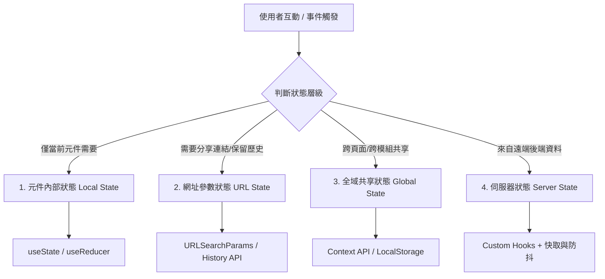

# 前端狀態架構與資料流規範 (State Management Guidelines)

> **定位**：規範 React 18 現代前端架構中的狀態分類、流轉原則、生命週期控制與效能最佳化，消除狀態不同步、冗餘渲染與資料競爭（Race Conditions）。  
> **適用技術棧**：React 18 (Hooks, Context API, Reducer)、瀏覽器 Web Storage、URL Search Params。  
> **關聯規範**：[`dev-guidelines.md`](file:///c:/Users/TINA/Documents/antigravity/practice/.agents/rules/dev-guidelines.md) | [`ui-design`](file:///c:/Users/TINA/Documents/antigravity/practice/.agents/skills/ui-design/SKILL.md)

---

## 1. 狀態管理核心思維 (Core Philosophies)



1. **狀態最小化與避免衍生狀態 (Minimal State & No Redundant State)**：
   - 凡是可以透過現有 Props 或 State 即時計算出的值（如篩選後的清單長度、總金額、是否全選），**嚴禁存入另一個 State**，應使用計算屬性或 `useMemo`。
2. **單一事實來源 (Single Source of Truth)**：
   - 狀態的持有者必須是最靠近所有需要該狀態的「共同父元件」或「專屬服務層」，杜絕多份拷貝並行維護。
3. **URL 作為導航與篩選的單一事實來源**：
   - 包含搜尋關鍵字、分頁碼、分類篩選、狀態 Tab、編輯模式 ID 等，必須優先同步於 URL Search Params，確保頁面重整、書籤收藏與瀏覽器上一頁/下一頁行為完全一致。
4. **不可變性 (Immutability)**：
   - 更新陣列或物件狀態時，必須回傳全新參照（如 `[...prev, newItem]`、`{ ...prev, [key]: value }`），嚴禁直接使用 `list.push()` 或 `obj.x = y`。

---

## 2. 狀態分層與實踐模式 (State Hierarchy & Patterns)

### 2.1 本次元件狀態 (Local State - `useState` & `useReducer`)
- **適用場景**：彈出視窗開關（`isOpen`）、輸入欄位臨時值、摺疊面板展開狀態、上傳進度條。
- **複雜邏輯推薦 `useReducer`**：當狀態包含多個子欄位且變更具備明確動作模式時，使用 Reducer 保持狀態機的確定性：

```javascript
const initialState = { status: 'idle', data: null, error: null };

function dataReducer(state, action) {
  switch (action.type) {
    case 'FETCH_START':
      return { ...state, status: 'loading', error: null };
    case 'FETCH_SUCCESS':
      return { status: 'success', data: action.payload, error: null };
    case 'FETCH_ERROR':
      return { status: 'error', data: null, error: action.payload };
    default:
      return state;
  }
}
```

### 2.2 網址狀態同步 (URL State Syncing)
管理文章狀態切換（`status=draft`）、搜尋（`q=keyword`）與分頁（`page=1`）時，透過 URL 控制元件：

```javascript
// 封裝 URL 查詢同步 Hook
function useQueryState(key, defaultValue) {
  const [value, setValue] = useState(() => {
    const params = new URLSearchParams(window.location.search);
    return params.get(key) || defaultValue;
  });

  const updateValue = useCallback((newValue) => {
    setValue(newValue);
    const params = new URLSearchParams(window.location.search);
    if (newValue) {
      params.set(key, newValue);
    } else {
      params.delete(key);
    }
    const newUrl = `${window.location.pathname}?${params.toString()}`;
    window.history.replaceState({}, '', newUrl);
  }, [key]);

  return [value, updateValue];
}
```

### 2.3 伺服器狀態與快取 (Server State & Cache)
- **樂觀更新 (Optimistic UI)**：在使用者點擊讚、刪除標籤或切換啟用狀態時，先在 UI 上立即反映更新，背後發送請求；若失敗則透過 `catch` 回滾原始快照並彈出 Toast。
- **自動防抖儲存 (Debounced Auto-Save)**：長文字編輯時，監聽輸入變化，設定 2000ms 防抖計時器，避免每一鍵都打向後端：

```javascript
useEffect(() => {
  if (!isDirty) return;

  const timer = setTimeout(() => {
    saveDraftToBackend(content);
  }, 2000);

  return () => clearTimeout(timer);
}, [content, isDirty]);
```

### 2.4 全域狀態與持久化 (Global State & Web Storage)
- **登入權杖與使用者資訊**：使用 Context API 提供全域存取，並持久化至 `localStorage`：
  - 儲存：`localStorage.setItem('auth_token', token)`
  - 讀取：初始化時同步讀取，遇 `401 Unauthorized` 時主動呼叫清除函式重導向至登入頁。

---

## 3. 效能最佳化與常見地雷 (Performance & Anti-Patterns)

### 3.1 嚴禁的的反模式 (Anti-Patterns to Avoid)
1. **依賴陣列缺少宣告 (Missing Dependencies)**：
   - `useEffect` 內部用到的變數必須完整宣告於依賴陣列中，嚴禁用空陣列 `[]` 掩蓋問題，導致閉包過期資料（Stale Closures）。
2. **在 State 中重複存儲 Props (Props to State Duplication)**：
   - 除非刻意作為「初始預設值」，否則不要寫 `const [val, setVal] = useState(props.val)`，這會導致 Props 更新時內部狀態無法自動同步。
3. **物件/陣列無效參照觸發多餘渲染**：
   - 傳給子元件的事件回呼，適時以 `useCallback` 封裝，傳給子元件的物件 options 以 `useMemo` 宣告，避免每次父元件重新渲染都建立新的記憶體參照。

---

## 4. 狀態管理自檢清單 (State Checklist)

- [ ] 是否盡量使用計算屬性而非重複宣告 State？
- [ ] 列表篩選、分頁與分頁標籤是否支援寫入 URL 參數？
- [ ] 非同步請求是否處理了元件卸載時的清理（Cleanup / AbortController）？
- [ ] 編輯中的未送出表單是否具備本機備份防當機遺失機制？
- [ ] 複雜表單或狀態機是否採用 `useReducer` 規範行為邊界？
