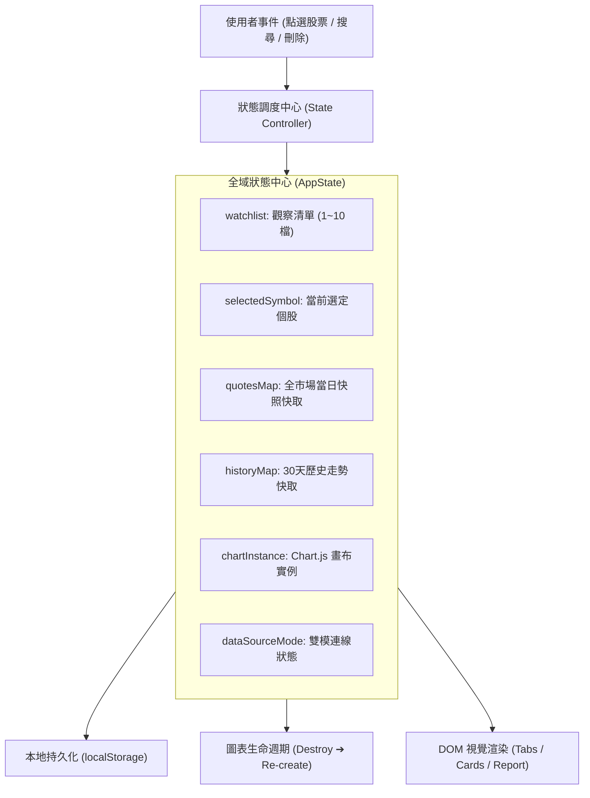

# 前端狀態管理與資料流規範 (State Management Guidelines)

> **定位**：規範前端資料流轉、全域狀態機（State Machine）、圖表實例生命週期（Instance Lifecycle）、本地持久化與非同步快取機制，杜絕狀態不同步、記憶體洩漏與畫面殘留。  
> **適用技術棧**：原生 ES6+ JavaScript（全域狀態物件/狀態機）、`localStorage`、Chart.js 實例管理、非同步 Fetch API。  
> **關聯規範**：[`architecture`](file:///c:/Users/TINA/Documents/antigravity/practice/.agents/skills/architecture/SKILL.md) | [`ui-design`](file:///c:/Users/TINA/Documents/antigravity/practice/.agents/skills/ui-design/SKILL.md)

---

## 1. 狀態管理核心思維 (Core Philosophies)



1. **單一事實來源 (Single Source of Truth)**：
   - 所有視圖渲染與控制項計算，統一以全域 `AppState` 為唯一權威來源，嚴禁在個別 DOM 上私藏業務狀態。
2. **生命週期顯式控制 (Explicit Lifecycle Management)**：
   - 外部函式庫實例（如 Chart.js）必須由狀態機統一持有參照；切換資料或遇到空資料時，必須**顯式銷毀（`destroy()`）**並歸零（`null`），杜絕記憶體洩漏與殘留覆蓋。
3. **持久化與防呆邊界 (Persistence & Boundary Guard)**：
   - 觀察清單異動必須即時同步至 `localStorage`。
   - 寫入前嚴格校驗資料邊界：名單最多 10 檔、最少保留 1 檔、代碼必須保留前導零。
4. **記憶體快取避免重複請求 (In-Memory Caching)**：
   - 歷史成交數據一旦抓取成功，即緩存於 `historyMap[symbol]`，後續重複切換該股票無需重新發起網路請求。

---

## 2. 標準全域狀態結構規格 (`app.js`)

```javascript
// 全域狀態機宣告
const AppState = {
  // 1. 觀察名單陣列 (字串陣列，嚴格保留前導 0)
  watchlist: ['2330', '2308', '2454'],

  // 2. 當前選定焦點個股
  selectedSymbol: '2330',

  // 3. 行情快取表 (以 symbol 為 Key 的字典物件)
  quotesMap: {},

  // 4. 歷史趨勢快取表 (包含 30 天 records 與 indicators 指標)
  historyMap: {},

  // 5. 官方日曆與市場狀態
  marketCalendar: null,

  // 6. Chart.js 折線圖現存實例 (無圖時為 null)
  chartInstance: null,

  // 7. 歷史表格抽屜開合狀態
  isHistoryTableOpen: false,

  // 8. 資料源連線模式: 'checking' | 'backend' | 'static' | 'offline'
  dataSourceMode: 'checking'
};
```

---

## 3. 圖表實例生命週期規範 (Chart.js Lifecycle Rules)

> [!CAUTION]
> 任何在已有 Chart.js 實例的 Canvas 上重新 `new Chart()` 卻未預先 `destroy()` 的操作，皆會引發 Canvas 重複疊圖與記憶體洩漏。

```javascript
function renderTrendChart(symbol, historyData) {
  const ctx = document.getElementById('trendChart').getContext('2d');
  const subtitleEl = document.getElementById('chartSubtitleDesc');

  // 1. 空狀態與無資料邊界防禦：必須立即銷毀舊圖表！
  if (!historyData || !historyData.history || historyData.history.length === 0) {
    if (AppState.chartInstance) {
      AppState.chartInstance.destroy();
      AppState.chartInstance = null;
    }
    if (subtitleEl) {
      subtitleEl.innerHTML = `【提示】靜態展示版尚未收錄 [${symbol}] 之 30 天歷史走勢檔。`;
    }
    return;
  }

  // 2. 若已有實例存在，先銷毀再建立全新圖表
  if (AppState.chartInstance) {
    AppState.chartInstance.destroy();
    AppState.chartInstance = null;
  }

  // 3. 建立並持有全新實例參照
  AppState.chartInstance = new Chart(ctx, {
    type: 'line',
    data: { /* 數據集配置 */ },
    options: { /* 響應式配置 */ }
  });
}
```

---

## 4. 本地持久化儲存規範 (LocalStorage Sync)

1. **專用儲存鍵名**：使用帶有版本後綴的唯一鍵名（如 `TW_STOCK_OFFICIAL_WATCHLIST_V3`），避免舊版快取結構污染。
2. **防呆讀取與還原**：
   - 讀取時必須包裹 `try...catch`，防止因瀏覽器隱私模式或 QuotaExceeded 拋錯導致整個應用崩潰。
   - 若本地儲存為空或格式損壞，自動優雅退避至預設名單（`DEFAULT_SYMBOLS`）。
3. **邊界防護**：
   - 新增時檢查 `watchlist.length < 10`，已達上限時停用按鈕並提示。
   - 刪除時檢查 `watchlist.length > 1`，剩餘最後一檔時禁止刪除。

---

## 5. 狀態管理檢核清單 (State Management Checklist)

- [ ] **代碼型別不變量**：所有股票代號於陣列與物件中均為 `string`，無任何 `parseInt()` 轉換。
- [ ] **實例必定銷毀**：在任何重繪、清空或切換操作前，先檢驗並執行 `instance.destroy()`。
- [ ] **空狀態處理健全**：在歷史資料回傳 `null` 或 `[]` 時，狀態機與 UI 能平滑呈現提示，無 Uncaught Error。
- [ ] **儲存異常防禦**：`localStorage.setItem` 與 `getItem` 全數配置例外補捉保護。
