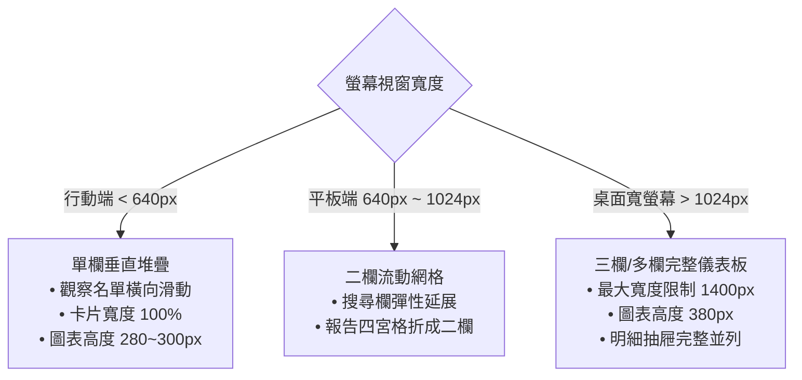

# UI 介面設計與設計系統規範 (UI Design & Design Systems)

> **定位**：為資料密集型儀表板與現代金融應用建立具備美學質感、視覺層次分明、符合無障礙規範（WCAG 2.1 AA）且自適應各種螢幕尺寸的高品質介面標準。  
> **適用技術棧**：原生 CSS3 Variables、現代 CSS Grid & Flexbox、語意化 HTML5、等寬金融字體。  
> **關聯規範**：[`ux-check`](file:///c:/Users/TINA/Documents/antigravity/practice/.agents/workflows/ux-check.md) | [`coding-standards`](file:///c:/Users/TINA/Documents/antigravity/practice/.agents/skills/coding-standards/SKILL.md)

---

## 1. UI 設計核心原則 (Core UI Principles)

1. **Design Tokens 驅動 (Token-Driven Consistency)**：
   - 嚴格禁止在元件內部寫死（Hardcode）色碼與尺寸值。
   - 所有背景色、文字色、強調色、邊框、陰影與圓角一律由 CSS Custom Properties（`:root`）集中宣告與管理。
2. **金融數據高對比與視覺秩序 (Financial Contrast & Hierarchy)**：
   - 數值與價格使用等寬字型（`JetBrains Mono` / `Roboto Mono`），確保小數點對齊與字距穩定。
   - 漲跌色碼需嚴格符合市場慣例：**上漲鮮亮紅（`--tw-up`）、下跌清新綠（`--tw-down`）、平盤中性灰（`--tw-flat`）**。
3. **無障礙優先 (Accessibility First - WCAG 2.1 AA)**：
   - 一般文字與深色背景對比度必須 **≥ 4.5:1**，大字級（18px+ 或 14px bold）對比度必須 **≥ 3.0:1**。
   - 鍵盤導航必須提供顯眼的 `:focus-visible` 焦點外框（如 2px 亮藍外環），不阻斷 Tab 鍵流暢度。
4. **極致響應式與觸控友善 (Fluid Responsiveness & Ergonomics)**：
   - 行動端（< 640px）所有可點擊按鈕與互動標籤，其有效點擊熱區必須 **≥ 44 × 44 px**。
   - 頁面整體嚴格禁止非預期的水平滾動溢出（`overflow-x: hidden`）。

---

## 2. 標準 Design Tokens 規格 (`style.css`)

```css
:root {
  /* 品牌深色主調 */
  --bg-primary: #0b0f19;        /* 全頁最深底色 */
  --bg-secondary: #111827;      /* 次層卡片容器 */
  --bg-card: #162032;           /* 獨立資料卡片 */
  --bg-card-hover: #1e2c44;     /* 懸停提亮卡片 */
  --bg-card-elevated: #1f2d47;  /* 浮層/表頭背景 */

  /* 邊框與外環 */
  --border-color: rgba(255, 255, 255, 0.08);
  --border-focus: #3b82f6;      /* 焦點亮藍色環 */

  /* 文字色彩階層 */
  --text-main: #f3f4f6;         /* 主要高光文字 (對比度 > 12:1) */
  --text-muted: #9ca3af;        /* 輔助標籤文字 (對比度 > 5:1) */
  --text-sub: #6b7280;          /* 次要註記/時間戳記 */

  /* 台股漲跌專用語意色 */
  --tw-up: #ef4444;             /* 上漲紅 */
  --tw-up-bg: rgba(239, 68, 68, 0.12);
  --tw-up-border: rgba(239, 68, 68, 0.3);
  --tw-down: #10b981;           /* 下跌綠 */
  --tw-down-bg: rgba(16, 185, 129, 0.12);
  --tw-down-border: rgba(16, 185, 129, 0.3);
  --tw-flat: #94a3b8;           /* 平盤灰 */

  /* 圓角尺度 */
  --radius-sm: 6px;
  --radius-md: 10px;
  --radius-lg: 16px;
  --radius-full: 9999px;

  /* 字體宣告 */
  --font-sans: 'Noto Sans TC', -apple-system, BlinkMacSystemFont, sans-serif;
  --font-mono: 'JetBrains Mono', Consolas, monospace;
}
```

---

## 3. 六大互動狀態與微互動設計 (Interactive States)

所有按鈕、超連結、卡片與輸入控制項必須完整覆蓋下列狀態：

| 狀態名稱 | 視覺反饋與行為要求 |
| :--- | :--- |
| **Default** | 具備基礎層次陰影與微透邊框，字級與圖示對齊。 |
| **Hover** | 輕微向上浮動（`translateY(-1px ~ -2px)`）、邊框提亮或背景漸層加強。 |
| **Active** | 按下微縮回彈（`scale(0.98)`），提供實體按鍵確證手感。 |
| **Focus-Visible**| 出現 `outline: 2px solid var(--border-focus); outline-offset: 2px;`，供鍵盤 Tab 精確導覽。 |
| **Disabled** | 降低透明度至 `0.5`，滑鼠游標設為 `not-allowed`，事件監聽器防連點阻擋。 |
| **Loading / Success** | 呈現旋轉動畫圖示（`.btn-spinning`），成功後短暫變換為綠色勾勾（`.btn-success-state`）。 |

---

## 4. 響應式排版檢核規則 (Responsive Layout Rules)



---

## 5. UI 設計交付檢核清單 (UI Design Checklist)

- [ ] **無寫死色碼**：全站樣式 100% 透過 `var(--...)` 引用，無零散 `#hex`。
- [ ] **等寬字型套用**：所有股票代碼、價格、成交量、均線百分比均套用 `font-family: var(--font-mono)`。
- [ ] **全鍵盤可巡覽**：純鍵盤 Tab 走查時，焦點清晰且不會陷入死循環。
- [ ] **無橫向破版**：在 320px、375px、414px 測試下，頁面左右均無超出視窗之水平卷軸。
