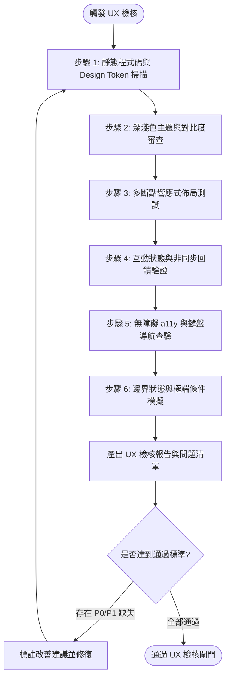

# UX 體驗與介面品質檢核規範 (UX Check Guidelines & Workflow)

> **版本**：v1.0.0  
> **最後更新**：2026-09-12  
> **狀態**：生效中 (Active)  
> **適用範疇**：前端元件庫 (`src/components/`)、頁面路由 (`src/App.jsx`) 與全站樣式 (`src/index.css`)  
> **關聯規範**：[`ui-design`](file:///c:/Users/TINA/Documents/antigravity/practice/.agents/skills/ui-design/SKILL.md) | [`dev-guidelines.md`](file:///c:/Users/TINA/Documents/antigravity/practice/.agents/rules/dev-guidelines.md)

本規範定義專案在開發新功能、重構前端介面或發布前，針對**使用者體驗 (UX)**、**介面設計 (UI)**、**無障礙標準 (a11y)**、**深淺色模式**與**響應式適配**進行系統化稽核的標準作業程序 (SOP)。

---

## 1. 工作流程目標與適用情境 (Workflow Objectives)

### 1.1 核心目標
- **一致性**：確保所有元件嚴格依循 `src/index.css` 定義的 Design Tokens（CSS Variables），避免零散寫死樣式。
- **可讀性與包容性**：符合 WCAG 2.1 AA 級標準，確保不同視力條件與裝置環境下的可讀性。
- **直覺回饋**：杜絕「無反饋操作」，所有非同步請求、載入、提交與錯誤皆具備明確的視覺提示。
- **穩健容錯**：涵蓋空狀態（Empty State）、網路中斷、極端長文字與格式錯誤等邊界情況。

### 1.2 觸發情境
1. 前端功能模組開發完成，進入驗收閘門（Phase Review）前。
2. 進行跨元件視覺走查（Design QA）或主題樣式調整後。
3. 發現使用者操作流暢度疑慮、佈局跑版或無障礙檢核缺失時。

---

## 2. 檢核作業流程 (Audit Workflow Flowchart)



---

## 3. 八大核心檢核面向與標準 (Core Audit Dimensions)

### 3.1 設計系統與 Token 一致性 (Design System & Tokens)
- [ ] **全站變數化**：所有背景色、文字色、邊框色與陰影必須使用 `var(--...)`，嚴格禁止直接寫死 Hex 色碼（如 `#ffffff`, `#1a1a1a`）。
  - 背景色：`var(--bg-main)`, `var(--bg-card)`, `var(--bg-card-hover)`, `var(--bg-input)`, `var(--bg-tag)`
  - 主文字：`var(--text-main)`, 次文字：`var(--text-muted)`
  - 主題色：`var(--primary)`, `var(--primary-hover)`, `var(--primary-gradient)`
  - 輔助色：`var(--warm-amber)`, `var(--warm-terracotta)`, `var(--warm-peach)`, `var(--warm-rose)`
- [ ] **圓角與間距尺度**：卡片、按鈕、輸入框之 `border-radius` 與 `padding` 應維持整齊倍數比例（4px / 8px / 12px / 16px）。
- [ ] **階層陰影**：卡片與彈窗應適當使用 `var(--shadow-sm)`, `var(--shadow-md)`, `var(--shadow-lg)` 表現 Z 軸景深。

### 3.2 雙模式主題與色彩對比 (Themes & WCAG Contrast)
- [ ] **深淺色即時切換**：在 `[data-theme="dark"]` 與預設淺色模式下切換時，所有元件無殘留白色底色或黑色文字。
- [ ] **色彩對比度**：
  - 一般文字（小於 18pt）：與背景對比度必須 **≥ 4.5:1**。
  - 大型文字（≥ 18pt 或粗體 14pt）：與背景對比度必須 **≥ 3:1**。
  - 核心互動元件（輸入框邊框、按鈕外框）：與背景對比度必須 **≥ 3:1**。
- [ ] **過渡動畫**：背景與文字色彩切換具備柔和過渡（如 `transition: background-color 0.3s ease, color 0.3s ease`），避免刺眼突變。

### 3.3 響應式佈局與裝置適配 (Responsive Adaptability)
- [ ] **斷點排版健全度**：
  - **行動端 (< 640px)**：單欄流式排版、側邊欄或篩選抽屜可摺疊收納、不出現非預期的水平滾動條（`overflow-x: hidden`）。
  - **平板端 (640px ~ 1024px)**：2 欄網格或彈性比例排版。
  - **桌面端 (> 1024px)**：完整多欄佈局、固定側邊欄或寬螢幕優化。
- [ ] **觸控目標尺寸**：行動端所有可點擊元素（按鈕、圖示、分頁標籤）之有效點擊區域 **≥ 44 × 44 px**。
- [ ] **防溢出保護**：標題與卡片內容必須配置文字截斷或換行規範（如 `text-overflow: ellipsis`, `word-break: break-word`）。

### 3.4 互動反饋與狀態機完整度 (Interactive States & Feedback)
- [ ] **全狀態樣式**：所有按鈕、超連結與卡片必須具備完整的狀態設計：
  - `Default`（預設狀態）
  - `Hover`（滑鼠懸停）
  - `Active`（按下點擊）
  - `Focus-Visible`（鍵盤聚焦點：清晰外框）
  - `Disabled`（停用狀態：降低透明度、游標為 `not-allowed`、禁止重複點擊）
- [ ] **非同步載入反饋**：
  - 請求耗時 > 300ms 時，顯示 Skeleton 骨架屏或 Spinner 指示器。
  - 按鈕發起請求時，呈現 Loading 狀態並自動停用防止連點。
- [ ] **Toast 訊息提示**：
  - 操作成功、失敗或警示時，透過浮動 Toast 清晰反饋結果，並具備自動關閉（3 ~ 5 秒）與手動關閉按鈕。

### 3.5 表單易用性與防呆機制 (Form Ergonomics & Validation)
- [ ] **欄位標籤與 Placeholder**：每個輸入框皆有明確的 `<label>` 或 `aria-label`，Placeholder 僅作為輔助範例，不取代 Label。
- [ ] **即時驗證與錯誤提示**：
  - 欄位錯誤時，輸入框邊框呈現醒目警示色（如 `var(--warm-rose)`），並於欄位下方即時顯示具體錯誤說明。
- [ ] **輸入防抖 (Debounce)**：搜尋欄與關鍵字篩選必須配置 300ms ~ 500ms 防抖處理，避免每次鍵入重複觸發 API。
- [ ] **長流程防呆**：刪除關鍵資料或不可逆操作時，必須跳出二次確認對話框（Confirm Modal）。

### 3.6 無障礙設計與鍵盤操作 (Accessibility / a11y)
- [ ] **語意化 HTML 標籤**：優先使用 `<header>`, `<nav>`, `<main>`, `<article>`, `<section>`, `<aside>`, `<footer>`, `<button>`。
- [ ] **鍵盤全可操作性**：
  - 使用 `Tab` 鍵可依序聚焦所有互動元件，焦點順序符合視覺邏輯。
  - 彈窗或對話框開啟時，支援 `Esc` 鍵關閉，焦點鎖定於 Modal 內部（Focus Trap）。
  - 下拉選單支援 `Enter` / `Space` 開啟與方向鍵切換項目。
- [ ] **螢幕閱讀器友善**：
  - 純圖示按鈕必須包含 `aria-label` 或隱藏輔助文字（`.sr-only`）。
  - 圖片必須提供具意義之 `alt` 屬性（裝飾性圖片設為 `alt=""`）。

### 3.7 體感效能與滾動體驗 (Perceived Performance & Scroll)
- [ ] **圖片載入優化**：
  - 列表與網格圖片一律採用 `loading="lazy"`。
  - 支援 WebP 格式轉換與適配縮圖，減少首屏載入頻寬消耗。
- [ ] **滾動條美化**：滾動條寬度控制在 6px ~ 8px，滾動軌道與滑塊色彩融入主色彩體系。
- [ ] **累計版面位移 (CLS)**：圖片與動態加載區塊需設定固定寬高比（`aspect-ratio`）或佔位容器，避免加載完成時畫面劇烈跳動。

### 3.8 邊界狀態與極端條件 (Edge Cases)
- [ ] **空狀態 (Empty State)**：資料庫無資料或搜尋無結果時，不可僅顯示空白，需呈現友好圖示、說明文案與引導按鈕（如「建立第一筆文章」）。
- [ ] **極限資料長度**：測試極長分類名稱、長標題或無空格連續英文字元，確認元件不破版。
- [ ] **網路中斷與重試**：離線或 API 伺服器異常時，提供「重新載入」或重試按鈕。

---

## 4. 執行檢核操作步驟 (Execution Steps)

當執行此 Skill 時，檢核者或 Agent 應遵循以下 4 個步驟：

### 步驟 1：界定檢核範圍與檢視程式碼
1. 確定本次受測之前端頁面或元件（例如：`src/components/MediaGallery.jsx`、`src/components/CmsPhase1.jsx`）。
2. 檢查對應之樣式宣告與 DOM 結構，確認是否引用 CSS 變數。

### 步驟 2：執行即時互動與介面走查
1. 啟動前端開發伺服器（`npm run dev`）。
2. 切換深色與淺色模式，確認各區塊色彩調性與層次。
3. 縮放瀏覽器視窗至 Mobile (375px)、Tablet (768px)、Desktop (1440px)，檢查斷點相容性。
4. 關閉滑鼠，僅使用鍵盤（`Tab`, `Shift+Tab`, `Space`, `Enter`, `Esc`）進行完整流程走查。

### 步驟 3：撰寫結構化檢核報告
依照下方標準範本輸出檢核成果：

```markdown
### UX 檢核成果摘要：[模組名稱]
- **檢核日期**：YYYY-MM-DD
- **檢核模式**：Light Mode / Dark Mode / 響應式雙端
- **總體評價**：[通過 / 附帶條件通過 / 需修復重測]

#### 發現問題與評級
| 嚴重度 | 影響範圍 | 問題描述 | 建議修復方式 |
| :--- | :--- | :--- | :--- |
| P0 (阻斷) | 登入按鈕 | 深色模式下文字與背景對比度僅 1.8:1，無法辨識 | 改用 `var(--text-main)` 並調整按鈕底色 |
| P1 (重要) | 標籤輸入框 | 行動端視窗縮排時邊界溢出 | 新增 `flex-wrap: wrap` 與 `max-width: 100%` |
| P2 (輕微) | 刪除按鈕 | 缺少 Tooltip 提示 | 補上 `title` 或 `aria-label` |
```

### 步驟 4：追蹤修復與回歸複測
針對評級為 `P0` 與 `P1` 之缺失，開立 Issue 或即時修復，修復後重新執行對應檢查項直至符合標準。

---

## 5. 快速查核清單 (Quick Checklist)

> [!TIP]
> 每次提交前端程式碼前，快速自檢以下 10 項黃金指標：

- [ ] 1. 全數使用 CSS Variables，無寫死色碼。
- [ ] 2. 深色與淺色模式切換順暢，文字無隱形。
- [ ] 3. 行動端（375px）無非預期橫向滾動。
- [ ] 4. 點擊按鈕具備 Hover、Active 與 Loading 狀態。
- [ ] 5. 非同步請求有明確的 Toast 成功 / 失敗提示。
- [ ] 6. 搜尋或篩選輸入欄位已設定防抖（Debounce）。
- [ ] 7. 圖片設置 `loading="lazy"` 與 `alt` 屬性。
- [ ] 8. 關鍵破壞性操作具備二次確認對話框。
- [ ] 9. 能全程單純透過鍵盤（Tab / Enter / Esc）操作核心流程。
- [ ] 10. 無資料時具備友善空狀態提示與引導操作。
