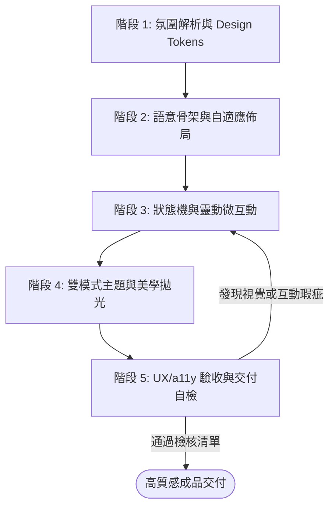

# VibeCoding 前端極速建構流程規範 (Vibe-Coding Frontend Builder)

> **定位**：將模糊的視覺直覺（Vibe）、美感風格與功能訴求，極速轉化為具備高美學質感、響應式自適應、細膩微互動且可維護的生產級前端介面。  
> **適用範疇**：原生前端 (HTML5 + CSS Variables + ES6 JavaScript) 及現代元件化 SPA (React 18 + Vite / Vue 3 / Tailwind CSS)。  
> **關聯規範**：[`dev-guidelines.md`](file:///c:/Users/TINA/Documents/antigravity/practice/.agents/rules/dev-guidelines.md) | [`ux-check`](file:///c:/Users/TINA/Documents/antigravity/practice/.agents/skills/ux-check/SKILL.md)

---

## 1. VibeCoding 核心精神與開發心法 (Philosophy & Core Principles)

VibeCoding 不僅僅是「寫出能運行的程式碼」，而是以**直覺美學為先導、工程規格為底座**的高敏捷開發模式：

1. **Token First (變數先導，嚴禁寫死色碼)**：
   - 任何介面組件動工前，第一要務是萃取並定義 **Design Tokens (CSS Variables)**。
   - 涵蓋畫布背景、文字階層、主強調色、邊框強弱、圓角尺度、立體陰影與過渡動效。
2. **Feedback Driven (操作必有反饋，杜絕視覺死角)**：
   - 任何可互動元素（按鈕、卡片、選單、拖曳區）必須涵蓋完整的狀態生命週期：`Default`、`Hover`、`Active`、`Focus-Visible`、`Disabled` 與非同步 `Loading`。
   - 所有異動（新增、更新、刪除、拖曳完成）必須具備清晰即時的浮動提示（Toast）或微動畫反饋。
3. **Dual-Input Accessibility (鍵盤與行動端降級兼顧)**：
   - 具備滑鼠拖曳（Drag & Drop）的卡片或項目，必須同步提供**微控制按鈕（如向左/向右移動箭頭）**，確保觸控螢幕、鍵盤導航與無障礙讀屏者皆能無痛操作。
4. **Resilient Boundaries (優雅防呆與邊界狀態)**：
   - 預設考量空狀態（Empty State）、超長文字折行（`word-break: break-word`）、文字溢出截斷（`text-overflow: ellipsis`）與高頻操作防抖（Debounce）。

---

## 2. 標準五階段 VibeCoding 開發管線 (The 5-Phase Pipeline)



---

### 階段 1：氛圍解析與 Design Tokens 奠基 (Vibe Extraction & Palette Design)

當收到使用者的視覺描述或功能要求時，先定調視覺主題（Vibe Palette）：

#### 1.1 常見 Vibe 風格與色彩語意對照
- **簡約暖陶土風 (Warm Minimalist)**：米白畫布 (`#FAF6F0`)、焦糖琥珀主色 (`#D97736`)、暖灰文字 (`#3C332A`)、草本鼠尾綠 (`#48774E`)。
- **深邃賽博科技風 (Cyber Tech Glow)**：深藍黑背景 (`#090D16`)、霓虹靛藍 (`#6366F1`)、螢光青青 (`#06B6D4`)、玻璃毛玻璃 (`rgba(255,255,255,0.08)`)。
- **現代清新企業風 (Modern Clean SaaS)**：冷白畫布 (`#F8FAFC`)、經典曜藍 (`#2563EB`)、石板深灰 (`#0F172A`)、翡翠綠成功色 (`#10B981`)。

#### 1.2 宣告標準 Design Tokens 範本 (`:root`)
在 CSS 檔頭或全域樣式中定義完整變數：

```css
:root {
  /* 背景層次 */
  --bg-page: #FAF6F0;
  --bg-card: #FFFFFF;
  --bg-column: #F8F4ED;
  --bg-dropzone-hover: #F3EBDD;
  --bg-input: #FDFBF8;

  /* 文字階層 (WCAG AA 4.5:1+) */
  --text-main: #3C332A;
  --text-muted: #827568;
  --text-light: #B5A99C;

  /* 邊框與分隔線 */
  --border-subtle: #EFE8DE;
  --border-strong: #E2D7C8;
  --border-focus: #D97736;

  /* 主題色與互動微色調 */
  --primary: #D96B27;
  --primary-hover: #C35B1A;
  --primary-subtle: #FAEEE5;
  --primary-text: #96420F;

  /* 功能語意色 */
  --status-todo: #D97736;
  --status-process: #C35334;
  --status-done: #48774E;
  --danger: #C85444;
  --danger-subtle: #FDF2F0;

  /* 圓角、陰影與過渡曲線 */
  --radius-sm: 6px;
  --radius-md: 10px;
  --radius-lg: 16px;
  --shadow-sm: 0 1px 3px rgba(60, 51, 42, 0.05);
  --shadow-card: 0 2px 8px rgba(60, 51, 42, 0.06);
  --shadow-hover: 0 8px 20px rgba(60, 51, 42, 0.12);
  --shadow-drag: 0 14px 28px rgba(217, 107, 39, 0.22);
  --transition-fast: 0.2s cubic-bezier(0.4, 0, 0.2, 1);
}
```

---

### 階段 2：語意骨架與自適應佈局 (Semantic Layout & Responsive Grid)

1. **嚴格語意化標籤**：
   - 頂部導覽／標題群組：`<header>` 與 `<nav>`
   - 核心互動區：`<main>`、`<section>`
   - 獨立卡片：`<article class="task-card">`
   - 控制項與按鈕：一律使用具備型別的 `<button type="button">` 或 `<button type="submit">`，禁止用無語意的 `<div onclick>`。
2. **多斷點響應式規則 (Responsive Breakdown)**：
   - **桌面端 (> 1024px)**：寬螢幕多欄排版（如看板 3 欄等寬、側邊欄固定寬度）。
   - **平板端 (640px ~ 1024px)**：彈性縮放欄寬、卡片文字自適應折行。
   - **行動端 (< 640px)**：
     - 單欄流式佈局（`grid-template-columns: 1fr`）。
     - 按鈕全寬置底（Full-width touch actions）。
     - 最小觸控目標面積：所有可點擊區域 **≥ 44 × 44 px**。
     - 水平防溢出：根節點或父容器設定 `overflow-x: hidden`。

---

### 階段 3：狀態機與靈動微互動 (Interactive States & Micro-interactions)

#### 3.1 完整互動狀態樣式
為所有按鈕與卡片配置標準五態過渡：
```css
/* 卡片懸浮景深提升 */
.interactive-card {
  transition: transform var(--transition-fast), box-shadow var(--transition-fast), border-color var(--transition-fast);
}
.interactive-card:hover {
  transform: translateY(-2px);
  box-shadow: var(--shadow-hover);
  border-color: var(--border-strong);
}

/* 鍵盤聚焦環 (a11y) */
button:focus-visible, input:focus-visible {
  outline: 2px solid var(--border-focus);
  outline-offset: 2px;
}
```

#### 3.2 雙軌拖曳與降級控制 (Dual-Track Drag & Drop)
- **原生拖曳支援**：為卡片設置 `draggable="true"`，綁定 `dragstart`, `dragend`, `dragover`, `dragleave`, `drop` 事件。
  - 拖曳中樣式：設置 `.dragging` 類別，半透明化並加上邊界聚焦色。
  - 放置目標區：懸停時標記 `.drag-over`，變更虛線外框與底色引導。
- **無障礙降級按鈕 (Micro Navigation)**：
  - 在卡片底部配置 `<button class="btn-move" title="移至下一階段">`。
  - 當使用者處於行動端（不便拖曳）或使用純鍵盤操作時，能直接點擊前進/後退狀態。

#### 3.3 非同步回饋與 Toast 提示系統
- 操作完成時（如新增卡片、移動狀態、刪除卡片），透過全域輕量 Toast 給予 2~3 秒視覺反饋：
```javascript
function showToast(message, type = 'info') {
  const toast = document.createElement('div');
  toast.className = `toast-pill toast-${type}`;
  toast.textContent = message;
  document.body.appendChild(toast);
  requestAnimationFrame(() => toast.classList.add('show'));
  setTimeout(() => {
    toast.classList.remove('show');
    setTimeout(() => toast.remove(), 300);
  }, 2500);
}
```

#### 3.4 輸入防抖處理 (Debounce)
- 即時搜尋與篩選輸入框，必須加入 300ms 防抖處理：
```javascript
function debounce(fn, delay = 300) {
  let timer = null;
  return function (...args) {
    clearTimeout(timer);
    timer = setTimeout(() => fn.apply(this, args), delay);
  };
}
```

---

### 階段 4：雙模式主題與美學拋光 (Themes & Visual Polish)

1. **深淺色雙模式支援 (Dark / Light Dual Mode)**：
   - 透過 `[data-theme="dark"]` 屬性覆寫 CSS 變數，維持元件 class 不變。
   - 預設讀取 `localStorage.getItem('theme')` 或 `window.matchMedia('(prefers-color-scheme: dark)')`。
2. **WCAG 2.1 AA 色彩對比規範**：
   - 一般文字與背景對比度必須 **≥ 4.5:1**。
   - 大字體與重要邊框對比度必須 **≥ 3.0:1**。
   - 絕對禁止在深色模式下出現白底或文字隱形問題。
3. **景深與微光暈 (Depth & Glow)**：
   - 深色模式採用 Subtle Borders (`rgba(255,255,255,0.1)`) 取代純黑硬陰影。
   - 科技風格加入外光暈（`box-shadow: 0 0 15px var(--primary-glow)`）。

---

### 階段 5：UX/a11y 驗收與交付自檢 (UX Verification & Delivery Checklist)

在將成果交付給使用者前，執行以下 10 項黃金指標檢查：

| 檢核項目 | 標準要求 | 自檢結果 |
| :--- | :--- | :---: |
| 1. **全站 Token 化** | 無任何寫死之 Hex/RGB 顏色，100% 透過 `var(--...)` 調用 | [ ] |
| 2. **雙模式正常** | 切換 Dark / Light 主題時無文字隱形或殘留背景區塊 | [ ] |
| 3. **無水平溢出** | 行動裝置視窗 (375px) 下無意外之橫向滾動條 (`overflow-x`) | [ ] |
| 4. **觸控友善** | 行動端按鈕與點擊目標面積均 ≥ 44 × 44 px | [ ] |
| 5. **互動狀態五態完整** | 按鈕與卡片均具備 Default / Hover / Active / Focus / Disabled | [ ] |
| 6. **雙軌操作可用** | 拖曳功能具備點擊式替代控制按鈕，無滑鼠亦可操作 | [ ] |
| 7. **操作即時回饋** | 新增、修改、刪除操作均有 Toast 或動畫即時確認 | [ ] |
| 8. **高頻輸入防抖** | 搜尋、過濾或即時保存輸入具備 300ms ~ 500ms Debounce | [ ] |
| 9. **邊界空狀態防呆** | 清單無項目時呈現友善空狀態圖示與提示，而非死白區塊 | [ ] |
| 10. **鍵盤可操作性** | 支援 Tab 聚焦導航、Enter 提交與 Esc 關閉彈窗 | [ ] |

---

## 3. 快速啟動範例程式碼 (Quick Reference Snippets)

### 3.1 友善空狀態結構 (Empty State Template)
```html
<div class="empty-state-box">
  <div class="empty-icon-wrap">
    <svg width="40" height="40" viewBox="0 0 24 24" fill="none" stroke="currentColor" stroke-width="1.5">
      <path d="M9 5H7a2 2 0 0 0-2 2v12a2 2 0 0 0 2 2h10a2 2 0 0 0 2-2V7a2 2 0 0 0-2-2h-2" />
      <rect x="9" y="3" width="6" height="4" rx="1" />
      <path d="M9 14l2 2 4-4" />
    </svg>
  </div>
  <p class="empty-title">目前尚無任何任務</p>
  <p class="empty-subtitle">從上方輸入框輸入事項，快速新增你的第一個任務！</p>
</div>
```

### 3.2 HTML5 拖曳卡片核心邏輯 (Drag & Drop Logic)
```javascript
// 綁定拖曳起始與結束
function bindCardDragEvents(cardEl) {
  cardEl.setAttribute('draggable', 'true');
  cardEl.addEventListener('dragstart', (e) => {
    e.dataTransfer.setData('text/plain', cardEl.dataset.taskId);
    cardEl.classList.add('dragging');
  });
  cardEl.addEventListener('dragend', () => {
    cardEl.classList.remove('dragging');
  });
}

// 放置區監聽
dropzones.forEach(zone => {
  zone.addEventListener('dragover', (e) => {
    e.preventDefault();
    zone.classList.add('drag-over');
  });
  zone.addEventListener('dragleave', () => {
    zone.classList.remove('drag-over');
  });
  zone.addEventListener('drop', (e) => {
    e.preventDefault();
    zone.classList.remove('drag-over');
    const taskId = e.dataTransfer.getData('text/plain');
    moveTaskToColumn(taskId, zone.dataset.status);
  });
});
```
