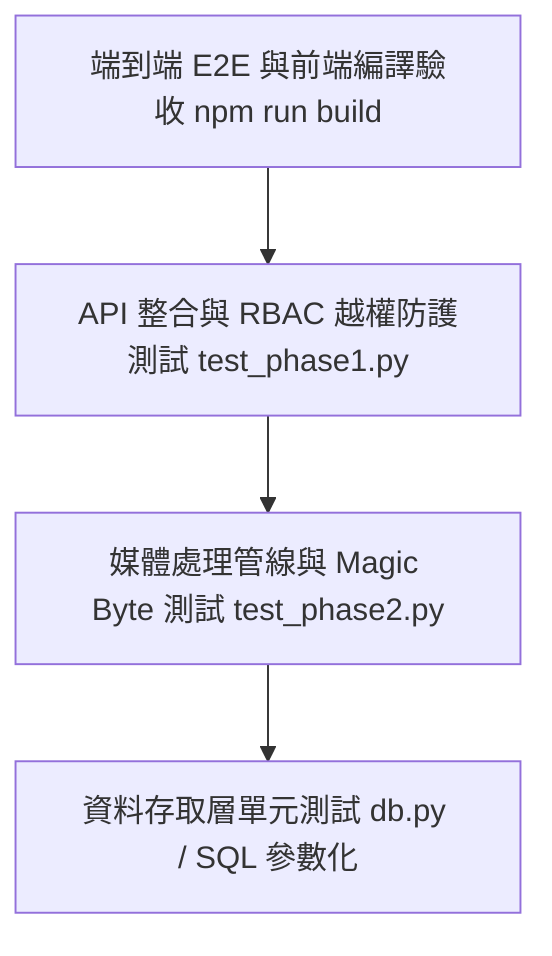

# 全端應用程式測試與品質驗證規範 (Web App Testing Guidelines)

> **定位**：建立端到端的自動化測試策略、API 整合測試管線、權限防護驗證與前端交付檢驗流程，確保每次功能迭代皆零回歸（Zero Regression）。  
> **適用技術棧**：Python `unittest` / `pytest`、FastAPI TestClient、SQLite 獨立測試資料庫、Vite 前端編譯檢核。  
> **關聯規範**：[`dev-guidelines.md`](file:///c:/Users/TINA/Documents/antigravity/practice/.agents/rules/dev-guidelines.md) | [`backend/test_phase1.py`](file:///c:/Users/TINA/Documents/antigravity/practice/backend/test_phase1.py) | [`backend/test_phase2.py`](file:///c:/Users/TINA/Documents/antigravity/practice/backend/test_phase2.py)

---

## 1. 測試金字塔與策略規劃 (Testing Strategy)



1. **階段式驅動驗證 (Phase-Driven Verification)**：
   - 每個功能階段皆有對應的自動化驗收測試腳本（如 Phase 1 驗證權限與資料核心，Phase 2 驗證媒體管線與轉碼）。
2. **測試環境隔離 (Environment Isolation)**：
   - 測試運行時絕不可污染生產資料庫。必須使用專屬測試資料庫檔（如 `backend/test_cms.db`）或記憶體資料庫（`:memory:`），並在測試結束後徹底清理（TearDown）。
3. **極限與邊界覆蓋 (Boundary & Edge Cases)**：
   - 不僅測試「快樂路徑 (Happy Path)」，更必須覆蓋非法 Token、越權存取、超大檔案、偽造二進制標頭、惡意 SQL 字串等異常情境。

---

## 2. 後端自動化測試實踐 (Backend Testing)

### 2.1 測試套件架構範例 (`unittest`)
```python
import unittest
import sqlite3
import os
from fastapi.testclient import TestClient
from backend.main import app
from backend.db import init_db

class TestAuthAndRBAC(unittest.TestCase):
    @classmethod
    def setUpClass(cls):
        # 建立隔離測試環境
        os.environ["DATABASE_PATH"] = "backend/test_cms.db"
        init_db(force_recreate=True)
        cls.client = TestClient(app)

    @classmethod
    def tearDownClass(cls):
        # 清除測試產物
        if os.path.exists("backend/test_cms.db"):
            os.remove("backend/test_cms.db")

    def test_unauthorized_access_blocked(self):
        """未提供 Token 請求受保護端點應回傳 401"""
        res = self.client.get("/api/v1/users/me")
        self.assertEqual(res.status_code, 401)

    def test_author_cannot_delete_system_settings(self):
        """作者角色嘗試進行管理員操作應回傳 403 Forbidden"""
        author_token = self._login_as("author")
        headers = {"Authorization": f"Bearer {author_token}"}
        res = self.client.delete("/api/v1/system/settings", headers=headers)
        self.assertEqual(res.status_code, 403)
```

### 2.2 媒體管線專項測試 (Media Pipeline Tests)
必須涵蓋以下檢核項目（如 `backend/test_phase2.py`）：
1. **Magic Bytes 防偽**：將 `.txt` 文字檔強制改名為 `.png` 上傳，系統應精確攔截並回傳 400 錯誤。
2. **超大檔案阻斷**：上傳 > 20MB 的檔案，伺服器應拒絕接收。
3. **WebP 自動轉碼驗收**：驗證轉出的縮圖尺寸為 400x400，主圖品質符合 85%，且檔案大小顯著下降。
4. **EXIF 翻轉校正**：驗證包含手機旋轉標籤之照片在處理後方向維持垂直。

---

## 3. 前端建構與介面檢核 (Frontend Verification)

在功能交付前，前端必須通過靜態檢查與建構測試：

```bash
# 執行 Vite 生產版本編譯檢測
npm run build
```

### 前端關鍵檢驗點：
1. **Zero Lint / Build Errors**：`npm run build` 必須無任何語法錯誤與未解析之模組參照。
2. **深淺色模式對比**：切換至深色模式（Dark Mode），文字不可出現低對比灰色或與背景融為一體之狀況。
3. **狀態反應性**：
   - 刪除操作必須具備二次確認對話框（Modal）或即時 Toast。
   - 非同步按鈕在點擊後應呈現 Loading 狀態並自動 Disable，避免連點送出兩次請求。

---

## 4. 測試執行與回歸驗證指令 (Execution Commands)

| 測試階段 / 目標 | 執行指令 | 預期結果 |
| :--- | :--- | :--- |
| **Phase 1 認證與核心驗證** | `python backend/test_phase1.py` | 全部測試通過（OK），無越權漏洞 |
| **Phase 2 媒體管線測試** | `python backend/test_phase2.py` | 裁切、Magic Byte、WebP 壓縮全數通過 |
| **全端前端生產打包** | `npm run build` | `dist/` 目錄成功輸出，無編譯錯誤 |

---

## 5. 測試驗收檢查清單 (Testing Checklist)

- [ ] 後端單元與整合測試是否執行並達到 100% 通過率？
- [ ] 測試過程中建立的臨時檔案或資料庫是否在 `tearDown` 中完全銷毀？
- [ ] 是否針對 4 種不同權限角色（super_admin, editor, author, proofreader）進行越權測試？
- [ ] 檔案上傳測試是否包含大小超出邊界與二進制檔案頭偽裝？
- [ ] 前端 `npm run build` 是否成功無告警產出？
