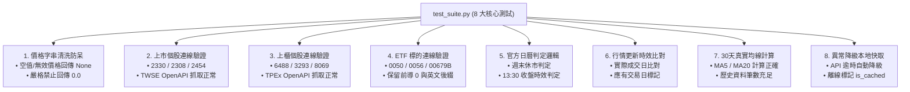

# 全端應用程式測試與品質驗證規範 (Web App Testing Guidelines)

> **定位**：建立端到端的自動化測試策略、API 整合測試管線、行情數值防呆驗證與發布前品質檢驗流程，確保每次代碼迭代皆達到零回歸（Zero Regression）。  
> **適用技術棧**：Python `unittest`、FastAPI TestClient、`test_suite.py`。  
> **關聯規範**：[`dev-guidelines.md`](file:///c:/Users/TINA/Documents/antigravity/practice/.agents/rules/dev-guidelines.md) | [`backend/test_suite.py`](file:///c:/Users/TINA/Documents/antigravity/practice/backend/test_suite.py)

---

## 1. 測試架構與八大核心測試項 (The 8 Core Test Suites)

專案測試核心集於 [`backend/test_suite.py`](file:///c:/Users/TINA/Documents/antigravity/practice/backend/test_suite.py)，涵蓋以下 8 大驗證維度：



---

## 2. 測試執行指引 (Running Tests)

在本地執行測試套件：

```powershell
# 執行全套件測試
py backend/test_suite.py
```

### 預期通過輸出
```text
........
----------------------------------------------------------------------
Ran 8 tests in 0.942s

OK
================== 開始台股官方整合檢核 ==================
  [V] 第 1 關通過: 文字清洗與無效價格防呆正確 (缺少時為 None，非轉成 0)
  [V] 上市股票 2330 (台積電): 收盤 2,550.00 元 | 來源: 臺灣證交所 (TWSE)
  ...
  [V] 第 8 關通過: API 失敗時標記更新失敗，退回真實歷史快取並提示
```

---

## 3. 核心測試案例設計原則

### 3.1 邊界與極值測試 (Edge Cases)
- **價格為空/零**：輸入 `""`、`"--"`、`"0.00"`（且成交量為 0）時，驗證 `clean_price_val()` 回傳 `None` 而非 `0`。
- **代碼型別保護**：傳入 `'0050'`、`'00631L'` 時，驗證未被字串截斷或轉型為整數。

### 3.2 隔離與快取測試
- 測試異常降級時，模擬斷網或 503 錯誤，驗證系統能否自 `backend/cache/market_quotes_cache.json` 讀取歷史數據並維持系統不中斷。

---

## 4. 上線前測試驗收標準 (Acceptance Gate)

- [ ] **8 項單元測試 100% 通過**（無任何 `FAIL` 或 `ERROR`）。
- [ ] **代碼保留前導零**：上市櫃與 ETF 標的皆具備前導 0 驗證。
- [ ] **無假零價格**：未成交股票絕對不出現 `0.00` 收盤價。
- [ ] **快取降級機制有效**：模擬 API 離線時能優雅退避至最近快照。
