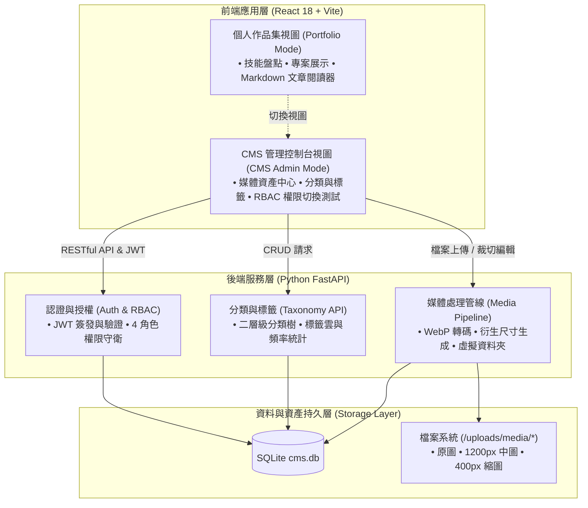

# 企業級內容管理系統與個人作品集平台 (Enterprise CMS & Portfolio Platform)

> **版本**：v2.0.0  
> **最後更新**：2026-09-12  
> **狀態**：開發中 (In Progress - Phase 2 交付完成)  
> **技術棧**：React 18 + Vite | Python FastAPI + SQLite + Pillow  

---

## 1. 專案簡介 (Overview)

本專案是一套整合了**現代化個人作品集 (Portfolio)** 與**企業級內容管理系統 (CMS)** 的全端應用平台。系統前台具備深淺色主題切換、技術技能棧盤點、專案作品展示與長文 Markdown 閱讀器；後台則具備完整的 RBAC 角色權限體系、二層級分類樹、標籤系統與高效能 WebP 媒體影像處理管線。

---

## 2. 系統架構與功能模組 (Architecture & Modules)

系統分為前端互動層、後端 API 服務層與資料持久化層：



### 2.1 核心模組功能一覽

1. **個人作品集 (Portfolio)**：
   - **深淺色主題切換**：支援即時切換並持久化儲存於 `localStorage`。
   - **文章詳情閱讀器**：支援純文字與 Markdown 渲染，具備自動目錄導航與代碼區塊高亮。
   - **專案與技能展演**：多維度篩選專案分類（全端、AI、前端、後端）。

2. **企業級 CMS - Phase 1：資料核心與 RBAC 基礎**：
   - **四層級角色矩陣 (RBAC)**：支援超級管理員 (`super_admin`)、主編 (`editor`)、作者 (`author`)、校對員 (`proofreader`)。
   - **二層級分類樹**：支援父子分類階層關聯，防呆刪除保護。
   - **標籤雲系統**：即時關鍵字檢索、使用頻率統計與自定義標籤新增。

3. **企業級 CMS - Phase 2：媒體管線與資產中心**：
   - **自動轉碼與壓縮**：上傳圖片自動轉換為 85% 質量之 WebP 格式，平均節省 70% 頻寬。
   - **多尺寸衍生圖**：自動生成 1200px 中圖與 400px 正方形縮圖。
   - **檔案安全檢查**：Magic Number 檔案標頭檢驗，限制單檔 20MB。
   - **媒體庫操作**：虛擬資料夾歸類、多圖批次上傳、Alt Text 編輯與即時圖片裁切/旋轉。

---

## 3. 技術棧總覽 (Tech Stack)

| 領域 | 技術項目 | 版本 / 規格 | 用途說明 |
| :--- | :--- | :--- | :--- |
| **前端框架** | React | `^18.3.1` | 元件化使用者介面構建 |
| **構建工具** | Vite | `^6.2.0` | 現代化前端極速建置與熱重載 (HMR) |
| **樣式設計** | 語意化 CSS / CSS Variables | CSS3 | 主題色彩變數管理與響應式排版 |
| **後端框架** | FastAPI | Python 3.10+ | 高效能非同步 RESTful API 服務 |
| **資料庫** | SQLite (`cms.db`) | SQLite3 | 內嵌式關係型資料庫，支援外鍵約束 |
| **認證機制** | PyJWT | RFC 7519 | JSON Web Token 簽發與 Bearer 驗證 |
| **影像處理** | Pillow (PIL) | 最新穩定版 | WebP 轉碼、衍生尺寸縮圖與 EXIF 旋轉校正 |
| **API 測試** | TestClient & Pytest | Python | 自動化單元測試與整合驗證 |

---

## 4. 專案目錄結構 (Directory Structure)

```text
practice/
├── .agents/                    # AI Agent 規範與客製化設定
│   └── rules/
│       ├── dev-guidelines.md   # 專案架構與全端開發規範
│       └── docs-writing.md     # 專案文件與 Markdown 撰寫規範
├── backend/                    # 後端 API 模組 (FastAPI)
│   ├── auth.py                 # JWT 認證與 RBAC 權限守衛中介層
│   ├── cms.db                  # 核心資料庫 (SQLite)
│   ├── db.py                   # 資料庫連線、Schema 定義與種子資料
│   ├── main.py                 # API 主程式與端點路由
│   ├── media_pipeline.py       # 媒體影像處理與 WebP 轉碼管線
│   ├── test_phase1.py          # Phase 1 自動化驗收測試腳本
│   └── test_phase2.py          # Phase 2 自動化驗收測試腳本
├── src/                        # 前端應用程式原始碼 (React)
│   ├── components/             # React 介面元件
│   │   ├── ArticleDetail.jsx   # 文章閱讀詳情元件
│   │   ├── CmsPhase1.jsx       # CMS 管理主控台 (含 RBAC 測試與分類管理)
│   │   └── MediaGallery.jsx    # 媒體庫與資產管理介面
│   ├── data/                   # 靜態模擬資料
│   ├── App.jsx                 # 前端應用主入口 (作品集 / CMS 切換)
│   ├── index.css               # 全域樣式與主題變數
│   └── main.jsx                # React DOM 掛載點
├── uploads/                    # 媒體上傳實體存儲目錄
│   └── media/                  # WebP 轉碼圖檔與縮圖
├── package.json                # 前端依賴配置
├── prd.md                      # CMS 產品需求文件
├── spec.md                     # CMS 系統架構規格書
├── todo.md                     # 開發進度里程碑與任務清單
└── vite.config.js              # Vite 構建配置
```

---

## 5. 快速上手與環境建置 (Getting Started)

### 5.1 前置需求 (Prerequisites)

- **Node.js**：`v18.0.0` 或更高版本
- **npm**：`v9.0.0` 或更高版本
- **Python**：`3.10` 或更高版本

### 5.2 後端環境建置與啟動 (Backend Setup)

1. **安裝 Python 依賴套件**：
   ```bash
   pip install fastapi uvicorn pyjwt pillow python-multipart pydantic pytest
   ```

2. **初始化資料庫與種子資料**：
   資料庫會在後端服務初次啟動時自動檢查並注入種子資料；亦可手動執行腳本進行重置：
   ```bash
   python -c "from backend.db import init_cms_database; init_cms_database()"
   ```

3. **啟動 FastAPI 後端伺服器**：
   在專案根目錄下執行以下指令：
   ```bash
   uvicorn backend.main:app --reload --host 127.0.0.1 --port 8000
   ```
   > [!NOTE]
   > 啟動成功後，可開啟瀏覽器存取互動式 API 文件：
   > - Swagger UI：`http://127.0.0.1:8000/docs`
   > - ReDoc：`http://127.0.0.1:8000/redoc`

### 5.3 前端環境建置與啟動 (Frontend Setup)

1. **安裝 npm 依賴套件**：
   ```bash
   npm install
   ```

2. **啟動 Vite 開發伺服器**：
   ```bash
   npm run dev
   ```
   啟動後預設於 `http://localhost:5173` 開啟前端網頁。

3. **切換 CMS 管理介面**：
   進入前台作品集頁面後，點選頂部導覽列右側的 **「CMS 後台」** 按鈕，即可進入後台管理控制台。

---

## 6. 測試帳號與權限矩陣 (Test Accounts & RBAC)

資料庫已預先注入 4 組預設測試帳號，均配置預設密碼 `password123`：

| 角色名稱 | 英文代碼 | 測試登入帳號 | 預設密碼 | 核心權限範圍 |
| :--- | :--- | :--- | :--- | :--- |
| **超級管理員** | `super_admin` | `admin@cms.example.com` | `password123` | 系統最高權限、所有資料 CRUD、全站設定 |
| **總編輯 / 主編** | `editor` | `editor@cms.example.com` | `password123` | 分類管理、媒體上傳/刪除、文章審核與發佈 |
| **專欄作者** | `author` | `author@cms.example.com` | `password123` | 專屬媒體庫管理、草稿撰寫、提交審查 |
| **校對員** | `proofreader` | `proofreader@cms.example.com` | `password123` | 內容檢視與校對修正，無分類管理與發佈權限 |

> [!TIP]
> 在 CMS 前端控制台的 **「RBAC 權限測試」** 分頁中，提供「一鍵切換身份」功能，無須手動反覆登出登入即可快速驗證 API 權限守衛。

---

## 7. 常用 API 端點清單 (Core API Endpoints)

### 7.1 認證與系統 (Auth & System)
- `POST /api/v1/auth/login`：使用者登入，回傳 JWT 存取權杖。
- `GET /api/v1/auth/me`：取得當前登入者身分與角色。
- `GET /api/v1/system/summary`：取得系統統計概況（使用者數、分類數、標籤數等）。

### 7.2 分類與標籤 (Categories & Tags)
- `GET /api/v1/categories`：取得樹狀結構分類清單。
- `POST /api/v1/categories`：新增分類（需 `super_admin` 或 `editor`）。
- `DELETE /api/v1/categories/:id`：刪除分類（支援關聯文章防呆轉移）。
- `GET /api/v1/tags`：取得標籤雲清單與使用統計。
- `POST /api/v1/tags`：新增標籤。

### 7.3 媒體管線 (Media Pipeline)
- `POST /api/v1/media/upload`：上傳單圖或多圖，自動轉碼為 WebP 並生成縮圖。
- `GET /api/v1/media`：取得媒體資產列表（支援資料夾篩選與分頁）。
- `PATCH /api/v1/media/:id`：更新圖片 Alt Text、檔名或所屬資料夾。
- `POST /api/v1/media/:id/crop`：線上裁切或旋轉圖片並重新生成衍生圖。
- `DELETE /api/v1/media/:id`：刪除媒體資產及實體圖檔。
- `GET /api/v1/media/folders`：取得虛擬資料夾列表。
- `POST /api/v1/media/folders`：建立虛擬資料夾。

---

## 8. 自動化測試驗證 (Automated Testing)

專案內建獨立驗收測試腳本，用以確保各階段目標與邊界條件符合規範：

### 8.1 執行 Phase 1 驗收測試 (RBAC 與資料核心)
```bash
python backend/test_phase1.py
```
測試涵蓋項目：
- 公開系統端點存取性
- 4 種角色登入與 JWT 簽發
- 越權阻擋攔截（如作者嘗試刪除分類回傳 `403 Forbidden`）
- 二層分類樹與標籤 API 正確性

### 8.2 執行 Phase 2 驗收測試 (媒體管線與轉碼)
```bash
python backend/test_phase2.py
```
測試涵蓋項目：
- 非法格式檔案標頭 (Magic Number) 上傳阻斷
- WebP 85% 質量轉碼與壓縮率檢驗
- 1200px 中圖與 400px 縮圖尺寸驗證
- 虛擬資料夾移動與 Alt Text 即時編輯

---

## 9. 相關規格文件 (Related Documentation)

- **產品需求文件**：[prd.md](file:///c:/Users/TINA/Documents/antigravity/practice/prd.md)
- **技術規格書**：[spec.md](file:///c:/Users/TINA/Documents/antigravity/practice/spec.md)
- **任務執行清單**：[todo.md](file:///c:/Users/TINA/Documents/antigravity/practice/todo.md)
- **文件撰寫規範**：[.agents/rules/docs-writing.md](file:///c:/Users/TINA/Documents/antigravity/practice/.agents/rules/docs-writing.md)
- **全端開發規範**：[.agents/rules/dev-guidelines.md](file:///c:/Users/TINA/Documents/antigravity/practice/.agents/rules/dev-guidelines.md)
