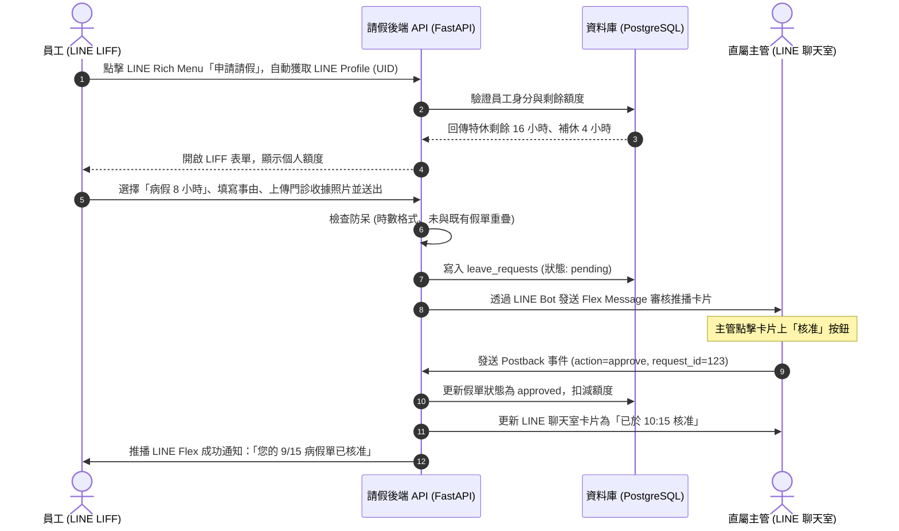
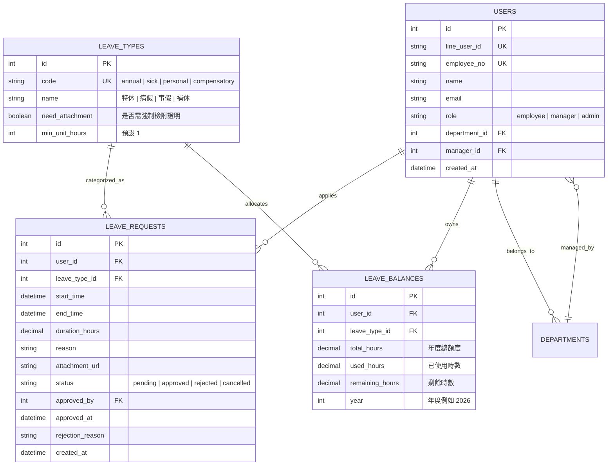

# LINE 輕量級員工請假與審核系統 (LINE Leave App) 產品需求文件 (PRD.md)

> **文件版本**：v1.0.0  
> **文件狀態**：已收斂 / 準備進入開發 (Approved for Development)  
> **目標客群**：中小型企業、新創團隊、診所與專業事務所 (10 ~ 100 人團隊)  
> **核心技術棧**：LINE Messaging API + LIFF (LINE Front-end Framework) + FastAPI / Node.js + PostgreSQL  
> **最後更新**：2026-09-12  

---

## 1. 產品概述與核心價值 (Product Overview & Value Proposition)

### 1.1 問題陳述 (Problem Statement)
- **現行痛點**：
  1. **重型 HR 系統昂貴且笨重**：市售人資系統（如 Workday、104 人資）導入成本高、功能過於複雜，員工每年登入次數少，常忘記密碼。
  2. **紙本/通訊軟體請假混亂**：用 LINE 私訊或紙本假單請假，主管容易漏批、無防呆額度計算，月底人資/會計核對薪資時需耗費 2~3 天人工比對。
  3. **出勤透明度低**：同仁請假無公開行事曆或即時推播，跨部門協作常撲空。

### 1.2 產品願景與定位 (Vision & Positioning)
打造**「零安裝摩擦力、零學習成本」**的企業級請假管理工具：
- **員工端**：直接在每個人天天使用的 LINE 官方帳號內，點擊選單 30 秒完成填單與證明上傳。
- **主管端**：LINE 聊天室收到精美 Flex Message 互動卡片，一鍵點擊「核准 / 駁回」，隨時隨地 3 秒完成簽核。
- **人資/會計端**：提供簡易 PC 後台，出勤日曆一目瞭然，月底一鍵匯出標準假卡 Excel/CSV 報表。

---

## 2. 目標與成功指標 (Goals & Metrics)

### 2.1 專案目標 (In-Scope Goals)
- [x] 透過 LINE LIFF 實現免帳密自動登入（以 LINE UID 綁定企業員工）。
- [x] 支援符合台灣勞基法標準假別（特休、事假、病假、補休、婚喪產假、生理假）。
- [x] 提供特休/補休時數實時檢核與自動扣抵，杜絕超額請假。
- [x] LINE 內一鍵互動審核與即時雙向推播通知。
- [x] 管理者後台：員工配額維護與月底出勤總表匯出。

### 2.2 明確非本期目標 (Non-Goals / Out of Scope - MVP 剪裁)
> [!IMPORTANT]
> 為了確保 3 週內完成 MVP 落地，以下項目明確留待 Phase 2：
- ❌ **排班/打卡 GPS 定位**：本期專注「請假與簽核」，不整合 GPS 門市上下班打卡。
- ❌ **多層級會簽審核**：第一版嚴格限制「直屬主管一級審核」，不支援超過 2 級以上會簽。
- ❌ **薪資自動試算系統**：僅提供請假時數總表匯出，薪資折算留給會計現有薪資軟體。

### 2.3 成功衡量指標 (Success Metrics)
| 指標名稱 | 目前基準 (Baseline) | MVP 上線後目標 (Target) |
| :--- | :--- | :--- |
| **員工填單平均耗時** | 5 ~ 10 分鐘（紙本/電腦打卡） | **< 45 秒** |
| **主管平均簽核回覆時間** | 12 ~ 24 小時 | **< 2 小時**（隨身 LINE 審核） |
| **月底請假資料核對工時** | 16 小時 / 月 | **< 15 分鐘**（一鍵匯出報表） |

---

## 3. 使用者角色與權限矩陣 (User Personas & RBAC)

| 角色名稱 | 角色代碼 | 存取介面 | 核心使用情境與功能 | 權限範圍 |
| :--- | :--- | :--- | :--- | :--- |
| **一般同仁** | `employee` | LINE LIFF 手機端 | 申請請假、查看自身假別剩餘額度、檢視歷史假單進度、取消待審核假單 | 僅限操作本人資料 |
| **直屬主管** | `manager` | LINE 聊天室 (Flex) + LIFF | 接收部屬請假推播、一鍵同意/駁回、查看部門同仁請假行事曆 | 操作所屬部門假單審批 |
| **人資/系統管理員** | `admin` | Web PC 後台管理端 | 員工資料與 LINE ID 綁定、匯入年度特休額度、全公司出勤行事曆、報表匯出 | 全系統最高權限 |

---

## 4. 端到端使用者旅程 (User Journey & Flowchart)



---

## 5. 功能規格與 MoSCoW 優先順序 (Feature Matrix)

### 5.1 優先等級清單
- **P0 (Must-Have)**：MVP 必要功能，缺之不可上線。
- **P1 (Should-Have)**：高價值功能，次版優先迭代。
- **P2 (Could-Have)**：資源充足時再行開發。
- **P3 (Won't-Have)**：明確不列入當前規劃。

| 模組 | 功能項目 | 優先級 | 說明 | 關聯代碼 |
| :--- | :--- | :---: | :--- | :--- |
| **身分與綁定** | LINE 自動登入與 UID 綁定 | **P0** | 透過 LIFF SDK 獲取 `userId`，初次需輸入員工工號/手機進行綁定 | `FR-AUTH-01` |
| **請假申請** | 勞基法標準假別選擇與額度連動 | **P0** | 支援特休、事假、普通傷病假、補休、公假、喪假、生理假 | `FR-LEAVE-01` |
| **請假申請** | 起訖時間與時數自動試算 | **P0** | 選擇日期與時間，自動排除午休 (12:00~13:00) 與例假日 | `FR-LEAVE-02` |
| **請假申請** | 附件拍照/相簿上傳 | **P0** | 病假或特殊假別可上傳收據或證明照片（限制 10MB） | `FR-LEAVE-03` |
| **簽核流程** | LINE Flex Message 一鍵審批 | **P0** | 主管在 LINE 收到卡片，直接點擊核准/駁回並可輸入備註 | `FR-APPR-01` |
| **通知系統** | 即時雙向推播通知 | **P0** | 送出即時推播主管、審核完成即時推播同仁 | `FR-NOTI-01` |
| **管理後台** | 員工特休/補休額度匯入與調整 | **P0** | 人資可在 PC 後台批量維護每位同仁年度特休總天數 | `FR-ADM-01` |
| **管理後台** | 請假紀錄 Excel/CSV 匯出 | **P0** | 供會計月底核算薪資與出勤扣款 | `FR-ADM-02` |
| **個人查詢** | 我的假單與請假歷史清單 | **P1** | 員工可於 LIFF 查看審核中、已核准假單與年度請假統計 | `FR-LEAVE-04` |
| **流程防呆** | 銷假 / 取消假單申請 | **P1** | 尚未發生的假單允許員工申請取消，由主管確認後回補額度 | `FR-APPR-02` |
| **出勤透明** | 今日誰請假 (團隊行事曆) | **P1** | 部門同仁可於 LINE 查看今日有哪些人排休，方便代理 | `FR-TEAM-01` |
| **簽核強化** | 逾期未審核自動催簽 | **P2** | 假單超過 24 小時未簽核，Bot 自動提醒主管 | `FR-APPR-03` |

---

## 6. 詳細功能規格與驗收條件 (Acceptance Criteria)

### 模組 1：請假申請與試算模組 (FR-LEAVE)

#### FR-LEAVE-01: 起訖時間與有效時數自動試算
- **輸入欄位**：
  - 請假日期：日曆選擇器（不得小於今日 30 天前，防惡意補單）。
  - 起訖時間：下拉選單（以 1 小時為單位，例如 09:00 至 18:00）。
- **業務試算邏輯**：
  1. **午休排除**：若時間跨越 12:00 ~ 13:00，自動扣除 1 小時（例如：09:00 ~ 18:00 全天工時計算為 8 小時，而非 9 小時）。
  2. **例假日排除**：若選擇跨天，週六、週日自動不計入請假天數。
  3. **最小單位**：1 小時。不足 1 小時以 1 小時計。
- **防呆機制 (Edge Cases)**：
  - 結束時間早於開始時間時，按鈕 Disable 並提示「結束時間不得早於開始時間」。
  - 與已有「審核中」或「已核准」假單時段重疊時，阻擋送單並提示「該時段已有請假紀錄」。
- **驗收準則 (Gherkin AC)**：
  ```gherkin
  場景: 請假時數自動扣除午休時間
    假設 員工在 LIFF 表單選取 2026-10-05 09:00 至 18:00
    當 系統執行工時計算引擎
    那麼 畫面即時顯示總請假時數為「8 小時」
    並且 提示標籤標註「已扣除 12:00-13:00 午休 1 小時」
  ```

---

#### FR-LEAVE-02: 特休與補休額度校驗
- **業務規則**：
  - 員工選擇「特休」或「補休」時，表單動態載入剩餘可用時數（例如：「特休剩餘：12 小時」）。
  - 申請時數 > 剩餘時數時，送出按鈕反灰 Disable，並標註紅字提示：「特休額度不足（剩餘 12 小時，申請 16 小時），請調整時數或改請事假」。
- **驗收準則 (Gherkin AC)**：
  ```gherkin
  場景: 申請時數超出特休餘額
    假設 員工當前特休餘額為 4 小時
    當 員工嘗試申請 8 小時特休並點擊送出
    那麼 系統應阻擋送單
    並且 顯示彈窗提示「特休額度不足，目前剩餘 4 小時」
  ```

---

### 模組 2：主管 LINE Flex Message 互動審核 (FR-APPR)

#### FR-APPR-01: 一鍵審批與訊息狀態防竄改
- **推播內容 (Flex Message)**：
  - 標題：【請假簽核通知】
  - 內容：申請人姓名、部門、假別（彩色標籤區分）、起訖時間、合計時數、請假事由。
  - 附件按鈕：若有收據，附帶「查看證明」超連結按鈕。
  - 操作按鈕：綠色【核准】與紅色【駁回】。
- **簽核回饋與狀態更新**：
  - 主管點擊【核准】後，API 驗證成功，主管端的原訊息即時透過 `replyMessage` 或更新畫面置換為：「✅ 已核准（簽核時間：2026-09-12 14:30）」，按鈕消失，防止重複點擊。
  - 若點擊【駁回】，彈出輸入框（LIFF 微視窗或文字回覆）填寫駁回原因（如「該日為季度大會，請調整時間」），並推播給同仁。
- **驗收準則 (Gherkin AC)**：
  ```gherkin
  場景: 主管在 LINE 聊天室成功核准假單
    假設 主管收到部屬送出的請假通知 Flex Message
    當 主管點擊卡片上的「核准」按鈕
    那麼 後端將該假單狀態由 pending 轉為 approved
    並且 該名員工即刻在 LINE 收到推播通知「您的 9/15 事假單已由主管核准」
    並且 主管聊天室內的按鈕更新為「已核准」，無法再次重複點擊
  ```

---

## 7. 非功能性需求 (Non-Functional Requirements)

1. **效能要求 (Performance)**：
   - LIFF 首屏載入時間 (FCP) < 1.0 秒。
   - LINE Flex Message 推播延遲 < 3 秒。
2. **安全性要求 (Security)**：
   - 採用 LINE 官方簽發之 `id_token` / `access_token` 於後端進行身分簽名驗證，防止惡意冒用 UID。
   - 假單審核 Postback 帶有一次性簽核權杖 (Non-reusable Token)，杜絕重放攻擊。
3. **可用性與體驗 (UX)**：
   - 遵循 LINE 官方 HIG 設計規範，色系使用乾淨商務綠白風格，適配 iOS 與 Android LINE 內嵌瀏覽器。

---

## 8. 領域資料實體模型 (Data Model / ERD)



---

## 9. 階段交付與發布計畫 (Milestones)

| 里程碑 | 時程 | 核心產出成果 | 驗收標準 |
| :--- | :--- | :--- | :--- |
| **Sprint 1 (架構與綁定)** | Week 1 | LINE 官方帳號申請、Webhook 部署、LIFF 員工 LINE UID 綁定 API | 員工加入好友後，打開 LIFF 成功綁定工號並顯示個人姓名 |
| **Sprint 2 (請假核心鏈)** | Week 2 | LIFF 請假表單、時數計算引擎、特休扣抵、LINE Flex 主管一鍵核准 | 員工送出假單，主管在 LINE 卡片點擊核准，雙方同步更新狀態 |
| **Sprint 3 (後台與報表)** | Week 3 | PC 端管理後台、員工額度 Excel 批次匯入、請假總表 CSV 匯出 | 人資後台能下載全公司請假明細 Excel，且數據與資料庫 100% 吻合 |
