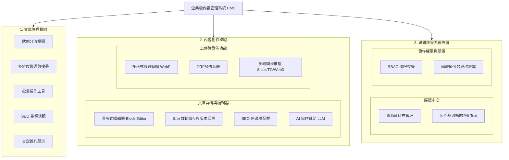
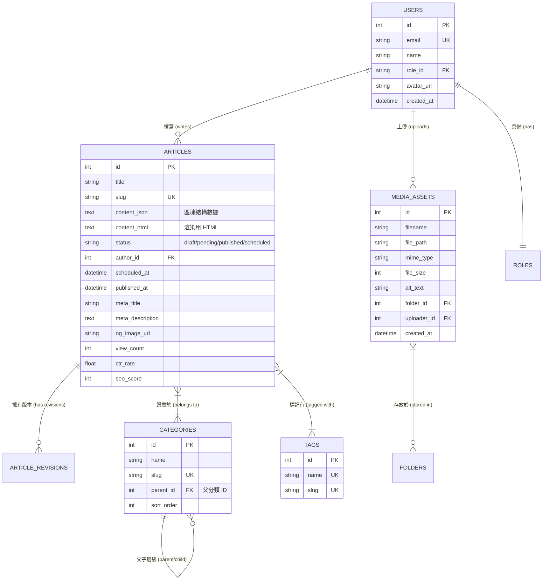
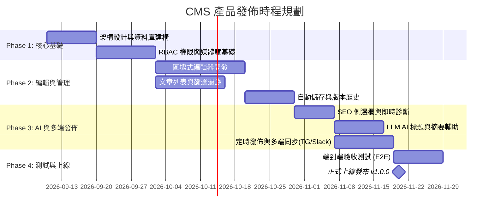

# 內容管理系統 (CMS) 產品需求文件 (PRD)

> **版本**：v1.0.0  
> **建立日期**：2026-09-05  
> **狀態**：審查中 (In Review)  
> **文件代號**：PRD-CMS-202609  

---

## 1. 專案背景與目標 (Background & Goals)

### 1.1 背景說明
隨著數位內容行銷、SEO 權重經營與跨平台內容散播的需求日益增加，傳統單一維度的部落格或簡易 CMS 已無法滿足現代內容團隊的高效協作。編輯團隊面臨內容狀態追蹤不易、多媒體排版瑣碎、SEO 缺乏即時輔助與多端手動發佈低效等痛點。

### 1.2 產品願景
打造一套集**「內容生命週期管理」、「現代化富文本創作」、「智慧 AI 輔助」與「多端自動化分發」**於一體的高效企業級 CMS 平台，顯著縮短內容生產週期並極大化內容曝光效益。

### 1.3 核心指標 (Success Metrics / KPIs)
- **創作效率提升**：文章初稿至發佈時程縮短 40%。
- **SEO 優化達標率**：新發佈文章 SEO 檢核通過率達 90% 以上。
- **協作零事故**：自動儲存與版本回溯機制達成 100% 編輯數據防遺失。

---

## 2. 使用者角色與權限矩陣 (User Roles & RBAC)

| 角色名稱 | 英文標識 | 職責與權限範圍 |
| :--- | :--- | :--- |
| **超級管理員** | `Super Admin` | 擁有系統所有權限，包含 RBAC 角色分配、全站系統設定、所有文章發佈與刪除。 |
| **總編輯 / 主編** | `Editor-in-Chief` | 管理所有文章、審核「待審核」文章、指派標籤分類、執行定時排程與批次操作。 |
| **作者 / 專欄作家** | `Author` | 創建與編輯自己的文章、上傳媒體資源、提交文章至「待審核」狀態。 |
| **校對員 / 審稿員** | `Proofreader` | 審核文章內容、修正錯別字、建議 SEO 與標籤優化，無最終刪除與全站設置權限。 |

---

## 3. 系統功能架構圖 (System Architecture)

---

## 4. 詳細功能規格 (Functional Requirements)

### 模組 1：文章管理模組 (Article Management)
此模組負責內容的全局概覽與篩選，旨在讓管理者快速掌握發佈現狀。

#### 1.1 文章列表 (Article List)

| 功能編號 | 功能名稱 | 優先級 | 詳細需求描述與規格 | 驗收準則 (Acceptance Criteria) |
| :--- | :--- | :---: | :--- | :--- |
| **F1.1.1** | **狀態分流視圖** | P0 | 列表頂部提供快照切換 Tab： • 全部 (`All`) • 草稿 (`Draft`) • 待審核 (`Pending Review`) • 已發佈 (`Published`) • 排程中 (`Scheduled`) | 1. 點擊不同 Tab 即時切換列表並帶有徽章筆數計數。 2. 支援網址 Query 參數聯動（如 `?status=draft`）。 |
| **F1.1.2** | **多維度篩選與搜尋** | P0 | 支援複合條件篩選面板： • 標題關鍵字（即時模糊比對） • 作者選單（支援下拉單選/多選） • 分類與標籤關聯過濾 • 日期區間選擇器（建立日期 / 發佈日期） | 1. 支援複合條件同時生效。 2. 提供「一鍵重設所有篩選」按鈕。 |
| **F1.1.3** | **批量操作工具** | P1 | 列表首列設有勾選框（Checkbox），支援單頁全選與跨選： • 批次變更狀態（批次發佈、下架） • 批次移至垃圾桶 / 永久刪除 • 批次修改分類（更換或追加） | 1. 選取項目時底部彈出浮動操作列。 2. 批次刪除需二次確認防呆彈窗。 |
| **F1.1.4** | **SEO 指標快照** | P1 | 列表行內直接展示關鍵指標快照： • 瀏覽量 (PV, Page Views) • 點擊率 (CTR, Click-Through Rate) • SEO 分數檢測燈號（紅/黃/綠 0-100 分） | 1. 滑鼠懸停於 SEO 分數時浮現扣分原因與診斷提示。 2. 數據每日自動同步統計。 |
| **F1.1.5** | **自定義列顯示** | P2 | 列表右上角提供「欄位設定（Column Visibility）」選單，可動態勾選隱藏/顯示： • 封面圖縮圖 • 文章字數統計 (Character Count) • 最後更新時間 • 留言數 | 1. 欄位顯示偏好儲存於使用者本機 `LocalStorage`。 2. 重整頁面後維持個人化排版。 |

---

### 模組 2：內容創作模組 (Editor & Creation)
核心功能在於提升編輯體驗，支援結構化內容輸入與後端數據處理。

#### 2.1 文章詳情與編輯器 (Article Details / Editor)

| 功能編號 | 功能名稱 | 優先級 | 詳細需求描述與規格 | 驗收準則 (Acceptance Criteria) |
| :--- | :--- | :---: | :--- | :--- |
| **F2.1.1** | **區塊式編輯器 (Block-based Editor)** | P0 | 採用 Block-style 互動體驗： • 完整 Markdown 快捷語法支援（`#`, `**`, `>` 等） • 區塊拖拽排序 (Drag & Drop) • 多媒體嵌入區塊：圖片、YouTube/Vimeo 影片、X (Twitter)/Instagram 貼文代碼 | 1. 任何區塊均可按 Enter 換行或按 `/` 喚起指令清單。 2. 支援拖拽任意區塊手柄調整段落順序。 |
| **F2.1.2** | **即時自動儲存與版本回溯** | P0 | • **自動儲存**：閒置 3 秒或每隔 30 秒背景自動存入草稿，防止斷電/崩潰。 • **版本歷史 (Revisions)**：記錄每次重要發佈與定時存檔，提供側邊欄 Timeline 比對與一鍵還原。 | 1. 頂部狀態列即時顯示「儲存於 14:32:01」。 2. 版本歷史支援雙欄 Diff 差異對比檢視。 |
| **F2.1.3** | **SEO 側邊欄配置** | P0 | 編輯器右側提供 SEO 專屬設定面板： • 自定義 Slug (URL 永久連結路徑) • Meta Title (字數限制 60 字內，附進度條) • Meta Description (字數限制 160 字內) • Open Graph (OG) 社群分享預覽卡片 (FB / LINE / X) | 1. 編輯 Meta 時即時渲染 Google 搜尋結果預覽卡片。 2. 支援一鍵上傳或從內文擷取 OG 封面縮圖。 |
| **F2.1.4** | **AI 協作輔助 (LLM)** | P1 | 深度整合 LLM (大語言模型) API： • **標題靈感庫**：輸入內文一鍵生成 5 組高 CTR 吸睛標題。 • **智慧摘要**：自動提取 150 字精華摘要作為 Meta Description。 • **關鍵字擷取**：自動分析全文並推薦 3~5 組核心 SEO 標籤。 | 1. AI 視窗具備「一鍵填入」與「重新生成」按鈕。 2. 提供口吻風格選項（專業客觀、引人入勝、輕鬆生活）。 |

#### 2.2 後端上傳與發佈功能 (Upload & Publishing)

| 功能編號 | 功能名稱 | 優先級 | 詳細需求描述與規格 | 驗收準則 (Acceptance Criteria) |
| :--- | :--- | :---: | :--- | :--- |
| **F2.2.1** | **多格式媒體上傳優化** | P0 | 支援單圖或多圖拖拽上傳： • 自動轉換格式為現代 **WebP**。 • 智慧壓縮（保持 85% 視覺無損，檔案體積平均縮減 60%）。 • 生成響應式尺寸（Thumbnail, Medium, Large）。 | 1. 單檔上傳上限預設 20MB。 2. 上傳完成後自動將 CDN 最佳化網址插入編輯器中。 |
| **F2.2.2** | **定時發佈系統** | P1 | 提供「指定發佈時間（Scheduled）」功能： • 選擇未來的特定日期與時間點。 • 後端排程任務（Cron/Queue）於到達時間時，自動將狀態由「排程中」轉為「已發佈」。 | 1. 到達預定時間後 1 分鐘內完成發佈轉移。 2. 支援在到達時間前隨時修改或取消排程。 |
| **F2.2.3** | **多端同步發佈** | P2 | 文章正式發佈時，支援觸發 Webhook 或 API 推播： • **社群與通訊軟體**：自動向指定 Telegram Channel 或 Slack 發送發佈卡片。 • **Web3 鏈上永久存儲**：支援將 Markdown 原文備份至 IPFS / Arweave 節點。 | 1. 發佈彈窗中提供勾選框供編輯自主勾選是否推播。 2. 推播失敗不影響本站主文章發佈，並記錄失敗日誌。 |

---

### 模組 3：媒體庫與系統設置 (Media & Assets)
作為 CMS 的底層支撐，處理靜態資源與全站配置。

#### 3.1 媒體中心 (Media Gallery)

| 功能編號 | 功能名稱 | 優先級 | 詳細需求描述與規格 | 驗收準則 (Acceptance Criteria) |
| :--- | :--- | :---: | :--- | :--- |
| **F3.1.1** | **全站資源管理** | P0 | 集中式管理全站圖片 (JPG/PNG/GIF/WebP/SVG)、影音 (MP4) 與 PDF 檔案： • 支援樹狀資料夾層級分類（如：`/2026/專題報導/`）。 • 支援檔名搜尋、檔案大小與上傳時間排序。 | 1. 支援在不同資料夾間拖拽移動檔案。 2. 顯示每個檔案在哪些文章中被引用。 |
| **F3.1.2** | **圖片內建編輯工具** | P1 | 於媒體庫點擊圖片可直接開啟輕量編輯視窗： • 裁切 (Crop，預設 16:9, 4:3, 1:1, 自訂) • 旋轉 (Rotate) 與縮放 (Resize) • **Alt Text (替代文字)** 統一編輯維護。 | 1. 保存時可選擇「覆蓋原圖」或「另存新檔」。 2. 必須提示編輯填寫 Alt Text，以符合 WCAG 無障礙與 SEO 要求。 |

#### 3.2 發佈權限與設置 (Settings)

| 功能編號 | 功能名稱 | 優先級 | 詳細需求描述與規格 | 驗收準則 (Acceptance Criteria) |
| :--- | :--- | :---: | :--- | :--- |
| **F3.2.1** | **RBAC 權限控管** | P0 | 基於角色的存取控制 (Role-Based Access Control)： • 管理員：全站所有權限。 • 編輯：可編輯與發佈所有人的文章，無帳號管理權限。 • 作者：僅能建立與編輯自己的草稿，發佈需提交審核。 • 校對：僅能給予評論與標記修訂建議。 | 1. 無權限之按鈕在介面上呈現停用（Disabled）或隱藏。 2. API 端必須執行嚴格的身分與角色權限校驗。 |
| **F3.2.2** | **分類與標籤管理** | P0 | • **兩層級分類架構**：支援「主分類 > 子分類」階層，並維護專屬分類 Slug。 • **標籤雲 (Tags) 管理**：全站標籤彙總、合併重複標籤、刪除未關聯標籤、統計標籤使用次數。 | 1. 分類刪除時需提示該分類下之文章轉移至預設分類。 2. 支援在編輯器內直接建立新標籤。 |

---

## 5. 資料庫實體關聯模型 (Data Model / ERD)

---

## 6. 非功能性需求 (Non-Functional Requirements)

### 6.1 效能要求 (Performance)
- **列表載入時間**：在 10,000 篇以上文章規模下，分頁列表首屏響應時間需小於 **400ms**。
- **編輯器流暢度**：超長篇（30,000 字以上及 50 張以上高解析圖片）輸入延遲低於 **16ms (60 FPS)**。
- **圖片轉換效能**：多圖上傳轉為 WebP 之伺服器處理時間每張不超過 **1.5 秒**。

### 6.2 安全性要求 (Security)
- **XSS 防禦**：編輯器輸入之 HTML 需經由白名單 Sanitizer 淨化，杜絕跨站腳本攻擊。
- **存取安全**：靜態媒體檔案上傳須執行後綴與 Magic Number 雙重 MIME 檢查，禁止上傳可執行檔。
- **審計日誌 (Audit Log)**：所有文章的「刪除」、「發佈」與「角色權限修改」必須記錄操作人員 IP 與時間戳記。

### 6.3 無障礙規範 (Accessibility)
- 後台介面符合 **WCAG 2.1 AA** 標準，支援鍵盤快捷操作（如 `Ctrl + S` 儲存、`Ctrl + K` 插入超連結）。

---

## 7. 產品開發里程碑規劃 (Milestones & Release Plan)

---

## 8. 附錄：術語表 (Glossary)
- **RBAC**：Role-Based Access Control（基於角色的存取控制）。
- **Block-based Editor**：區塊式編輯器（如同 Notion 或 WordPress Gutenberg，以獨立區塊組織內容）。
- **WebP**：Google 開發之現代圖片格式，提供優秀之無損與有損壓縮率。
- **Open Graph (OG)**：社群媒體協定，定義網頁被分享至 Facebook、LINE 時呈現之標題、描述與縮圖。
- **GraphRAG / LLM**：大語言模型與智慧輔助生成技術。
