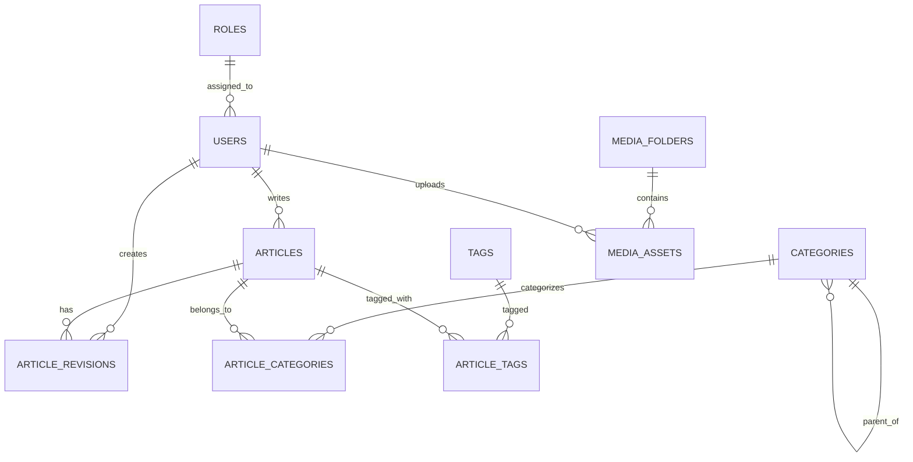
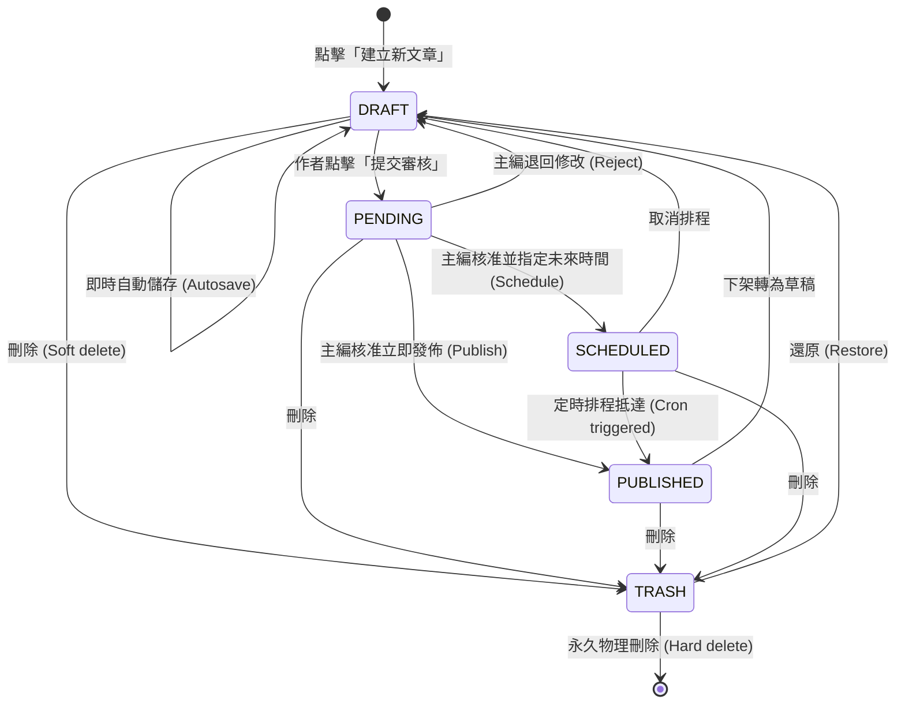

# 企業級內容管理系統 (CMS) 功能規格與技術設計文件 (SPEC.md)

> **版本**：v1.0.0  
> **文件狀態**：已審核 / 準備進入開發 (Approved for Development)  
> **關聯文件**：[prd.md](file:///c:/Users/TINA/Documents/antigravity/practice/prd.md)  
> **最後更新**：2026-09-05  

---

## 1. 功能概述與目標 (Overview & Objectives)

### 1.1 要解決的問題
1. **內容狀態追蹤混亂**：缺乏全局狀態流轉視圖，導致稿件在草稿、審核與排程階段遺失或重複溝通。
2. **編輯體驗低落與資料遺失風險**：傳統單純 HTML 輸入框排版瑣碎，遇瀏覽器崩潰或斷網容易遺失未儲存文稿。
3. **SEO 配置孤立與事後補救**：SEO 資訊往往在文章發佈後才被檢查，缺乏內嵌即時驗證、社群卡片預覽與 AI 標題/摘要輔助。
4. **多媒體資產缺乏最佳化**：大圖上傳未經壓縮直接拖慢前台首屏載入速度，缺乏統一的 Alt Text 與分類管理。
5. **發佈管道單一**：無法一鍵定時發佈並同步跨渠道（Slack/Telegram/Web3）廣播。

### 1.2 預期達成目標
- 打造標準化**文章生命週期管理**：支援 5 種狀態快照、多維度篩選與批量操作。
- 提供兼具靈活性與安全性的**區塊式編輯器 (Block-based Editor)**，具備 3 秒即時自動儲存與雙欄版本比對還原機制。
- 內建 **SEO 側邊欄與 AI 賦能**：即時預覽 Google 搜尋結果與社交卡片，整合 LLM 產出高 CTR 標題與摘要。
- 建立高性能**媒體管線**：支援 WebP 自動無損壓縮、尺寸自適應與雲端集中儲存。
- 實現嚴格的 **RBAC 角色存取控制**（超級管理員、總編輯、作者、校對員）。

---

## 2. 使用情境與使用者故事 (User Scenarios & Stories)

### 2.1 使用者故事 (User Stories)

| 序號 | 角色 (Who) | 使用情境 (When / Context) | 預期操作 (What) | 達成價值 (Why / Value) |
| :--- | :--- | :--- | :--- | :--- |
| **US-01** | **主編** | 每週內容審查會議時 | 在文章列表中點選「待審核」Tab，並按「SEO 分數」排序快速檢閱多篇稿件 | 快速掌握本週待上線內容品質並進行批次審核。 |
| **US-02** | **作者** | 撰寫長篇專題報導時 | 使用區塊式編輯器，透過 `/` 快速插入代碼塊、YouTube 嵌入影片，並依賴背景自動儲存 | 沉浸於心流寫作，無須擔心當機或斷網導致稿件遺失。 |
| **US-03** | **作者 / 編輯** | 完成文章草稿後 | 點擊「AI 輔助」，一鍵生成 5 組標題選項與 150 字 Meta 摘要，並檢視 Google/FB 分享卡片 | 提高文章在搜尋引擎與社群媒體上的點擊率 (CTR)。 |
| **US-04** | **主編** | 規劃國定連假檔期時 | 將通過審核的文章設定為特定連假期間定時發佈，並勾選同步廣播至官方 Telegram 頻道 | 無需人工於假日手動登入發佈，達成自動化運營。 |
| **US-05** | **編輯** | 上傳高解析度相機照片時 | 將 15MB 的 PNG 照片拖入編輯器，系統自動壓縮為 400KB WebP 並提示填寫 Alt Text | 兼顧畫質、載入效能與無障礙網頁規範 (WCAG)。 |
| **US-06** | **超級管理員** | 邀請外部特約專欄作家時 | 為其建立帳號並賦予「作者」角色，限制其僅能編輯自身草稿且發佈必須經過審核 | 保障全站內容發布安全性與組織資安邊界。 |

---

## 3. 詳細功能需求與規則 (Functional Requirements & Rules)

### 模組 1：文章管理模組 (Article Management)

#### FR-1.1 狀態分流視圖 (Status Tabs)
1. **狀態定義**：
   - `ALL`（全部）：呈現未被移至垃圾桶的所有狀態文章。
   - `DRAFT`（草稿）：僅作者與編輯可見之進行中稿件。
   - `PENDING`（待審核）：作者已完成並提交審批，等待主編覆核。
   - `PUBLISHED`（已發佈）：前台公開可見。
   - `SCHEDULED`（排程中）：審核通過，等待特定時間由系統自動發布。
   - `TRASH`（垃圾桶）：軟刪除（Soft Deleted）之文章，保留 30 天可還原。
2. **行為規則**：
   - 每個 Tab 上標註該狀態之文章即時總數 badge。
   - 切換 Tab 時將狀態寫入 URL 搜尋參數（例如：`?status=pending`），支援瀏覽器前進/後退。

#### FR-1.2 多維度篩選與搜尋 (Filtering & Search)
1. **搜尋條件**：
   - 關鍵字：比對文章標題 (`title`) 與摘要 (`excerpt`)，Debounce 延遲 300ms 觸發。
   - 作者：下拉選單選取（支援模糊搜尋作者姓名與 Email）。
   - 分類與標籤：階層樹下拉選取主/子分類，多選標籤過濾。
   - 日期範圍：提供「建立時間」或「發佈時間」自訂起訖日（含快捷鍵：今天、最近 7 天、本月）。
2. **重設機制**：提供「清除所有篩選」按鈕，清空後恢復預設第一頁狀態。

#### FR-1.3 批量操作工具 (Bulk Actions)
1. **選取規則**：表格首列提供 Checkbox，勾選「全選本頁」時提供提示：「已選取本頁 20 筆，是否選取符合條件的全部 142 筆？」。
2. **可用批次指令**：
   - 批次變更狀態（草稿 → 待審核、待審核 → 發佈、已發佈 → 下架草稿）。
   - 批次移動分類（覆蓋或新增）。
   - 批次移至垃圾桶（需彈出二次確認對話框，輸入刪除數量防呆）。
3. **權限約束**：「作者」角色僅能批次操作自身草稿，無法批次修改他人文章。

#### FR-1.4 SEO 指標快照與自定義列 (SEO Snapshot & Column Config)
1. **SEO 分數計算規則**：滿分 100 分，依據下列規則即時計算：
   - Meta Title 存在且介於 30~60 字元 (+25 分)
   - Meta Description 存在且介於 80~160 字元 (+25 分)
   - 內文具有至少 1 個 H2/H3 標籤 (+15 分)
   - 包含至少 1 張具備 Alt Text 的圖片 (+15 分)
   - 內文包含至少 1 個外部與內部超連結 (+20 分)
2. **自定義欄位**：
   - 支援動態切換欄位（封面圖、作者、分類、標籤、PV/CTR、字數、建立日、更新日、操作欄）。
   - 偏好設定持久化於瀏覽器 `localStorage`（鍵名：`cms_article_cols_pref`）。

---

### 模組 2：內容創作模組 (Editor & Creation)

#### FR-2.1 區塊式編輯器 (Block-based Editor)
1. **區塊支援清單**：
   - `Paragraph`（文字段落，支援 Markdown 行內語法）
   - `Heading`（H1, H2, H3, H4）
   - `Image`（圖文區塊，含圖片 Caption 與 Alt Text）
   - `CodeBlock`（程式碼區塊，支援語言高亮與複製按鈕）
   - `Quote / Callout`（引用與重點提示框：Info, Warning, Tip）
   - `Embed`（YouTube、X/Twitter、CodePen 嵌入支援）
2. **互動手勢**：
   - 在空白行輸入 `/` 喚起快顯區塊選單（Slash Command Menu）。
   - 支援滑鼠拖拽區塊手柄（Drag Handle）垂直調整順序。

#### FR-2.2 自動儲存與版本回溯 (Autosave & Revisions)
1. **自動儲存觸發機制**：
   - 編輯者停止輸入 3 秒（Debounce 3000ms）後觸發。
   - 每間隔 30 秒定期強制檢查是否有髒資料（Dirty State）並執行靜默儲存。
   - 儲存目標為後端草稿快取（Draft Payload），不覆蓋正式已發佈版本。
2. **版本歷史 (Revisions)**：
   - 手動點擊「發佈」或系統定時發佈時，建立具備版本號之歷史快照（Snapshot）。
   - 提供版本側邊欄，展示版本建立時間、修改者姓名與修改摘要。
   - 支援視覺化 Diff 比對（紅底刪除、綠底新增），並提供「還原至此版本」按鈕。

#### FR-2.3 SEO 側邊欄與 AI 協作 (SEO & AI Assistant)
1. **SEO 側邊欄**：
   - **URL Slug**：根據標題自動生成拼音/英文 Slug，支援手動客製，僅允許 `[a-z0-9-]`。
   - **Meta Title / Description**：內建字數即時計算指示條。
   - **社群預覽**：提供「Google 搜尋結果」、「Facebook 分享卡」與「LINE 卡片」之即時渲染視圖。
2. **AI 協作（整合 LLM API）**：
   - **標題優化**：讀取內文重點，回傳 5 組不同風格標題（懸念型、權威型、數字量化型等）。
   - **自動摘要**：生成繁體中文 120~150 字精準摘要，並可一鍵填入 Meta Description 與 Excerpt。
   - **關鍵字萃取**：分析全文高頻與語意實體，推薦 3~6 組標籤建議。

#### FR-2.4 媒體上傳與定時/多端發佈 (Upload & Publishing)
1. **媒體上傳管道**：
   - 接收拖拽檔案或剪貼簿貼上（Paste from Clipboard）。
   - 服務端自動透過 Sharp/ImageMagick 轉碼為 **WebP**，壓縮品質預設 `q=85`。
   - 自動生成三種尺寸：原圖 WebP、中圖（寬度 1200px）、縮圖（寬度 400px）。
2. **定時發佈 (Scheduled Publishing)**：
   - 選擇未來時間（不得小於當前時間 + 5 分鐘）。
   - 後端定時排程每 1 分鐘輪詢，到達時間將狀態由 `SCHEDULED` 改為 `PUBLISHED`。
3. **多端同步推播 (Webhooks)**：
   - 正式發佈時，若勾選同步 Telegram，後端調用 Bot API 發送 Markdown 訊息卡片。
   - 若勾選同步 Slack，向設定之 Incoming Webhook 發送 Block Kit 格式訊息。
   - 若勾選 Web3 鏈上儲存，將文章 Markdown 封裝成 JSON 寫入 IPFS 節點並回存 CID。

---

### 模組 3：媒體庫與系統設置 (Media & Assets)

#### FR-3.1 媒體中心 (Media Gallery)
1. **資源層級管理**：
   - 虛擬資料夾結構（支援多層巢狀），支援新增、重命名、刪除資料夾。
   - 支援批量選取資源並拖拽移動至目標資料夾。
2. **圖片內建編輯器**：
   - 裁切比例鎖定（自由、1:1、4:3、16:9）。
   - 旋轉角度（90度順時針/逆時針）。
   - 強制 Alt Text 編輯欄位，未填寫時給予提示。

#### FR-3.2 權限與分類標籤設置 (RBAC & Categories)
1. **權限矩陣細節**：
   - `Super Admin`：所有 API 均不受限。
   - `Editor`：文章、分類、標籤、媒體庫全開；無法增刪管理員帳號。
   - `Author`：僅能讀寫自己身為 `author_id` 的文章；無法直接將狀態變更為 `PUBLISHED`。
   - `Proofreader`：可檢視所有草稿與發布文章，僅能在編輯器內增加建議與評論（Comments）。
2. **分類樹與標籤雲**：
   - 分類最多支援二級（Parent -> Child）。
   - 刪除分類時，若其下包含文章，強制要求選擇「移轉至分類 X」或「改為未分類」，不可孤立文章。

---

## 4. 資料模型設計 (Data Model / Schema)



### 4.1 資料表規格定義

#### 1. `users`（使用者與帳號表）
| 欄位名稱 | 型別 | 屬性 | 說明 |
| :--- | :--- | :--- | :--- |
| `id` | `INTEGER` | `PK, AUTOINCREMENT` | 使用者唯一編號 |
| `email` | `VARCHAR(255)` | `NOT NULL, UNIQUE` | 登入與聯絡用信箱 |
| `name` | `VARCHAR(100)` | `NOT NULL` | 真實姓名或筆名 |
| `password_hash` | `VARCHAR(255)` | `NOT NULL` | 加密密碼 (Argon2id 或 bcrypt) |
| `role` | `VARCHAR(30)` | `NOT NULL, DEFAULT 'author'` | 角色：`super_admin`, `editor`, `author`, `proofreader` |
| `status` | `VARCHAR(20)` | `NOT NULL, DEFAULT 'active'` | 帳號狀態：`active`, `inactive`, `suspended` |
| `created_at` | `DATETIME` | `NOT NULL, DEFAULT CURRENT_TIMESTAMP` | 註冊時間 |
| `updated_at` | `DATETIME` | `NOT NULL, DEFAULT CURRENT_TIMESTAMP` | 更新時間 |

#### 2. `articles`（文章主表）
| 欄位名稱 | 型別 | 屬性 | 說明 |
| :--- | :--- | :--- | :--- |
| `id` | `INTEGER` | `PK, AUTOINCREMENT` | 文章唯一主鍵 |
| `title` | `VARCHAR(255)` | `NOT NULL` | 文章標題 |
| `slug` | `VARCHAR(255)` | `NOT NULL, UNIQUE` | URL 永久連結路徑 (小寫英數與破折號) |
| `excerpt` | `TEXT` | `NULL` | 文章簡述 / 引言 |
| `content_json` | `JSON` / `TEXT` | `NOT NULL` | 區塊編輯器原始結構化 JSON 資料 |
| `content_html` | `TEXT` | `NOT NULL` | 前台渲染專用 HTML 產物 |
| `cover_image_id`| `INTEGER` | `NULL, FK -> media_assets(id)`| 封面圖 ID |
| `status` | `VARCHAR(30)` | `NOT NULL, DEFAULT 'draft'` | 狀態：`draft`, `pending`, `published`, `scheduled`, `trash` |
| `author_id` | `INTEGER` | `NOT NULL, FK -> users(id)` | 撰寫作者 ID |
| `scheduled_at` | `DATETIME` | `NULL` | 預計自動發佈時間 (排程中必填) |
| `published_at` | `DATETIME` | `NULL` | 實際正式公開發佈時間 |
| `meta_title` | `VARCHAR(100)` | `NULL` | SEO 標題 |
| `meta_desc` | `VARCHAR(255)` | `NULL` | SEO 描述 |
| `og_image_id` | `INTEGER` | `NULL, FK -> media_assets(id)`| 社群分享圖 ID |
| `seo_score` | `INTEGER` | `NOT NULL, DEFAULT 0` | SEO 檢測健康分數 (0~100) |
| `view_count` | `INTEGER` | `NOT NULL, DEFAULT 0` | 累計瀏覽次數 (PV) |
| `click_count` | `INTEGER` | `NOT NULL, DEFAULT 0` | 外部連結點擊數 |
| `created_at` | `DATETIME` | `NOT NULL, DEFAULT CURRENT_TIMESTAMP` | 建立時間 |
| `updated_at` | `DATETIME` | `NOT NULL, DEFAULT CURRENT_TIMESTAMP` | 最後更新時間 |

#### 3. `article_revisions`（文章歷史版本表）
| 欄位名稱 | 型別 | 屬性 | 說明 |
| :--- | :--- | :--- | :--- |
| `id` | `INTEGER` | `PK, AUTOINCREMENT` | 版本編號 |
| `article_id` | `INTEGER` | `NOT NULL, FK -> articles(id)`| 對應文章 ID |
| `editor_id` | `INTEGER` | `NOT NULL, FK -> users(id)` | 該版本儲存操作者 |
| `title` | `VARCHAR(255)` | `NOT NULL` | 當時標題 |
| `content_json` | `JSON` / `TEXT` | `NOT NULL` | 當時內容快照 |
| `revision_note`| `VARCHAR(255)` | `NULL` | 版本備註（如「修正錯別字」、「發佈存檔」） |
| `created_at` | `DATETIME` | `NOT NULL, DEFAULT CURRENT_TIMESTAMP` | 快照建立時間戳記 |

#### 4. `categories`（二層級分類表）
| 欄位名稱 | 型別 | 屬性 | 說明 |
| :--- | :--- | :--- | :--- |
| `id` | `INTEGER` | `PK, AUTOINCREMENT` | 分類主鍵 |
| `name` | `VARCHAR(100)` | `NOT NULL` | 分類顯示名稱 |
| `slug` | `VARCHAR(100)` | `NOT NULL, UNIQUE` | 分類 URL 代稱 |
| `parent_id` | `INTEGER` | `NULL, FK -> categories(id)` | 父層分類 ID (為 NULL 表示主分類) |
| `sort_order` | `INTEGER` | `NOT NULL, DEFAULT 0` | 排序權重 |

#### 5. `tags`（標籤資料表）
| 欄位名稱 | 型別 | 屬性 | 說明 |
| :--- | :--- | :--- | :--- |
| `id` | `INTEGER` | `PK, AUTOINCREMENT` | 標籤 ID |
| `name` | `VARCHAR(50)` | `NOT NULL, UNIQUE` | 標籤名稱 |
| `slug` | `VARCHAR(50)` | `NOT NULL, UNIQUE` | 標籤 Slug |

#### 6. `article_categories` 與 `article_tags`（多對多中繼表）
- `article_categories`: `(article_id, category_id)` 複合主鍵，`ON DELETE CASCADE`。
- `article_tags`: `(article_id, tag_id)` 複合主鍵，`ON DELETE CASCADE`。

#### 7. `media_assets`（媒體資源主表）
| 欄位名稱 | 型別 | 屬性 | 說明 |
| :--- | :--- | :--- | :--- |
| `id` | `INTEGER` | `PK, AUTOINCREMENT` | 媒體資源主鍵 |
| `filename` | `VARCHAR(255)` | `NOT NULL` | 原始檔案名稱 |
| `webp_url` | `VARCHAR(500)` | `NOT NULL` | CDN/靜態伺服器 WebP 路徑 |
| `thumb_url` | `VARCHAR(500)` | `NULL` | 縮圖路徑 |
| `mime_type` | `VARCHAR(50)` | `NOT NULL` | 檔案類型 (如 `image/webp`, `video/mp4`) |
| `file_size` | `INTEGER` | `NOT NULL` | 檔案大小 (Bytes) |
| `width` | `INTEGER` | `NULL` | 圖片原始寬度 |
| `height` | `INTEGER` | `NULL` | 圖片原始高度 |
| `alt_text` | `VARCHAR(255)` | `NULL` | SEO / 無障礙替代文字 |
| `folder_id` | `INTEGER` | `NULL, FK -> media_folders(id)` | 所屬資料夾 ID |
| `uploader_id` | `INTEGER` | `NOT NULL, FK -> users(id)` | 上傳者 ID |
| `created_at` | `DATETIME` | `NOT NULL, DEFAULT CURRENT_TIMESTAMP` | 上傳時間 |

---

## 5. API 介面規格定義 (API Interface Specifications)

> **Base URL**：`/api/v1`  
> **認證模式**：`Bearer JWT Token`（放於 Request Header: `Authorization: Bearer <token>`）  
> **資料傳輸格式**：`application/json`  

### 5.1 文章管理模組 API

#### ① 文章列表查詢
- **Endpoint**: `GET /api/v1/articles`
- **權限**: 需登入（依角色回傳可視範圍）
- **Query Parameters**:
  - `page`: `int` (預設 1)
  - `limit`: `int` (預設 20)
  - `status`: `string` (`all|draft|pending|published|scheduled|trash`)
  - `keyword`: `string` (選填)
  - `author_id`: `int` (選填)
  - `category_id`: `int` (選填)
  - `tag_id`: `int` (選填)
  - `start_date`: `ISO8601 string` (選填)
  - `end_date`: `ISO8601 string` (選填)
  - `sort_by`: `string` (`created_at|published_at|seo_score|view_count`, 預設 `created_at`)
  - `order`: `string` (`asc|desc`, 預設 `desc`)
- **Success Response (200 OK)**:
```json
{
  "code": 200,
  "message": "success",
  "data": {
    "items": [
      {
        "id": 101,
        "title": "2026 生成式 AI 與 RAG 企業落地全指南",
        "slug": "generative-ai-rag-guide-2026",
        "status": "published",
        "author": { "id": 1, "name": "陳子揚", "email": "alex@example.com" },
        "categories": [{ "id": 3, "name": "人工智慧" }],
        "tags": ["RAG", "LLM"],
        "seo_score": 92,
        "view_count": 4820,
        "ctr_rate": 0.084,
        "scheduled_at": null,
        "published_at": "2026-03-01T10:00:00Z",
        "created_at": "2026-02-28T08:30:00Z"
      }
    ],
    "pagination": {
      "total": 142,
      "page": 1,
      "limit": 20,
      "total_pages": 8
    },
    "counts_by_status": {
      "all": 142,
      "draft": 23,
      "pending": 8,
      "published": 105,
      "scheduled": 6,
      "trash": 4
    }
  }
}
```

#### ② 批量操作文章
- **Endpoint**: `POST /api/v1/articles/batch`
- **權限**: `Super Admin`, `Editor`
- **Request Body**:
```json
{
  "action": "update_status", // "update_status" | "delete" | "change_category"
  "article_ids": [101, 102, 105],
  "payload": {
    "status": "published" // 配合 action 使用
  }
}
```
- **Success Response (200 OK)**:
```json
{
  "code": 200,
  "message": "批次操作成功",
  "data": { "affected_count": 3 }
}
```
- **Error Response (403 Forbidden)**:
```json
{
  "code": 403,
  "error": "FORBIDDEN",
  "message": "您無權批次發佈他人撰寫之文章"
}
```

---

### 5.2 內容創作模組 API

#### ③ 自動儲存草稿 (Autosave)
- **Endpoint**: `PUT /api/v1/articles/:id/autosave`
- **Request Body**:
```json
{
  "title": "草稿標題更新中...",
  "content_json": { "time": 1772890000, "blocks": [...] },
  "content_html": "<p>內文...</p>",
  "meta_title": "SEO 標題",
  "meta_desc": "SEO 描述"
}
```
- **Success Response (200 OK)**:
```json
{
  "code": 200,
  "data": {
    "saved_at": "2026-09-05T14:32:01Z",
    "article_id": 101,
    "seo_score": 85
  }
}
```

#### ④ AI 協作端點 (AI Assistant)
- **Endpoint**: `POST /api/v1/ai/generate`
- **Request Body**:
```json
{
  "task": "title_suggestions", // "title_suggestions" | "summary" | "keywords"
  "article_content": "這是一篇關於 RAG 與向量資料庫整合的文章...",
  "tone": "professional" // "professional" | "catchy" | "casual"
}
```
- **Success Response (200 OK)**:
```json
{
  "code": 200,
  "data": {
    "task": "title_suggestions",
    "results": [
      "從向量檢索到 GraphRAG：2026 企業知識庫終極實戰",
      "擺脫 AI 幻覺！GraphRAG 架構全面解析與落地評測",
      "深度解析：如何運用知識圖譜賦能企業級生成式 AI"
    ]
  }
}
```
- **Error Response (429 Too Many Requests)**:
```json
{
  "code": 429,
  "error": "RATE_LIMIT_EXCEEDED",
  "message": "本分鐘 AI 呼叫額度已滿，請於 30 秒後重試"
}
```

#### ⑤ 媒體上傳端點
- **Endpoint**: `POST /api/v1/media/upload`
- **Content-Type**: `multipart/form-data`
- **Form Data**:
  - `file`: 二進位檔案 (單檔或多檔)
  - `folder_id`: `int` (選填)
  - `alt_text`: `string` (選填)
- **Success Response (201 Created)**:
```json
{
  "code": 201,
  "message": "上傳與 WebP 轉換成功",
  "data": {
    "id": 501,
    "filename": "cloud-architecture.webp",
    "webp_url": "https://cdn.example.com/media/2026/09/cloud-architecture.webp",
    "thumb_url": "https://cdn.example.com/media/2026/09/cloud-architecture_thumb.webp",
    "original_size_bytes": 4200150,
    "compressed_size_bytes": 380120,
    "compression_ratio": "90.9%",
    "width": 1920,
    "height": 1080
  }
}
```

---

## 6. 業務流程與邊界條件 (Flows & Boundary Conditions)

### 6.1 文章狀態流轉狀態機 (State Machine)



### 6.2 邊界條件與例外處理 (Boundary & Exception Handling)

| 情境 / 異常事件 | 觸發條件 | 系統處置機制與使用者反饋 |
| :--- | :--- | :--- |
| **自動儲存遭遇斷網** | 編輯文章時網路中斷 | 1. 編輯器前端將變更寫入 `IndexedDB` 進行本地鏡像備份。<br>2. 頂部狀態列變為黃色警示：「⚠️ 網路連線中斷，已為您暫存於本地端」。<br>3. 網路恢復後自動發送同步請求並更新為「已同步至雲端」。 |
| **多人並發編輯衝突** | 兩位編輯同時開啟同一篇草稿進行編修 | 1. 進入編輯頁時透過 WebSocket 檢查是否有他人鎖定（Lock）。<br>2. 若已被鎖定，提示：「總編輯 Alex 正在編輯此文，目前為唯讀狀態」。<br>3. 提供「強制接管編輯權」按鈕（限主編以上權限）。 |
| **大圖上傳超限** | 上傳超過 20MB 之原始圖片或非支援格式 | 1. 前端在發送請求前先檢驗檔案大小與後綴副檔名。<br>2. 後端進行 MIME Magic Number 深度二進位驗證，若不合規立即回傳 `422 Unprocessable Entity`。<br>3. UI 顯示清晰 Toast：「檔案過大，請上傳小於 20MB 之圖片」。 |
| **定時發佈伺服器時間漂移** | 伺服器時鐘誤差或排程任務堵塞 | 1. 排程查詢條件為 `scheduled_at <= CURRENT_TIMESTAMP AND status = 'scheduled'`，避免因特定時間點剛好漏掉。<br>2. 採用分散式任務鎖（Redis Lock），防止多台負載平衡伺服器重複觸發發佈。 |
| **外發社群 API 失敗** | 發佈文章時，Telegram 或 Slack 網路超時報錯 | 1. 本站文章狀態依然成功標記為 `PUBLISHED`（保證主業務優先）。<br>2. 記錄失敗日誌至隊列，背景執行指數退避重試（Retry 3 次）。<br>3. 於後台通知中心提示編輯：「文章已發佈，但 Telegram 推播失敗，可點此手動補送」。 |

---

## 7. 驗收標準 (Acceptance Criteria - Gherkin 格式)

### AC-01：狀態切換與列表篩選
```gherkin
Scenario: 編輯檢核待審核清單
  Given 使用者已登入為「總編輯」
  When 使用者在文章列表點擊「待審核」Tab
  Then 列表僅顯示 status 為 "pending" 之文章
  And 頂部 Tab 上之筆數徽章與列表總筆數完全一致
  And 網址欄 URL 應帶有參數 "?status=pending"
```

### AC-02：即時自動儲存與斷電復原
```gherkin
Scenario: 編輯文稿並遭遇非預期關閉
  Given 使用者正在區塊編輯器輸入新段落 "人工智慧在 2026 年的飛躍發展"
  When 停止鍵盤輸入達 3 秒鐘
  Then 頂部狀態列應呈現 "已於 XX:XX 自動儲存"
  When 使用者直接關閉瀏覽器標籤頁並重新開啟該文章
  Then 編輯器中應完整保留剛才輸入的段落文字
```

### AC-03：圖片拖拽轉碼與 Alt Text 提示
```gherkin
Scenario: 拖拽上傳高解析度圖片
  Given 使用者開啟文章編輯器
  When 拖拽一張 12MB 的 PNG 圖片至編輯區塊
  Then 系統顯示上傳進度條
  And 上傳完成後自動將圖片轉為 WebP 格式
  And 圖片尺寸寬度不超過 1920px 且檔案大小小於 1MB
  And 編輯器應彈出或提示填寫該圖片之「Alt Text (替代文字)」
```

### AC-04：定時排程自動發佈
```gherkin
Scenario: 設定排程並驗證自動轉換
  Given 文章目前為「待審核」狀態
  When 主編將排程時間設為 10 分鐘後的未來時間 "2026-09-05 15:15:00"
  And 點擊「設定排程發佈」
  Then 文章狀態應變更為 "scheduled"
  When 系統時間到達 "2026-09-05 15:15:00"
  Then 後端定時任務應將文章狀態更新為 "published"
  And 文章的 published_at 欄位應被正確寫入當前時間
```

---

## 8. 技術棧與系統架構限制 (Tech Stack & Architecture Constraints)

### 8.1 建議技術棧選型

| 層級 | 推薦技術 | 選型考量與優勢 |
| :--- | :--- | :--- |
| **前端應用 (Frontend)** | **React 18 / Next.js 14+ (App Router)** | 高度元件化、強大的 SSR 支援、生態系健全。 |
| **區塊編輯器 (Editor Core)** | **TipTap / BlockNote (基於 ProseMirror)** | 無頭（Headless）架構，支援完全自定義區塊、Markdown 捷徑與即時協同擴充。 |
| **樣式庫 (Styling)** | **Tailwind CSS + Radix UI** | 高度自訂、符合 WCAG 無障礙規範、原生支援深淺色主題切換。 |
| **後端服務 (Backend)** | **Node.js (NestJS / Express) 或 Python (FastAPI)** | 高 I/O 吞吐、豐富之非同步處理函式庫與社群生態。 |
| **圖片轉碼引擎** | **Sharp (libvips)** | 極速影像處理庫，CPU 與記憶體佔用極低，原生支援高效 WebP 轉換。 |
| **資料庫 (Database)** | **PostgreSQL 15+ (或本機環境 SQLite)** | 支援原生 JSON 欄位索引、高可靠性與嚴謹關聯約束。 |
| **非同步佇列與排程** | **Redis + BullMQ (或 Celery)** | 精確處理定時發佈任務、防止並發衝突與非同步外發推播。 |

### 8.2 系統架構限制與規範
1. **資料隔離與完整性**：
   - 所有的刪除操作必須預設為「軟刪除（Soft Delete）」，保留 `deleted_at` 欄位，防止人為誤刪造成資料不可逆損失。
2. **CDN 緩存策略**：
   - 上傳之靜態 WebP 媒體檔案採用 Immutable 命名策略（如：`hash.webp`），CDN 設置 `Cache-Control: max-age=31536000, immutable`。
   - 文章列表與公開 HTML 設置適當的 `stale-while-revalidate`，並於文章發佈時精準發送 Cache Purge 訊號。
3. **API 頻率限制 (Rate Limiting)**：
   - AI 生成 API 端點：限制單一使用者每分鐘上限 10 次。
   - 一般 CRUD 介面：限制每 IP 每分鐘上限 120 次。
