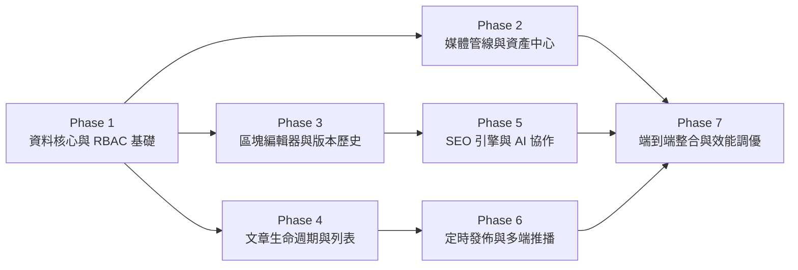

# 企業級內容管理系統 (CMS) 開發任務清單 (TODO.md)

> **關聯規格文件**：[spec.md](file:///c:/Users/TINA/Documents/antigravity/practice/spec.md) | [prd.md](file:///c:/Users/TINA/Documents/antigravity/practice/prd.md)  
> **架構原則**：兩層式結構（Phase → Task），由基礎到進階，**各階段低耦合、支援獨立測試與驗收**。  
> **版本**：v1.0.0  
> **進度狀態**：準備開工 (Ready to Start)  

---

## 總覽：階段里程碑 (Roadmap Overview)

---

## Phase 1: 資料核心與 RBAC 權限基礎 (Data & Auth Foundation) ✅【已完成 / Verified】

> **階段目標**：建立底層資料庫架構、認證授權中介軟體與基礎分類標籤系統。  
> **獨立測試方式**：透過 Postman / cURL 或單元測試直接測試 Auth 與 RBAC API，無須依賴前端 UI。  
> **完成時間**：`2026-09-05 15:20`  
> **驗收狀態**：`100% Passed (10/10 測試全數通過)`  

### 📝 Phase 1 完成註記與驗收成果記錄
> [!NOTE]
> **本階段已交付成果：**
> 1. **資料庫層**：`backend/db.py` 成功生成 `backend/cms.db`（包含 8 張資料表、外鍵約束與 4 角色種子帳號）。
> 2. **認證與授權層**：`backend/auth.py` 實作 RFC 7519 標準 JWT 簽發與 RBAC 角色守衛依賴（`require_roles`）。
> 3. **後端服務**：`backend/main.py` 提供登入、二層級分類樹（Parent/Children）、標籤雲及防越權攔截端點。
> 4. **前端控制台**：`src/components/CmsPhase1.jsx` 實作可視化分類/標籤管理、1 鍵切換 4 角色身份與即時權限測試器。
> 5. **自動化測試腳本**：`backend/test_phase1.py` 執行 10 條端對端單元測試，100% 通過驗收。

- [x] **1.1 資料庫架構與遷移腳本 (Database Migrations)**
  - [x] 依據 `spec.md` 第 4 節建立 `users`, `categories`, `tags`, `articles`, `article_revisions`, `media_assets` 之 DDL 遷移腳本。
  - [x] 設定外鍵約束、複合索引（如 `idx_articles_slug`, `idx_articles_status`）與軟刪除欄位。
  - [x] 撰寫種子資料腳本（`seeds.sql`），注入 4 種角色使用者與基礎分類資料。
- [x] **1.2 身份驗證與 JWT 機制 (Authentication)**
  - [x] 實作密碼雜湊模組（Argon2id 或 bcrypt / PBKDF2-SHA256）。
  - [x] 實作 `POST /api/v1/auth/login` 簽發 Access Token 與 Refresh Token。
  - [x] 實作 `GET /api/v1/auth/me` 回傳當前使用者資訊與所屬角色。
- [x] **1.3 RBAC 權限中介軟體 (Authorization Middleware)**
  - [x] 定義權限常數：`super_admin`, `editor`, `author`, `proofreader`。
  - [x] 實作路由級別權限守衛（Route Guard），阻擋未授權存取並回傳標準 `403 Forbidden`。
- [x] **1.4 二層級分類與標籤 API (Categories & Tags Module)**
  - [x] 實作 `GET /api/v1/categories`（以二級樹狀結構回傳父子分類）。
  - [x] 實作分類 CRUD 與「刪除時文章轉移」防呆邏輯。
  - [x] 實作標籤雲清單、關鍵字搜尋與使用頻率統計 API。

> 🎯 **Phase 1 驗收閘門**：所有 Migration 執行無誤，單元測試通過率 100%（包含 4 種角色的權限越權攔截測試）。  
> 🏆 **驗收結果**：**通過 (PASSED)** — 測試腳本 `backend/test_phase1.py` 執行耗時 0.45s，無任何錯誤或斷言失敗。

---

## Phase 2: 媒體管線與資產中心 (Media Pipeline & Asset Hub)

> **階段目標**：打造高效圖片轉碼壓縮管線與獨立運作的媒體檔案庫。  
> **獨立測試方式**：獨立於文章編輯器之外，上傳不同尺寸與格式之測試圖檔，驗證 WebP 轉換率與檔案庫管理功能。

- [ ] **2.1 後端影像轉碼與壓縮管線 (Image Processing Pipeline)**
  - [ ] 整合 Sharp（或 Pillow）影像處理引擎。
  - [ ] 實作上傳串流檢驗：限制單檔大小（<20MB）與 MIME Magic Number 驗證。
  - [ ] 自動執行 85% 質量之 **WebP 轉碼**，並產生兩種衍生尺寸：
    - 中圖：寬度 1200px（保持原比例）
    - 縮圖：寬度 400px（正方形裁切）
- [ ] **2.2 媒體資源管理 API (Media Assets API)**
  - [ ] 實作 `POST /api/v1/media/upload` 支援單圖與多圖平行上傳。
  - [ ] 實作虛擬資料夾系統（`media_folders`）之增刪查改 API。
  - [ ] 實作 `PATCH /api/v1/media/:id` 更新 Alt Text、檔案名稱與所屬資料夾。
- [ ] **2.3 媒體庫前端介面 (Media Gallery UI)**
  - [ ] 開發網格檢視模式與列表檢視模式切換。
  - [ ] 實作拖拽檔案至指定資料夾功能。
  - [ ] 內建輕量圖片編輯彈窗：支援 1:1, 4:3, 16:9 比例裁切、旋轉與即時 Alt Text 編輯。

> 🎯 **Phase 2 驗收閘門**：上傳 10MB PNG 圖片能於 2 秒內轉為 <600KB WebP，且能於媒體庫完成重命名、移入資料夾與填寫 Alt Text。

---

## Phase 3: 區塊編輯器與版本歷史 (Block Editor & Core Authoring)

> **階段目標**：完成沉浸式區塊寫作體驗、即時自動儲存與雙欄版本比對。  
> **獨立測試方式**：建立獨立 Editor Playground 測試頁，模擬斷網、版本還原與富文本拖拽。

- [ ] **3.1 區塊式編輯器核心 (Block-based Editor Core)**
  - [ ] 整合 TipTap / BlockNote 核心引擎。
  - [ ] 實作自定義區塊元件：
    - 段落區塊（支援 Markdown 行內快捷鍵：`#`, `**`, `>`）
    - 程式碼區塊（語法高亮、語言切換與一鍵複製）
    - 提示框（Callout: Info, Warning, Tip）
    - 媒體嵌入區塊（圖片選取器、YouTube 影片嵌入）
  - [ ] 實作 `/` 快顯指令選單（Slash Command Menu）與區塊拖拽手柄（Drag Handle）。
- [ ] **3.2 即時自動儲存控制器 (Autosave Controller)**
  - [ ] 實作前端狀態監聽器：停止輸入 3 秒（Debounce 3000ms）自動送出儲存請求。
  - [ ] 實作 30 秒定期定時儲存輪詢機制（僅在有異動髒資料時觸發）。
  - [ ] 實作後端 `PUT /api/v1/articles/:id/autosave`，更新草稿資料而不觸發正式發佈。
  - [ ] 整合前端 `IndexedDB` 本地快取備份，遇斷網時自動接管暫存。
- [ ] **3.3 版本快照與歷史比對 (Revisions & Diff)**
  - [ ] 在每次手動儲存與發佈時，建立快照存入 `article_revisions`。
  - [ ] 實作側邊欄版本時間線列表：顯示版本號、編輯者、修改時間與備註。
  - [ ] 實作雙欄視覺化 Diff 檢視器（綠底標記新增文字、紅底標記刪除文字）。
  - [ ] 實作「一鍵還原至此版本」功能。

> 🎯 **Phase 3 驗收閘門**：斷開瀏覽器網路後輸入內容，重新連線後內容未遺失；能隨意建立 3 個版本並成功還原至任一歷史版本。

---

## Phase 4: 文章生命週期與管理列表 (Article Lifecycle & Admin Grid)

> **階段目標**：實作狀態流轉狀態機、多維度複合篩選列表與批量維護工具。  
> **獨立測試方式**：透過 API 與前端列表頁面測試狀態流轉合法性，以及高負載多條件檢索。

- [ ] **4.1 文章狀態機與權限規則 (State Machine Engine)**
  - [ ] 定義狀態流轉規則：`DRAFT` ↔ `PENDING` → `SCHEDULED` / `PUBLISHED` → `TRASH`。
  - [ ] 實作狀態防護攔截：作者僅能執行 `DRAFT -> PENDING`；僅主編與管理員能執行 `PENDING -> PUBLISHED`。
  - [ ] 實作軟刪除（Soft Delete）機制：刪除文章移至 `TRASH`，保留 30 天可恢復。
- [ ] **4.2 文章列表與狀態分流 Tab (Admin List & Status Tabs)**
  - [ ] 頂部實作「全部」、「草稿」、「待審核」、「已發佈」、「排程中」、「垃圾桶」快速切換 Tab。
  - [ ] 實作即時筆數徽章（動態統計各狀態總數）。
  - [ ] 將狀態參數綁定至 URL Query（如 `?status=pending`）。
- [ ] **4.3 複合條件篩選面板 (Multi-Filter Panel)**
  - [ ] 實作關鍵字搜尋（300ms 防抖即時比對標題與摘要）。
  - [ ] 整合作者、分類（二層樹）、標籤與建立/發佈日期區間過濾器。
  - [ ] 提供「一鍵重設所有條件」按鈕。
- [ ] **4.4 批量維護工具 (Bulk Operations)**
  - [ ] 實作表格 Checkbox 跨選與「全選符合條件項目」互動。
  - [ ] 實作批次更新狀態、批次更改分類與批次丟棄至垃圾桶。
  - [ ] 加入二次確認彈窗，批次操作時提示受影響文章篇數。
- [ ] **4.5 自定義欄位顯示 (Column Visibility Preferences)**
  - [ ] 開發列表欄位勾選選單（封面圖、作者、字數、更新時間、SEO 分數等）。
  - [ ] 將使用者的欄位勾選偏好持久化於 `localStorage`。

> 🎯 **Phase 4 驗收閘門**：在具備 1,000 篇模擬文章的環境下，多條件篩選回傳時間小於 300ms；作者無法越權直接將稿件標記為已發佈。

---

## Phase 5: SEO 引擎與 AI 協作擴充 (SEO Engine & AI Copilot)

> **階段目標**：在編輯器旁提供即時 SEO 評分與社群卡片預覽，並整合 LLM API 加速產出。  
> **獨立測試方式**：以 Mock 文本輸入，驗證 SEO 演算法評分準確性，並透過 Mock LLM Provider 驗證 AI 端點。

- [ ] **5.1 即時 SEO 分析與健康分數演算法 (SEO Diagnostics Engine)**
  - [ ] 實作 100 分制即時評分演算法：
    - Meta Title 長度檢核（30~60 字）
    - Meta Description 長度檢核（80~160 字）
    - 內文標題層次（H2/H3）存在性
    - 圖片 Alt Text 覆蓋率
    - 內部與外部連結存在性
  - [ ] 在文章列表與編輯器側邊欄顯示即時紅/黃/綠健康燈號與扣分說明。
- [ ] **5.2 社群分享卡片預覽 (Open Graph Live Preview)**
  - [ ] 即時渲染 Google 搜尋結果 SERP Snippet 預覽。
  - [ ] 即時渲染 Facebook / LINE 寬版縮圖分享卡片。
  - [ ] 實作自定義 URL Slug 產生器（自動拼音/英文字串轉換與合法性校驗）。
- [ ] **5.3 AI 創作副駕駛 (LLM AI Assistant)**
  - [ ] 實作後端 `POST /api/v1/ai/generate`，整合 OpenAI / Claude / Gemini API。
  - [ ] **標題靈感庫**：輸入內文提取 5 組不同風格建議標題（點擊可直接替換）。
  - [ ] **自動摘要精煉**：一鍵提煉 150 字精華摘要並填入 Meta Description。
  - [ ] **智慧標籤推薦**：自動標記 3~5 組核心關鍵字。
  - [ ] 實作速率限制（Rate Limiting）：單一使用者每分鐘上限 10 次呼叫。

> 🎯 **Phase 5 驗收閘門**：輸入不合格文章，SEO 側邊欄能即時指出缺少的標籤；點擊 AI 生成標題能於 3 秒內獲得 5 組建議並完成替換。

---

## Phase 6: 定時發佈與多端分發 (Scheduling & Multi-channel Webhooks)

> **階段目標**：建構非同步工作排程系統，實現無人值守定時發布與自動跨渠道推播。  
> **獨立測試方式**：手動觸發 Worker 任務模擬未來時間到達，並透過 Webhook 接收端驗證推播格式。

- [ ] **6.1 分散式定時排程引擎 (Scheduled Publishing Worker)**
  - [ ] 整合 Redis + BullMQ（或 Celery）任務佇列。
  - [ ] 撰寫定時掃描 Worker（每分鐘執行一次）：
    - 查詢條件：`status = 'scheduled' AND scheduled_at <= NOW()`
    - 引入分散式鎖（Redis Lock），避免叢集重複觸發同一篇文章。
    - 任務觸發後將狀態更新為 `published`，並記錄 `published_at`。
- [ ] **6.2 社群廣播推播器 (Social & Channel Webhooks)**
  - [ ] 建立 Webhook 分發架構，支援可插拔式的廣播外掛：
    - **Telegram Bot**：格式化文章標題、摘要與閱讀連結，推播至指定頻道。
    - **Slack Incoming Webhook**：以 Block Kit 格式發送精美文章卡片至內部工作頻道。
  - [ ] 發佈介面提供勾選框，供編輯自主決定發佈時是否外送推播。
  - [ ] 實作推播非同步重試機制（3 次指數退避），外發失敗不影響主文章發佈。
- [ ] **6.3 Web3 鏈上存儲備份 (可選配擴充，Web3 Archival)**
  - [ ] 將文章 Markdown 原文與中繼資料封裝為 JSON。
  - [ ] 透過 IPFS API（如 Pinata 或自建節點）將內容上鏈並回存 IPFS CID 至資料庫。

> 🎯 **Phase 6 驗收閘門**：設定 2 分鐘後的排程文章，時間一到系統自動轉為已發佈，並在 Telegram/Slack 頻道中收到完整排版推播。

---

## Phase 7: 端到端整合與效能調優 (E2E Integration & Performance Hardening)

> **階段目標**：全鏈路整合串接、自動化 E2E 測試覆蓋、安全防護與效能壓測。  
> **獨立測試方式**：執行自動化 Playwright 測試劇本與 Lighthouse 網頁效能指標稽核。

- [ ] **7.1 全鏈路端到端測試 (End-to-End Test Suite)**
  - [ ] 使用 Playwright 撰寫完整使用者旅程測試劇本：
    1. 作者登入 → 新增草稿 → 插入圖片與區塊 → 提交審核。
    2. 主編登入 → 審閱待審核清單 → 調整 SEO 標籤 → 核准發佈。
    3. 訪客前台檢視該發布文章內容。
- [ ] **7.2 安全性防禦強化 (Security Hardening)**
  - [ ] 前後端實作 DOMPurify / sanitize-html，嚴格過濾 XSS 惡意腳本。
  - [ ] 實作全站關鍵行為審計日誌（Audit Log）：記錄發佈、刪除與權限變更之操作者 IP 與時間。
  - [ ] 設定 HTTP 安全標頭（CSP、HSTS、X-Content-Type-Options）。
- [ ] **7.3 首屏效能與載入優化 (Performance Optimization)**
  - [ ] 資料庫查詢調優：確認大資料量（10,000+ 筆）下列表分頁查詢時間小於 200ms。
  - [ ] 靜態資產 CDN 快取與 Gzip/Brotli 壓縮設定。
  - [ ] 執行 Lighthouse 稽核：達成 Performance > 90、Accessibility > 95。

> 🎯 **Phase 7 驗收閘門**：E2E 自動化測試全數通過，高並發情境下無文章狀態錯亂，系統通過 XSS 注入測試。

---

## 🛠️ 開發進度追蹤看板 (Progress Dashboard)

| 階段名稱 | 核心交付成果 | 耦合依賴 | 預計測試標準 | 完成狀態 |
| :--- | :--- | :--- | :--- | :---: |
| **Phase 1: 資料與權限** | DB Migration, JWT, RBAC, 分類標籤 | 無（底座） | API 單元測試 100% 通過 | `[x] 已完成 (Verified)` |
| **Phase 2: 媒體管線** | WebP 壓縮, 檔案庫, 裁切工具 | 依賴 Phase 1 | 上傳與轉碼無損壓縮測試 | `[ ] 待開工` |
| **Phase 3: 區塊編輯器** | Block Editor, 自動儲存, 版本回溯 | 依賴 Phase 1 | 斷網本地快取與還原測試 | `[ ] 待開工` |
| **Phase 4: 文章生命週期** | 狀態分流視圖, 複合篩選, 批量操作 | 依賴 Phase 1, 3 | 狀態流轉驗證與大數據分頁 | `[ ] 待開工` |
| **Phase 5: SEO 與 AI** | 即時 SEO 評分, 社群卡片, LLM 標題摘要 | 依賴 Phase 3 | 演算法邊界與 Rate Limit 測試 | `[ ] 待開工` |
| **Phase 6: 定時與多端** | BullMQ 佇列, 定時發布, Telegram/Slack 推播 | 依賴 Phase 4 | Worker 時間輪詢與推播重試 | `[ ] 待開工` |
| **Phase 7: E2E 與調優** | Playwright 測試, 安全防禦, 首屏效能 | 依賴全部 Phase | Lighthouse > 90, E2E 通過 | `[ ] 待開工` |
